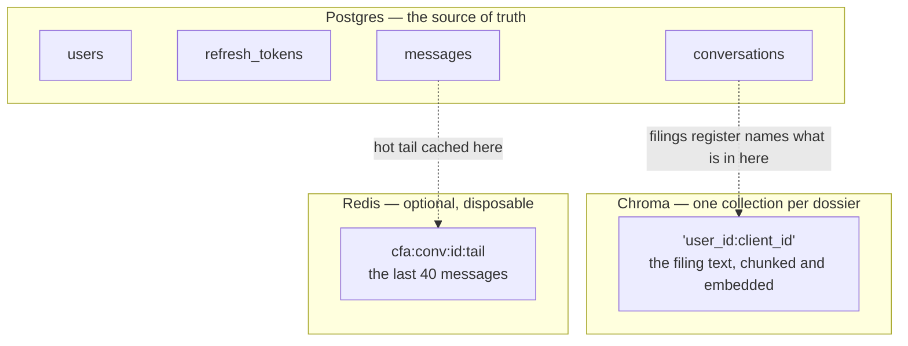
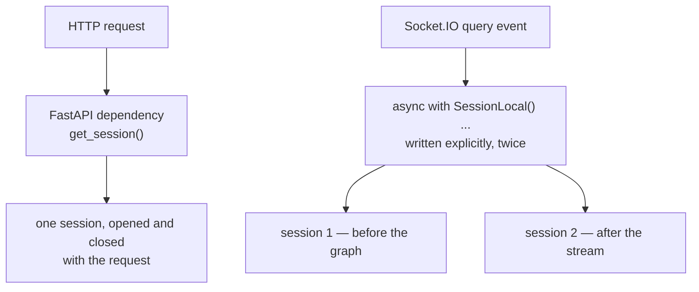
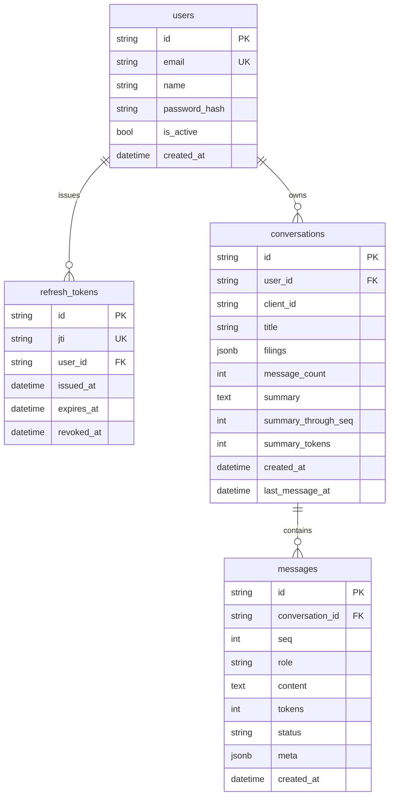
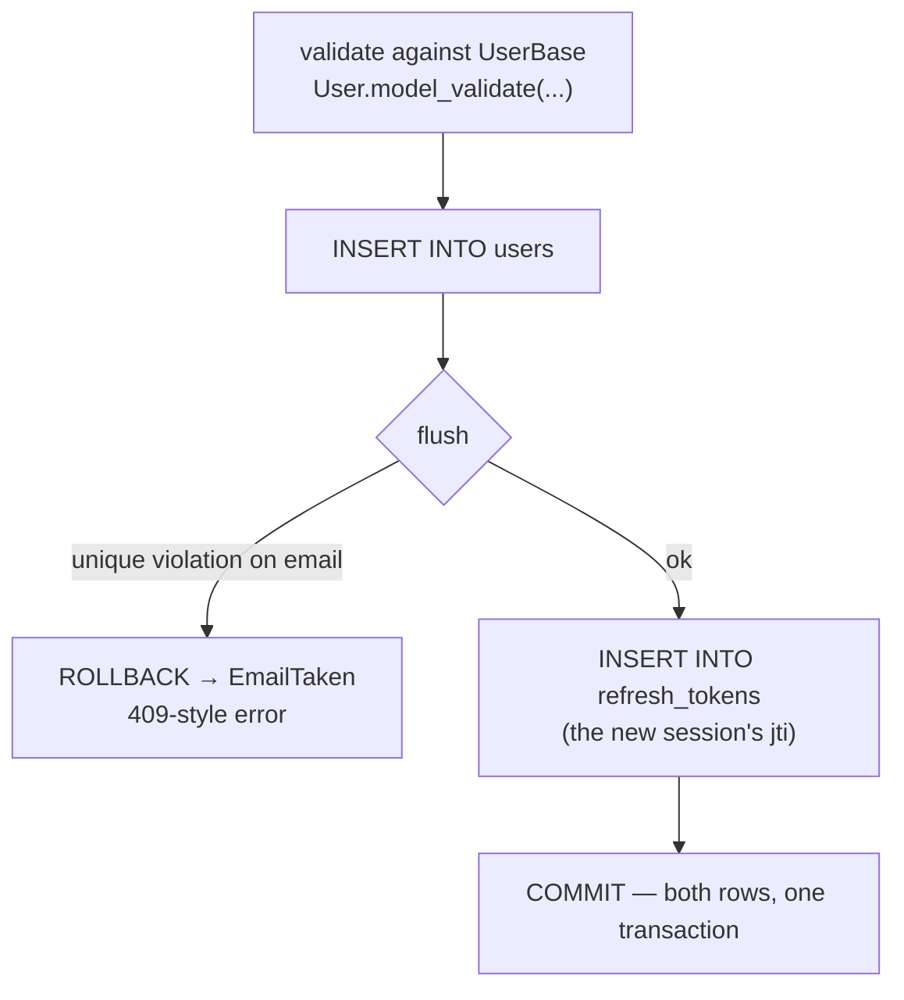
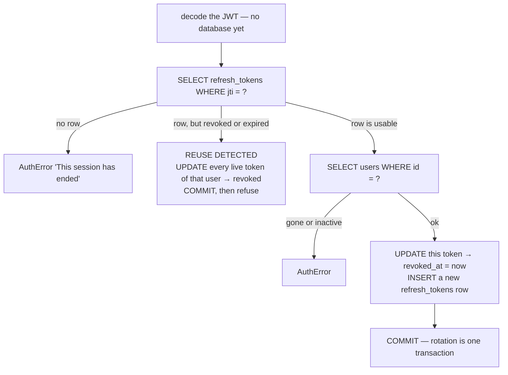
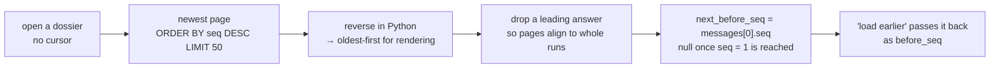
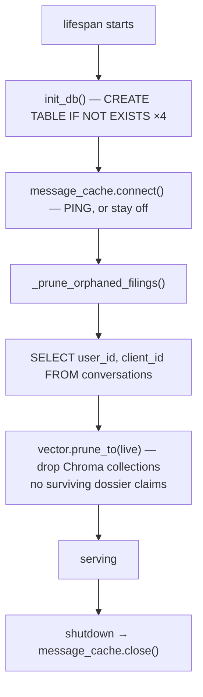
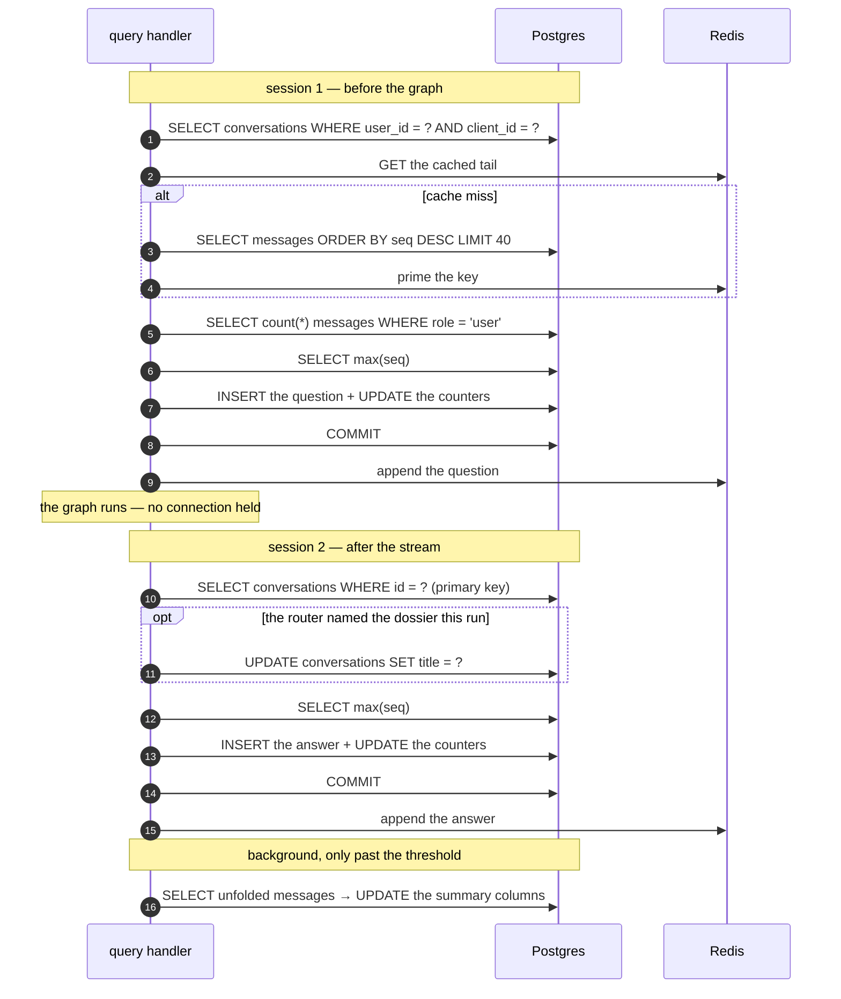
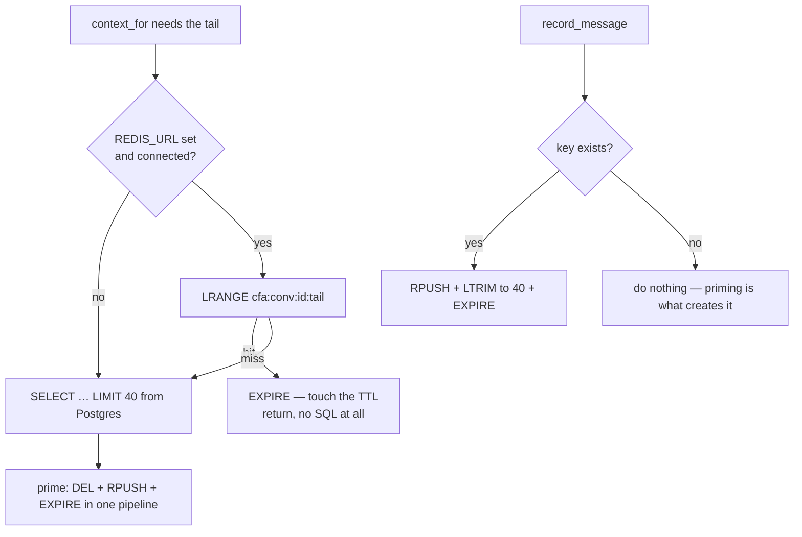
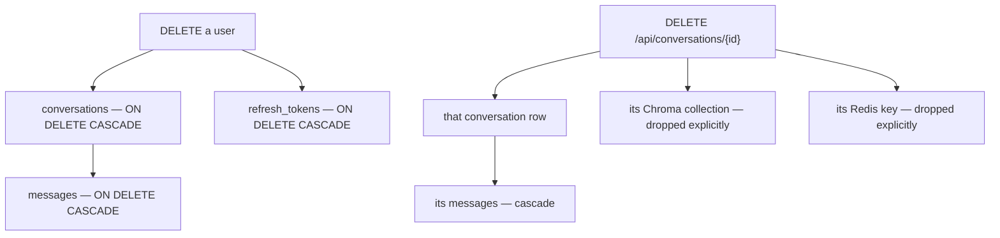

# The database, operation by operation

Everything the Corporate Filing Analyzer stores in Postgres, and every operation
it performs against it: which statement runs, when, from where, in what
transaction, and what happens when it fails.

Four tables, and about twenty distinct operations across them. This document
covers all of them.

| Where to look | For |
| --- | --- |
| [DOSSIER-FAQ.md](DOSSIER-FAQ.md) | the simple version — what gets saved when, in plain answers |
| **this file** | the schema, and every read and write the app makes |
| [FRONTEND-SOCKETIO.md](FRONTEND-SOCKETIO.md) | what the backend does for each workbench operation |
| [SOCKETIO.md](SOCKETIO.md) | the real-time transport itself |
| [HOW-IT-WORKS.md](HOW-IT-WORKS.md) | the whole system, end to end |

The code:

- [`db/engine.py`](../backend/Analyzer/db/engine.py) — engine, pool, session factory, `create_all`
- [`db/columns.py`](../backend/Analyzer/db/columns.py) — shared id and timestamp column shapes
- [`auth/models.py`](../backend/Analyzer/auth/models.py) — `users`, `refresh_tokens`
- [`conversations/models.py`](../backend/Analyzer/conversations/models.py) — `conversations`, `messages`
- [`auth/service.py`](../backend/Analyzer/auth/service.py) — every account operation
- [`conversations/service.py`](../backend/Analyzer/conversations/service.py) — every ledger operation
- [`conversations/cache.py`](../backend/Analyzer/conversations/cache.py) — the optional Redis tail cache

---

## Contents

1. [Three stores, and what lives in each](#1-three-stores-and-what-lives-in-each)
2. [The engine, the pool, the session factory](#2-the-engine-the-pool-the-session-factory)
3. [Where a session comes from](#3-where-a-session-comes-from)
4. [The schema](#4-the-schema)
5. [Six decisions that shaped it](#5-six-decisions-that-shaped-it)
6. [Account operations](#6-account-operations)
7. [Dossier operations](#7-dossier-operations)
8. [Message operations](#8-message-operations)
9. [Startup and maintenance](#9-startup-and-maintenance)
10. [What one question writes, end to end](#10-what-one-question-writes-end-to-end)
11. [Transactions: who commits and who does not](#11-transactions-who-commits-and-who-does-not)
12. [Indexes, and the queries that use them](#12-indexes-and-the-queries-that-use-them)
13. [The Redis cache in front of `messages`](#13-the-redis-cache-in-front-of-messages)
14. [Deletion, and what cascades](#14-deletion-and-what-cascades)
15. [Races and failure modes](#15-races-and-failure-modes)
16. [Settings that change database behaviour](#16-settings-that-change-database-behaviour)
17. [Cheat sheet](#17-cheat-sheet)

---

## 1. Three stores, and what lives in each

Postgres is not the only place state lives, and knowing which store owns what
explains most of the operations below.



| Store | Holds | Survives a restart | Losing it costs |
| --- | --- | --- | --- |
| **Postgres** | accounts, refresh tokens, dossiers, every message, the rolling summary | yes | everything |
| **Chroma** | the chunked, embedded text of each filing | yes (on disk) | answers can no longer cite filings; the ledger is intact |
| **Redis** | a cached tail of recent messages | no, and it does not need to | one extra `SELECT` per question |

Only Postgres is required. Redis is off unless `REDIS_URL` is set, and every
operation against it fails soft.

---

## 2. The engine, the pool, the session factory

```python
engine: AsyncEngine = create_async_engine(
    settings.DATABASE_URL,
    echo=settings.DB_ECHO,
    pool_size=settings.DB_POOL_SIZE,          # 5
    max_overflow=settings.DB_MAX_OVERFLOW,    # 10
    # A connection killed by something between us and Postgres — a restart, an
    # idle timeout on a proxy — looks alive in the pool until it is used. This
    # is the cheap round trip that finds out first.
    pool_pre_ping=True,
    pool_recycle=settings.DB_POOL_RECYCLE_SECONDS,   # 1800
)

SessionLocal = async_sessionmaker(
    engine,
    class_=AsyncSession,        # SQLModel's, so exec() types back to the model
    expire_on_commit=False,     # a returned model stays readable after commit
)
```

| Setting | Default | Why it matters |
| --- | --- | --- |
| `pool_size` | 5 | steady-state connections. With 5 + 10 overflow, at most 15 concurrent statements per worker |
| `max_overflow` | 10 | burst room — a queue forms beyond it rather than an error |
| `pool_pre_ping` | on | the cheapest fix for "connection was closed by the server" after a Postgres restart |
| `pool_recycle` | 1800 s | replaces connections before a proxy's idle timeout does it for you |
| `expire_on_commit` | `False` | without it, reading `user.email` after `commit()` triggers a lazy refresh — which under async raises `MissingGreenlet` |
| `echo` (`DB_ECHO`) | off | turn on to log every statement; the fastest way to check what a code path really issues |

`expire_on_commit=False` is the one that would bite hardest if changed: routes
routinely serialise a model they have just committed.

---

## 3. Where a session comes from

Two ways, one per transport.



```python
async def get_session() -> AsyncIterator[AsyncSession]:
    """FastAPI dependency yielding a session that closes with the request."""
    async with SessionLocal() as session:
        yield session
```

A Socket.IO handler has no request to hang a dependency off, so it opens
sessions itself — and deliberately opens **two short ones** rather than one long
one:

> An answer can take a minute, and a pooled connection held open across it is a
> connection nothing else can use.

With a pool of 5 + 10, holding a session across each run would cap the number of
analysts who can be mid-question at fifteen per worker.

---

## 4. The schema



### `users`

| Column | Notes |
| --- | --- |
| `id` | uuid4 hex, 32 chars, no dashes |
| `email` | **unique index**, stored lower-cased by `_normalize()` |
| `password_hash` | bcrypt. The password itself is never written anywhere, including logs |
| `is_active` | checked on login, on refresh, and on every socket handshake |

### `refresh_tokens`

One row per issued refresh token. The token's signature already proves it was
minted here; **this row is what makes it revocable.**

| Column | Notes |
| --- | --- |
| `jti` | unique index — the claim inside the JWT that points here |
| `user_id` | FK → `users.id`, `ON DELETE CASCADE` |
| `revoked_at` | `NULL` means live. Rotation, logout and revoke-all all just set this |
| `is_usable` | a Python property: not revoked **and** not expired |

### `conversations`

| Column | Notes |
| --- | --- |
| `id` | ours — what `messages.conversation_id` points at |
| `client_id` | the browser's dossier id. `UNIQUE (user_id, client_id)` — never unique alone |
| `title` | blank until the router names the dossier on its first question |
| `filings` | `jsonb` list of `{name, chunks, added_at}` — the register the dock shows |
| `message_count` | kept in step with the last `seq`, in the same transaction as the insert |
| `summary`, `summary_through_seq`, `summary_tokens` | the rolling summary and how far it reaches |
| `last_message_at` | what "most recent dossier first" orders by |

### `messages`

| Column | Notes |
| --- | --- |
| `seq` | position from 1. `UNIQUE (conversation_id, seq)` |
| `role` | `user` / `assistant` / `system`, validated in Python, plain string column |
| `tokens` | estimated at write time — what the context budget later spends |
| `status` | `complete` or `error`. A failed run is kept, not dropped |
| `meta` | `jsonb`: `{"files": [...]}` and `{"run": n}` on questions, `{"category", "run_id", "error"}` on answers |

---

## 5. Six decisions that shaped it

1. **Rows, not one blob per conversation.** A single JSON document is fine until
   something needs to page through a conversation, edit one message, or count
   tokens across a range — and then it is a rewrite.
2. **`seq`, not `created_at`, is the order.** Two messages in the same
   millisecond would order by coin toss, and cursor pagination needs a total
   order.
3. **Two ids per dossier.** `client_id` is the browser's and is only unique
   *per account*; `id` is ours. Nothing is looked up by `client_id` alone.
4. **`jsonb`, not `json`, for `meta` and `filings`.** Postgres stores it parsed,
   so it reads back without a per-row parse and can be indexed into later.
5. **`timestamptz` everywhere**, via a shared column helper — SQLModel would
   otherwise map `datetime` to a naive column, and comparing a naive value to an
   aware `now()` raises.
6. **Cascades in Postgres, not in the ORM.** The FKs declare
   `ON DELETE CASCADE` and there are no ORM relationships. An unused
   relationship is a liability under async: touching an unloaded one raises
   `MissingGreenlet` from wherever it happened to be read.

---

## 6. Account operations

### 6.1 Signup — `POST /api/auth/signup`



```python
session.add(user)
try:
    await session.flush()
except IntegrityError as error:
    await session.rollback()
    # Decided by the unique index on User.email, not by a prior SELECT,
    # so two simultaneous signups cannot both win.
    raise EmailTaken("An account with that email already exists.") from error

pair = await self._issue(session, user)
await session.commit()
```

**Statements:** `INSERT users` → `INSERT refresh_tokens` → `COMMIT`.
**Note the `flush()` before `_issue`** — the user row needs an id the token row
can point at, but neither should exist if the other fails.

### 6.2 Login — `POST /api/auth/login`

```python
user = await self._by_email(session, _normalize(email))   # SELECT ... WHERE email = ?

if user is None:
    verify_password(password, _DUMMY_HASH)   # constant-time-ish: hash anyway
    raise AuthError("Email or password is incorrect.")
```

**Statements:** `SELECT users WHERE email = ?` → `INSERT refresh_tokens` →
`COMMIT`.

An unknown address still runs a bcrypt verification against a dummy hash, so the
response time does not reveal which addresses are registered. The error message
is identical for a wrong password, an unknown address and a disabled account.

### 6.3 Refresh — `POST /api/auth/refresh`

The busiest account operation: the browser refreshes about every 14 minutes, and
again whenever a 401 is met.



```python
if not record.is_usable:
    # Already spent or explicitly revoked.
    await self.revoke_all(session, record.user_id)
    await session.commit()
    logger.warning("Reused refresh token for user %s — all sessions revoked", record.user_id)
    raise AuthError("This session has ended. Please sign in again.")
```

**Reuse detection is the security-relevant write here.** A refresh token is
single-use; seeing a spent one again means either a stolen token or a badly
behaved client, and the response is to revoke every live session that account
has.

### 6.4 Logout — `POST /api/auth/logout`

```python
await session.exec(
    update(RefreshToken)
    .where(RefreshToken.jti == claims.get("jti", ""), RefreshToken.revoked_at.is_(None))
    .values(revoked_at=utcnow())
)
await session.commit()
```

One `UPDATE`, no `SELECT`. A token that cannot even be decoded returns silently:
logging out is not a place to report problems, since whatever the client holds
is unusable afterwards either way.

### 6.5 `revoke_all` — every session at once

Same `UPDATE`, filtered by `user_id` instead of `jti`, and it **does not
commit** — the caller decides the transaction boundary. Today its only caller is
reuse detection.

### 6.6 Resolving a bearer token — every authenticated request, and the handshake

```python
claims = decode_token(token, "access")               # signature, expiry, type
user = await session.get(User, str(claims["sub"]))   # one primary-key read
if user is None or not user.is_active:
    raise AuthError("This account is no longer active.")
```

**One `SELECT` by primary key.** Access tokens are never looked up in
`refresh_tokens` — that is what makes them cheap, and why revoking a session
takes effect on the access token's own short expiry rather than immediately.

This is also the **only** database read the Socket.IO handshake performs.

---

## 7. Dossier operations

### 7.1 `open_conversation` — find or create

Called by the `query` handler before every run, and by `POST /api/upload` before
recording a filing.

```python
conversation = await self.find(session, user_id, client_id)
if conversation is not None:
    return conversation

conversation = Conversation(user_id=user_id, client_id=client_id, title=title.strip()[:200])
session.add(conversation)
try:
    await session.commit()
except Exception:
    # Two questions raced into the same new dossier and the unique
    # constraint caught the second.
    await session.rollback()
    existing = await self.find(session, user_id, client_id)
    if existing is None:
        raise
    return existing
```

**Statements:** `SELECT` → (`INSERT` + `COMMIT`) only when new → on a race,
`ROLLBACK` + `SELECT`.

This is where a dossier's row comes into being. Clicking *New dossier* in the
workbench writes nothing at all — an analyst who opens five and uses one leaves
four that never touch the database.

### 7.2 `find` — the scoped lookup everything uses

```python
select(Conversation)
    .where(Conversation.user_id == user_id)
    .where(Conversation.client_id == client_id)
```

Always both columns. This pair is the unique constraint, so the query is an
index lookup and the scoping is not something a caller can forget.

### 7.3 `list_conversations` — the dock

```python
select(Conversation)
    .where(Conversation.user_id == user_id)
    .order_by(col(Conversation.last_message_at).desc())
    .limit(limit)                                    # 100
```

Served by `ix_conversation_owner_recent (user_id, last_message_at)`. Messages
are **not** joined or counted here — `message_count` is already on the row.

### 7.4 `set_title` — naming a dossier

```python
title = title.strip()[:200]
if not title or title == conversation.title:
    return conversation        # no statement at all
conversation.title = title
session.add(conversation)
await session.commit()
```

Called once per dossier in practice, from `_record_answer`, when the router
named it during that run. A blank title is ignored rather than stored.

### 7.5 `record_filing` — the register

```python
filings = list(conversation.filings or [])
filings.append({"name": name, "chunks": chunks, "added_at": utcnow().isoformat()})
# Reassigned rather than mutated in place: SQLAlchemy tracks a JSON
# column by identity, and an appended-to list looks unchanged to it.
conversation.filings = filings
```

That comment is a real bug avoided: `conversation.filings.append(...)` would
commit silently and change nothing.

Runs after the ingest succeeded, never before — the register must not list a
filing that is not actually searchable.

### 7.6 `delete_conversation`

```python
conversation = await self.find(session, user_id, client_id)
if conversation is None:
    return False
conversation_id = conversation.id
await session.delete(conversation)
await session.commit()
await self.cache.drop(conversation_id)
```

**Statements:** `SELECT` → `DELETE` → `COMMIT`, plus a Redis `DEL`. The messages
go with it through the FK cascade, in Postgres, without the ORM loading a single
one. See [§14](#14-deletion-and-what-cascades).

---

## 8. Message operations

### 8.1 `record_message` — the only write path for messages

```python
meta = dict(meta or {})
if role == ROLE_USER and "run" not in meta:
    meta["run"] = await self._run_number(session, conversation.id)

next_seq = await self._next_seq(session, conversation.id)
message = Message(
    conversation_id=conversation.id, seq=next_seq, role=role, content=content,
    tokens=estimate_tokens(content), status=status, meta=meta,
)
conversation.message_count = next_seq
conversation.last_message_at = message.created_at

session.add(message)
session.add(conversation)
await session.commit()
await session.refresh(message)

await self.cache.append(conversation.id, _cacheable(message))
```

**Statements for a question row:**

| # | Statement | Why |
| --- | --- | --- |
| 1 | `SELECT count(*) FROM messages WHERE conversation_id = ? AND role = 'user'` | the run number stamped into `meta.run` |
| 2 | `SELECT seq FROM messages WHERE conversation_id = ? ORDER BY seq DESC LIMIT 1` | the next position |
| 3 | `INSERT INTO messages …` | the message |
| 4 | `UPDATE conversations SET message_count = ?, last_message_at = ?` | the counters, **same transaction** |
| 5 | `COMMIT` | |

An answer row skips step 1 — runs are numbered by their question.

**Why `seq` is read from `messages` and not from `message_count`:** a counter
that has drifted must not be able to hand out a position that is already taken.
`UNIQUE (conversation_id, seq)` is the backstop if it ever did.

### 8.2 `page_messages` — display history

```python
query = select(Message).where(Message.conversation_id == conversation.id)
if before_seq is not None:
    query = query.where(col(Message.seq) < before_seq)

result = await session.exec(query.order_by(col(Message.seq).desc()).limit(limit))
messages = list(reversed(result.all()))

# Pages are aligned to whole runs.
while len(messages) > 1 and messages[0].role != ROLE_USER:
    messages.pop(0)
```



- **Cursored on `seq`, not `OFFSET`.** A message arriving mid-scroll cannot
  shift the page under the reader.
- **Run alignment costs at most one message off the front of a page** and saves
  every client from stitching a question and its answer across two pages.
- `next_before_seq` is derived from the page itself — cheaper than a second
  `COUNT`.

### 8.3 `context_for` and `_recent` — context history

The read that every question depends on. Detailed in
[FRONTEND-SOCKETIO.md §8](FRONTEND-SOCKETIO.md#8-retrieving-history-when-you-ask-in-an-old-dossier);
the database side is one statement, and often none:

```python
cached = await self.cache.recent(conversation.id)
if cached is not None:
    return cached

window = max(self.context_messages, settings.REDIS_HOT_WINDOW)   # max(10, 40)
result = await session.exec(
    select(Message)
    .where(Message.conversation_id == conversation.id)
    .order_by(col(Message.seq).desc())
    .limit(window)
)
tail = [_cacheable(m) for m in reversed(result.all())]
await self.cache.prime(conversation.id, tail)
```

A dossier with two thousand messages reads forty rows — or zero, on a cache hit.

### 8.4 `_summarise` — the rolling summary

Runs as a background task after an answer has been delivered, in **its own
session**.

```python
async with SessionLocal() as session:
    conversation = await session.get(Conversation, conversation_id)
    if conversation is None:
        return

    result = await session.exec(
        select(Message)
        .where(Message.conversation_id == conversation_id)
        .where(col(Message.seq) > conversation.summary_through_seq)
        .order_by(col(Message.seq))
    )
    pending = list(result.all())
    if len(pending) <= self.summary_threshold:      # 24
        return
    ...
    conversation.summary = summary
    conversation.summary_through_seq = fold[-1].seq
    conversation.summary_tokens = estimate_tokens(summary)
    session.add(conversation)
    await session.commit()
```

**Statements:** `SELECT conversation by PK` → `SELECT unfolded messages` →
(LLM call) → `UPDATE conversations` → `COMMIT`. Usually it stops at the
threshold check and writes nothing.

Guarded so a burst of questions cannot start the same fold twice:

```python
if self.summarizer is None or conversation_id in self._summarising:
    return
```

and the task is kept in a set, because asyncio only holds a weak reference to a
running task — a fold with no strong reference can be collected mid-await and
simply never finish.

---

## 9. Startup and maintenance



### `init_db`

```python
async with engine.begin() as connection:
    await connection.run_sync(SQLModel.metadata.create_all)
```

`create_all` creates missing tables and **never alters existing ones**. It is
enough for a single-service app; a deployment that needs versioned schema
changes should put Alembic in front of it.

### `_prune_orphaned_filings`

The one operation that reads Postgres to correct another store:

```python
result = await session.exec(select(Conversation.user_id, Conversation.client_id))
live = [scoped_session_id(user_id, client_id) for user_id, client_id in result.all()]
analysis_pipeline.vector.prune_to(live)
```

It drops vector collections whose dossier was deleted while the backend was
down, or left behind by a crash between ingesting a file and recording it.
Failure is logged and shrugged off — startup housekeeping should not cost the
analyst their app over disk that is merely untidy.

---

## 10. What one question writes, end to end

The complete database traffic for a single question in an existing dossier:



**Totals for a typical follow-up question:** two `INSERT`s, two counter
`UPDATE`s, four to five `SELECT`s (three on a cache hit), two commits — and no
connection held while the model is generating.

---

## 11. Transactions: who commits and who does not

| Function | Commits? | Notes |
| --- | --- | --- |
| `signup` | yes | user + first refresh token in **one** transaction |
| `login` | yes | after issuing the pair |
| `refresh` | yes | revoke-the-old + insert-the-new is one transaction |
| `logout` | yes | one `UPDATE` |
| `revoke_all` | **no** | the caller owns the transaction |
| `_issue` | **no** | adds the token row; the caller commits |
| `open_conversation` | yes, only when inserting | a found row commits nothing |
| `set_title` | yes | and returns early with no statement if unchanged |
| `record_filing` | yes | |
| `record_message` | yes | message **and** counters together, never separately |
| `delete_conversation` | yes | then drops the Redis key |
| `_summarise` | yes | in its own session, in a background task |
| `context_for`, `page_messages`, `find`, `list_conversations` | reads | no writes |

The rule the codebase follows: **helpers that build part of a larger change
(`_issue`, `revoke_all`) do not commit; operations that are a complete change
do.**

---

## 12. Indexes, and the queries that use them

| Index | On | Serves |
| --- | --- | --- |
| `users_pkey` | `users.id` | resolving a bearer token, every handshake |
| unique `users.email` | `email` | login, and *deciding* duplicate signups |
| unique `refresh_tokens.jti` | `jti` | refresh and logout |
| `refresh_tokens.user_id` | `user_id` | `revoke_all` |
| `uq_conversation_owner_client` | `(user_id, client_id)` | **every** dossier lookup — `find`, and the race guard on insert |
| `ix_conversation_owner_recent` | `(user_id, last_message_at)` | the dock's most-recent-first list |
| `messages.conversation_id` | `conversation_id` | every ledger read |
| `uq_message_position` | `(conversation_id, seq)` | ordering, cursor pagination, `max(seq)`, and stopping two writers claiming one position |

Every hot query is covered. The two unique constraints double as the indexes
their lookups need, which is why there is no separate index on `client_id` or
`seq`.

---

## 13. The Redis cache in front of `messages`

Optional, and only ever in front of **one** read: the context tail.



| Behaviour | Reason |
| --- | --- |
| `append` never creates the key | a conversation nobody has read would end up cached as a one-message tail, which a later read would take for the whole window and answer from |
| the whole key expires at once | so a hit never has to wonder whether it is looking at a partial tail |
| TTL touched on every read | an active dossier stays hot, an abandoned one falls out on its own |
| any Redis error **disables** the cache | reconnecting per message would mean paying a timeout per request for as long as Redis is down; the database is both correct and faster than that |
| unreadable JSON → drop the key | something else wrote it, or the format changed |
| `REDIS_HOT_WINDOW` is raised to at least `HISTORY_CONTEXT_MESSAGES` at startup | a cache window smaller than the context window could never serve a full read |

The database is the source of truth throughout. Losing Redis costs one `SELECT`
per question.

---

## 14. Deletion, and what cascades



Discarding a dossier removes it from all three stores, and **in that order**:

```python
deleted = await history.delete_conversation(session, user.id, session_id)
dropped = analysis.delete_session(scoped_session_id(user.id, session_id))
```

> Both halves go, and in that order — a conversation whose messages were kept
> while its filings were dropped would answer follow-ups out of a summary of
> documents it can no longer cite.

There is no soft delete and no retention window: discarding is final.

**Deleting a user** is not exposed as an endpoint, but the schema is ready for
it — both FKs cascade in Postgres, so one `DELETE` takes the tokens, the
dossiers and every message. The Chroma collections would need pruning, which the
startup pass already does.

---

## 15. Races and failure modes

| Situation | What the database does | What the code does |
| --- | --- | --- |
| Two signups, same email, same moment | unique index rejects the second | `IntegrityError` → `EmailTaken`, not a 500 |
| Two questions open the same new dossier | `uq_conversation_owner_client` rejects the second insert | rollback, re-`SELECT`, use the winner's row |
| Two writers claim one `seq` | `uq_message_position` rejects the second | the write fails rather than corrupting the order pagination depends on |
| A dossier is deleted mid-run | the row is gone by the time the answer is recorded | `if conversation is None: return` — quiet, no orphan |
| Recording the answer fails | nothing written | logged and swallowed; the analyst has already read the answer |
| The summariser fails or returns nothing | nothing written | logged; the dossier keeps a longer unsummarised tail |
| Redis is down | not involved | the cache disables itself; reads go to Postgres |
| A pooled connection was killed | `pool_pre_ping` catches it | the statement runs on a fresh connection |
| A refresh token is presented twice | the row is already revoked | **every** live session for that user is revoked |

The pattern: **let the constraint decide, then handle the rejection.** No
operation in this codebase does a `SELECT` to check whether an `INSERT` will be
allowed.

---

## 16. Settings that change database behaviour

| Setting | Default | Effect |
| --- | --- | --- |
| `DATABASE_URL` | local Postgres | must be an **async** Postgres URL (`postgresql+asyncpg://…`); validated at startup |
| `DB_ECHO` | `false` | log every statement |
| `DB_POOL_SIZE` | `5` | steady-state connections per worker |
| `DB_MAX_OVERFLOW` | `10` | burst connections |
| `DB_POOL_RECYCLE_SECONDS` | `1800` | replace connections before an idle timeout does |
| `HISTORY_CONTEXT_MESSAGES` | `10` | how many recent messages a run may be sent |
| `HISTORY_CONTEXT_TOKENS` | `1500` | the budget those messages share with the summary |
| `HISTORY_SUMMARY_THRESHOLD` | `24` | unfolded messages before a fold is attempted |
| `HISTORY_PAGE_SIZE` | `50` | default page for display history |
| `HISTORY_MAX_PAGE_SIZE` | `200` | the cap a client may request |
| `REDIS_URL` | `""` | blank means no cache at all |
| `REDIS_HOT_WINDOW` | `40` | cached tail length; raised to `HISTORY_CONTEXT_MESSAGES` if set lower |
| `REDIS_TTL_SECONDS` | `3600` | tail lifetime, touched on each read |
| `ACCESS_TOKEN_EXPIRE_MINUTES` | `15` | how long a revoked session stays usable |
| `REFRESH_TOKEN_EXPIRE_DAYS` | `14` | how long `refresh_tokens` rows stay usable |

---

## 17. Cheat sheet

| Operation | Trigger | Tables | Statements | Commits |
| --- | --- | --- | --- | --- |
| `signup` | `POST /api/auth/signup` | users, refresh_tokens | 2 × `INSERT` | 1 |
| `login` | `POST /api/auth/login` | users, refresh_tokens | `SELECT`, `INSERT` | 1 |
| `refresh` | timer, or a 401 retry | refresh_tokens, users | `SELECT`, `SELECT`, `UPDATE`, `INSERT` | 1 |
| `logout` | `POST /api/auth/logout` | refresh_tokens | `UPDATE` | 1 |
| `revoke_all` | refresh-token reuse | refresh_tokens | `UPDATE` | caller's |
| resolve bearer token | every request, every handshake | users | `SELECT` by PK | — |
| `open_conversation` | `query`, upload | conversations | `SELECT` (+ `INSERT` if new) | 0 or 1 |
| `list_conversations` | `GET /api/conversations` | conversations | `SELECT` | — |
| `page_messages` | opening / paging a dossier | messages | `SELECT` | — |
| `context_for` | **every** question | messages | `SELECT` (skipped on a cache hit) | — |
| `record_message` | twice per question | messages, conversations | `COUNT`?, `max(seq)`, `INSERT`, `UPDATE` | 1 |
| `set_title` | first answer in a dossier | conversations | `UPDATE` | 1 |
| `record_filing` | after each upload | conversations | `UPDATE` (jsonb) | 1 |
| `_summarise` | after an answer, past the threshold | messages, conversations | `SELECT`, `SELECT`, `UPDATE` | 0 or 1 |
| `delete_conversation` | `DELETE /api/conversations/{id}` | conversations, messages | `SELECT`, `DELETE` (+ cascade) | 1 |
| `init_db` | startup | all four | `CREATE TABLE IF NOT EXISTS` | — |
| `_prune_orphaned_filings` | startup | conversations | `SELECT` | — |
