# Dossiers, the socket, and the database — questions answered

Plain answers to the things that are genuinely confusing about this app: how one
connection serves every conversation, what actually happens when you click *New
dossier*, what happens when you go back to an old one, and where the history
comes from when you ask a follow-up.

Every answer starts with the short version. Read only those and you will still
have the whole picture.

> This is the simple explanation. The detailed versions live in
> [FRONTEND-SOCKETIO.md](FRONTEND-SOCKETIO.md) (the backend's Socket.IO layer,
> operation by operation) and [DB-OPERATIONS.md](DB-OPERATIONS.md) (every
> database read and write).

---

## The whole idea in five sentences

1. Your browser opens **one** Socket.IO connection when you sign in, and keeps it
   for as long as the tab is open.
2. That connection knows **who you are**, and nothing else.
3. Every question you send over it carries **which dossier it belongs to**.
4. Dossiers, filings and messages live in the database and the vector store —
   not in the connection.
5. So one connection can serve a hundred dossiers, because the connection was
   never the thing holding a conversation together.

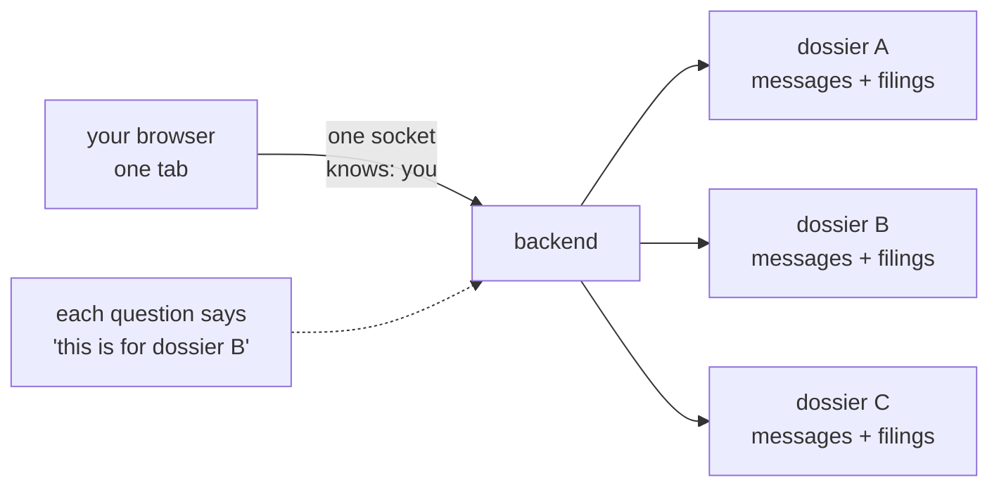

---

## Contents

**About the connection**
- [Q1. Does each conversation get its own socket connection?](#q1-does-each-conversation-get-its-own-socket-connection)
- [Q2. Then how does the backend know which dossier my question is about?](#q2-then-how-does-the-backend-know-which-dossier-my-question-is-about)
- [Q3. How does it know *who* I am?](#q3-how-does-it-know-who-i-am)
- [Q4. Do I have to join or subscribe to a dossier?](#q4-do-i-have-to-join-or-subscribe-to-a-dossier)
- [Q5. What happens to the socket when I switch dossiers?](#q5-what-happens-to-the-socket-when-i-switch-dossiers)
- [Q6. What if I open two tabs?](#q6-what-if-i-open-two-tabs)
- [Q7. Why does the socket only connect after I sign in?](#q7-why-does-the-socket-only-connect-after-i-sign-in)

**About ids**
- [Q8. Does every dossier have a unique id?](#q8-does-every-dossier-have-a-unique-id)
- [Q9. Who creates that id — the browser or the backend?](#q9-who-creates-that-id--the-browser-or-the-backend)
- [Q10. Could someone guess my dossier id and read my filings?](#q10-could-someone-guess-my-dossier-id-and-read-my-filings)

**What happens when you…**
- [Q11. …click "New dossier"?](#q11-click-new-dossier)
- [Q12. …so when does the dossier actually get saved?](#q12-so-when-does-the-dossier-actually-get-saved)
- [Q13. …attach a filing?](#q13-attach-a-filing)
- [Q14. …click an old dossier?](#q14-click-an-old-dossier)
- [Q15. …ask a new question in an old dossier?](#q15-ask-a-new-question-in-an-old-dossier)
- [Q16. …ask a follow-up — how is the history found?](#q16-ask-a-follow-up--how-is-the-history-found)
- [Q17. …delete a dossier?](#q17-delete-a-dossier)
- [Q18. …lose the connection while an answer is streaming?](#q18-lose-the-connection-while-an-answer-is-streaming)
- [Q19. …sign out?](#q19-sign-out)

**About the database**
- [Q20. What exactly is saved for one question?](#q20-what-exactly-is-saved-for-one-question)
- [Q21. Is the whole conversation sent to the model every time?](#q21-is-the-whole-conversation-sent-to-the-model-every-time)
- [Q22. Does the database store the socket connection?](#q22-does-the-database-store-the-socket-connection)
- [Q23. Do old dossiers slow things down?](#q23-do-old-dossiers-slow-things-down)

[**If you remember only five things**](#if-you-remember-only-five-things)

---

# About the connection

## Q1. Does each conversation get its own socket connection?

**Short answer: no. One connection per browser tab, shared by every dossier you
have.**

If you have thirty dossiers, you still have one socket. Opening a dossier does
not open a connection. Closing one does not close anything.

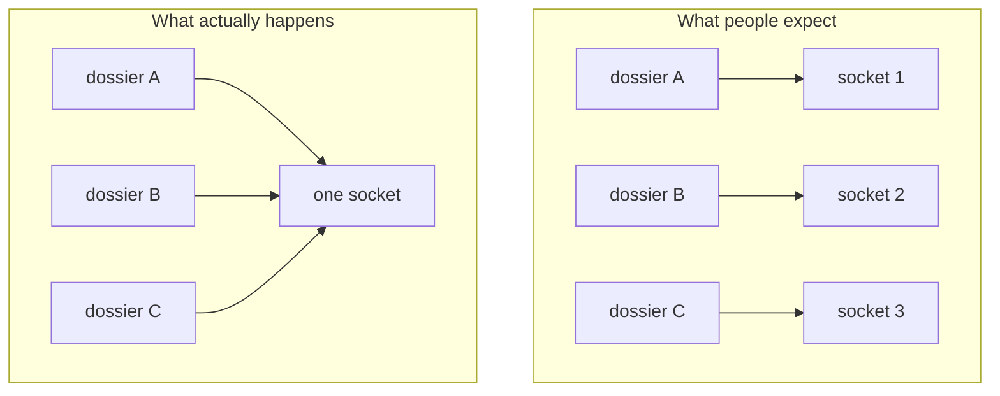

**How is that possible?** Because the connection does not represent a
conversation. It represents *you*. The conversation is named inside each
message you send.

Think of it like a phone line to your bank. You do not need a separate line per
account — you say which account you mean at the start of each request.

---

## Q2. Then how does the backend know which dossier my question is about?

**Short answer: you tell it, in the question itself.**

Every question sent over the socket carries the dossier's id:

```
query event → { query: "...", session_id: "a91f3c…", title: "...", files: [...] }
                                ^^^^^^^^^^^^^^^^^^^^
                                this is the dossier
```

The backend reads it at the top of the handler:

```python
session_id = (data.get("session_id") or "").strip()
```

And if it is missing, the question is refused rather than answered:

```python
if not session_id:
    logger.warning("Query from %s carried no session id — refused", sid)
    await sio.emit("error", {"message": "This chat has no id — reload the page and try again."}, to=sid)
    return
```

A question with no dossier behind it has no filings it is allowed to read, so
answering it would mean answering from nothing.

---

## Q3. How does it know *who* I am?

**Short answer: from the connection, not from the message.**

This is the split that makes the whole design work:

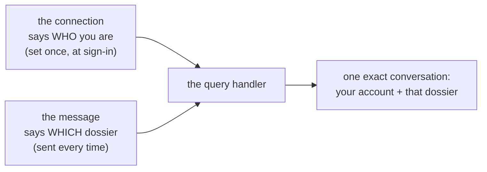

When your browser connects, it hands over your access token. The backend checks
it, looks up your account once, and pins the result to that connection:

```python
await sio.save_session(sid, {"user_id": user.id, "email": user.email})
```

From then on, every question on that connection is answered **as you**. Your
browser never sends a user id, and would not be believed if it did.

If the token is missing or expired, the connection is refused outright — you
never get a socket that looks healthy but answers nothing.

---

## Q4. Do I have to join or subscribe to a dossier?

**Short answer: no. There is nothing to join.**

Some chat apps make you join a "room" for each conversation. This one has no
rooms at all. There is no `join_dossier` event, no `leave` event, and no
subscription list anywhere on the backend.

Answers are sent straight back to the one connection that asked:

```python
await sio.emit(event_name, payload, to=sid)
```

`to=sid` means "to this one socket". Not to a group, not broadcast.

---

## Q5. What happens to the socket when I switch dossiers?

**Short answer: absolutely nothing.**

No event is sent. No room is changed. The backend is not even told.

It works because the backend never knew which dossier you were looking at in
the first place. It only ever learns a dossier id when a question arrives
carrying one.

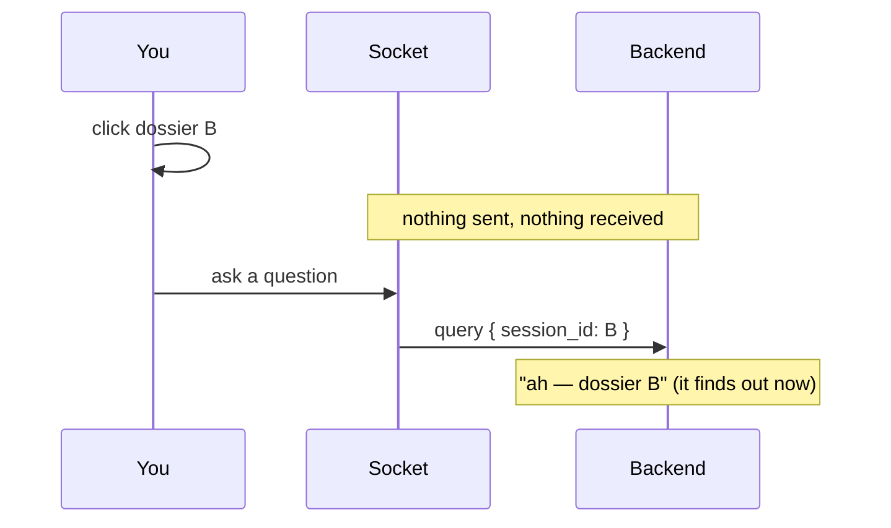

---

## Q6. What if I open two tabs?

**Short answer: two independent connections, one shared set of data.**

- Each tab connects separately and gets its own connection id.
- An answer streams **only** to the tab that asked. The other tab sees nothing
  live.
- Both tabs read the same dossiers, messages and filings from the database, so
  a dossier created in one shows up in the other the next time it loads its
  list.
- Two questions asked at the same moment are two independent runs. Nothing
  blocks them on the backend.

---

## Q7. Why does the socket only connect after I sign in?

**Short answer: because a connection without a valid token is refused.**

The backend checks the token during the handshake — before any question can be
sent:

```python
token = _token_from(auth_data, environ)
if not token:
    raise socketio.exceptions.ConnectionRefusedError("Not signed in.")
```

So connecting before sign-in would achieve nothing except a refusal. The
browser waits until it has a token, then connects.

When your token is refreshed later (it happens quietly every few minutes), the
connection is not disturbed. It only matters again if the connection drops and
has to be re-established, and then the newest token is used.

---

# About ids

## Q8. Does every dossier have a unique id?

**Short answer: yes — and it actually has two.**

| | The one you see | The one the database uses |
| --- | --- | --- |
| called | `client_id` / `session_id` | `id` |
| made by | your browser | the backend |
| unique | **per account** | globally |
| used for | socket messages, uploads, URLs | linking messages to a conversation |

Why two? Because your browser makes its id **before** the backend has ever
heard of the dossier. When the row is finally created, the database gives it its
own primary key and remembers the browser's id alongside it.

The database enforces this rule:

```python
UniqueConstraint("user_id", "client_id", name="uq_conversation_owner_client")
```

Read that as: *"a dossier id must be unique within one account"* — not
globally. Two different analysts could, in theory, end up with the same browser
id, and nothing breaks, because every single lookup includes the account:

```python
select(Conversation)
    .where(Conversation.user_id == user_id)
    .where(Conversation.client_id == client_id)
```

---

## Q9. Who creates that id — the browser or the backend?

**Short answer: the browser, the moment you click *New dossier*.**

It is a random UUID. The backend does not see it, approve it, or reserve it —
it simply receives it later, attached to your first upload or your first
question.

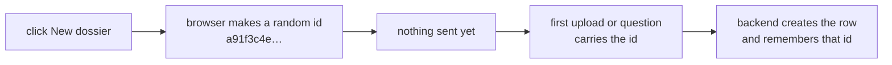

---

## Q10. Could someone guess my dossier id and read my filings?

**Short answer: no. Every lookup is scoped to the account making it.**

Two protections, both automatic:

1. **The conversation lookup** always includes `user_id`, which comes from your
   connection — not from anything the attacker can send. Their id would simply
   find nothing.
2. **The filings** are stored under a collection name that mixes in the account:

```python
def scoped_session_id(user_id: str, session_id: str) -> str:
    return f"{user_id}:{session_id}"
```

So even if someone sent your exact dossier id, the backend would look in
`<their-account>:<your-dossier-id>`, which is empty.

---

# What happens when you…

## Q11. …click "New dossier"?

**Short answer: nothing. Not on the socket, not in the database.**

This surprises people, so plainly:

- No event is sent over the socket.
- No row is created in the database.
- No collection is created in the vector store.
- The backend does not know the dossier exists.

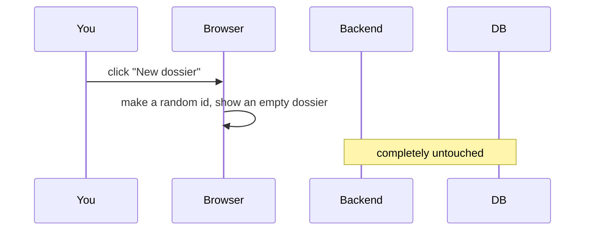

**Why is that good?** If you open five dossiers and only use one, four of them
never existed as far as the backend is concerned. There is nothing to clean up,
because nothing was created.

---

## Q12. …so when does the dossier actually get saved?

**Short answer: the first time you use it — whichever comes first, an upload or
a question.**

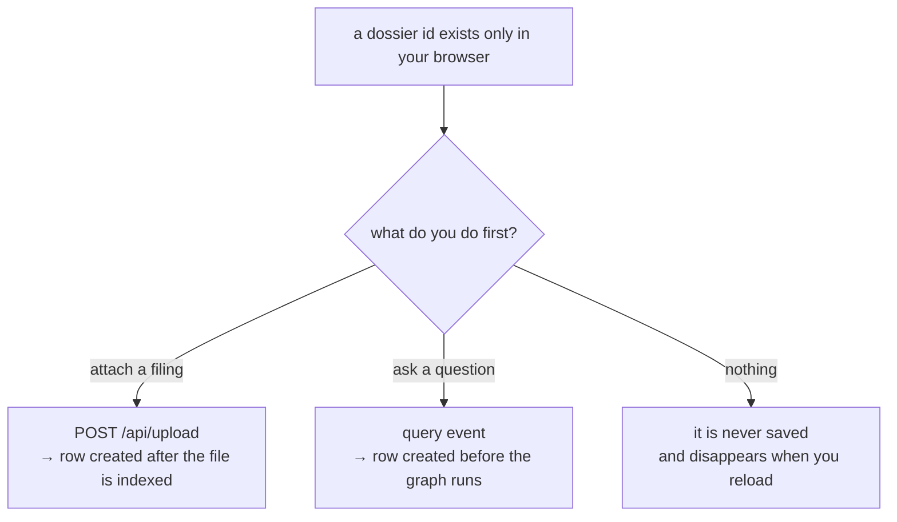

Both paths call the same function, which either finds the row or creates it:

```python
conversation = await self.find(session, user_id, client_id)
if conversation is not None:
    return conversation

conversation = Conversation(user_id=user_id, client_id=client_id, title=title.strip()[:200])
session.add(conversation)
await session.commit()
```

That is also the moment this appears in the log:

```
INFO  conversations.service  Opened conversation 0d2b… (user=6f1c…)
```

---

## Q13. …attach a filing?

**Short answer: it goes over a normal HTTP upload, not over the socket, and it
is indexed into that dossier's own private collection.**

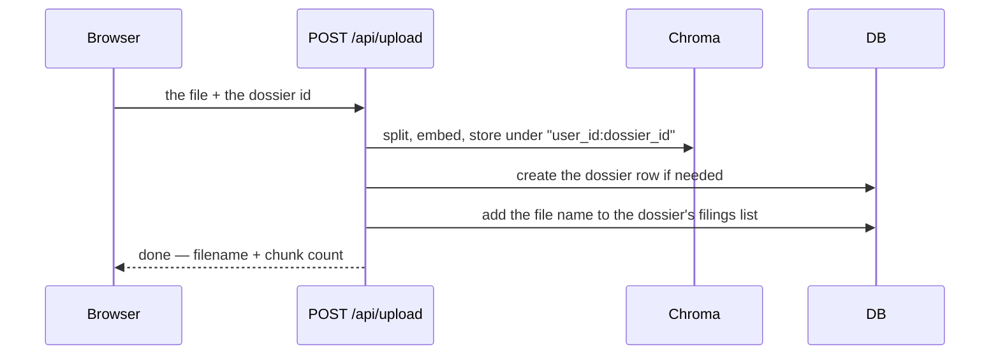

Why not over the socket? Because a 10-K PDF can be tens of megabytes, and
Socket.IO is built for many small messages, not one big one.

Each dossier gets its **own** collection, which is why a question in dossier A
can never accidentally read a filing you attached to dossier B.

---

## Q14. …click an old dossier?

**Short answer: one ordinary HTTP request for its messages. The socket is not
involved at all.**

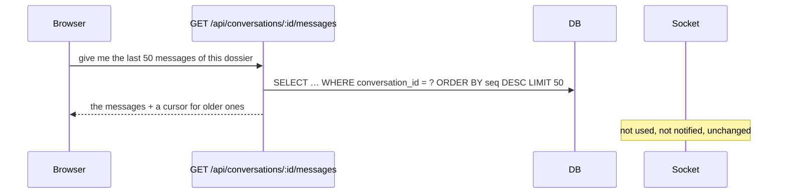

Details worth knowing:

- **Messages are fetched only when you open a dossier**, not when you sign in.
  If you have forty dossiers, signing in fetches the *list* of forty — not their
  contents.
- **Newest page first.** Opening a dossier should show the last thing said, not
  the first. "Load earlier runs" fetches the page before it.
- **This does not affect the model.** What you are reading on screen and what
  the model gets sent are two different things — see
  [Q16](#q16-ask-a-follow-up--how-is-the-history-found).

---

## Q15. …ask a new question in an old dossier?

**Short answer: exactly the same thing as asking in a new one. There is no
separate code path for "old".**

The backend cannot tell the difference, and does not try. The only thing that
differs is what it *finds*: an existing row instead of no row, and some history
instead of none.

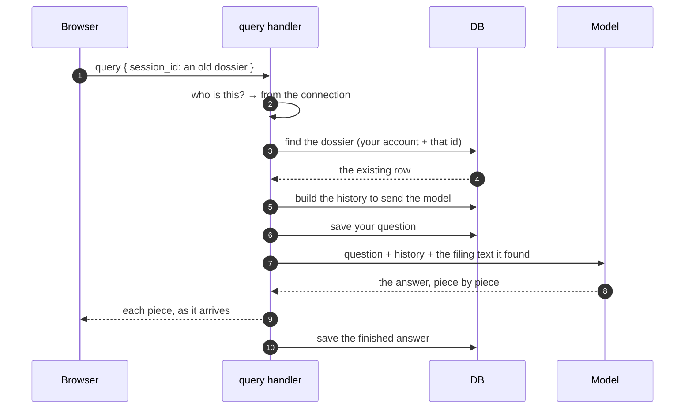

The filings are still there because nothing deleted them: the dossier's
collection is named after your account and that dossier, and it survives
restarts.

---

## Q16. …ask a follow-up — how is the history found?

**Short answer: the backend builds a small, fresh summary of the conversation
every single time you ask. It is never "loaded" once and kept.**

Two different "histories" exist, and mixing them up is the usual source of
confusion:

| | What you see on screen | What the model is sent |
| --- | --- | --- |
| contains | everything ever said, including failed runs | a summary + roughly the last 10 messages |
| when | when you open the dossier | rebuilt on **every** question |
| limited by | pages of 50 | a token budget (~1500) |

So scrolling back through a dossier changes nothing about what the model knows.

### How the small version is built

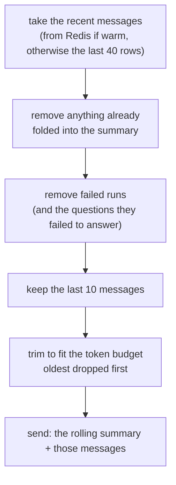

Each step exists for a reason:

| Step | Why |
| --- | --- |
| already summarised → drop | it is in the summary already; sending both wastes room |
| failed runs → drop | conditioning on an error message just teaches the model to apologise |
| last 10 | a prompt is a fixed size; a dossier is not |
| token budget | the summary's own length is subtracted first, so the total stays bounded |

### And the "rolling summary"?

Once a dossier grows past about 24 messages, a background task compresses the
older ones into a paragraph and records how far it got. That paragraph is then
sent instead of those messages.

It runs **after** an answer has been delivered, never before one — nobody
should wait for last week's history to be compressed.

The log line tells you exactly what a run was given:

```
Run 7c44… started: 'How did that compare…' (session=6f1c…:a91f3c…, history=8 msg/~1180 tokens)
```

Eight messages. Not three hundred.

---

## Q17. …delete a dossier?

**Short answer: it is removed from all three places it lived, and it is
permanent.**

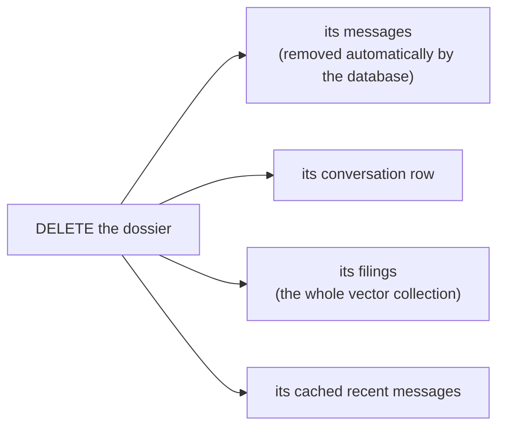

Messages disappear on their own because the database is told, at schema level,
that messages belong to a conversation — delete the parent and the children go
with it.

The order matters: history first, filings second. A conversation that kept its
messages but lost its filings would keep answering follow-ups about documents it
can no longer actually read.

If you delete a dossier while an answer is still streaming, the run finishes,
finds its conversation gone, and quietly writes nothing.

---

## Q18. …lose the connection while an answer is streaming?

**Short answer: the answer is still finished and still saved. You just stop
seeing it live.**

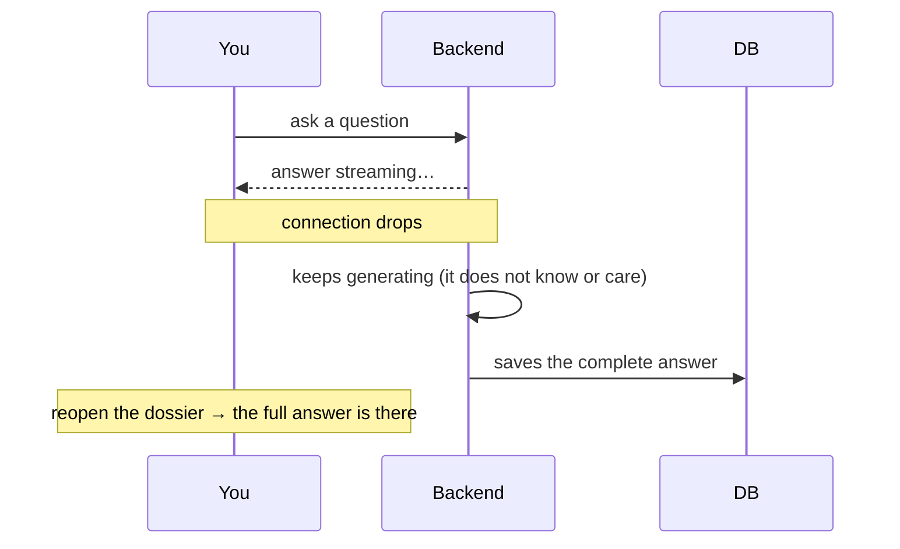

The run is **not** resumable. When you reconnect you get a brand-new connection,
and there is no way to reattach to a stream that was addressed to the old one.
Recovery is simply reading the saved answer — which is exactly what reopening
the dossier does.

---

## Q19. …sign out?

**Short answer: the connection closes and your refresh token is revoked.**

The backend has nothing to tidy up when a connection closes. Its entire
disconnect handler is:

```python
@sio.event
async def disconnect(sid: str) -> None:
    logger.info("Client disconnected: %s", sid)
```

One honest limitation: your short-lived access token stays technically valid
until it expires (about 15 minutes). Signing out stops new sessions being
created, but does not instantly invalidate a token already issued. This is the
trade-off that makes every other request cheap — no database lookup per request.

Your dossiers, messages and filings are untouched. Signing back in — anywhere —
brings them all back.

---

# About the database

## Q20. What exactly is saved for one question?

**Short answer: two rows. Your question, and the answer.**

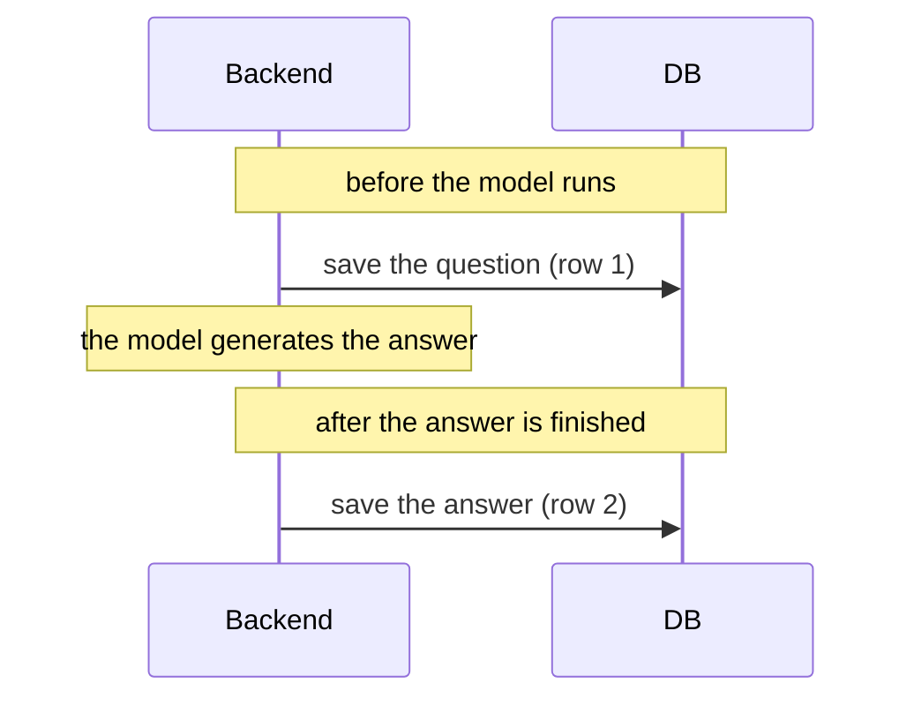

Row 1 (your question) records the text, which filings were attached, and which
run number it is. Row 2 (the answer) records the text, what kind of analysis
produced it, and an internal run id.

If the run fails, **both rows are still written** — the second one marked as an
error. You should be able to come back tomorrow and see that a question was
asked and did not land, rather than find it silently missing.

Two small details that matter:

- The two writes happen in **two separate short database sessions**, with the
  model's work in between. Holding one open across a minute-long answer would
  waste a database connection nobody else can use.
- Messages are numbered by position (1, 2, 3…), not by timestamp. Two messages
  written in the same millisecond would otherwise sort randomly.

---

## Q21. Is the whole conversation sent to the model every time?

**Short answer: no, and it never grows.**

A dossier can run to hundreds of messages. What the model receives stays about
the same size forever: a summary paragraph, plus roughly the last ten messages,
capped by a token budget. See [Q16](#q16-ask-a-follow-up--how-is-the-history-found).

---

## Q22. Does the database store the socket connection?

**Short answer: no. The connection id never appears in any table.**

The connection id lives only in memory, and changes every time you reconnect.
The only thing kept against it is your account id — and *that* is what every
database write is keyed by.

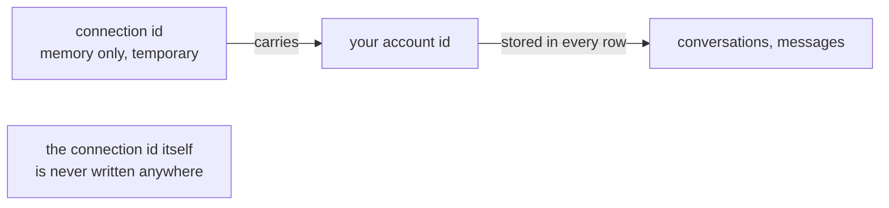

This is why refreshing the page mid-conversation loses nothing: what was saved
was tied to your account and the dossier, never to the connection.

---

## Q23. Do old dossiers slow things down?

**Short answer: no. Nothing about a dossier is loaded until you open it.**

- Signing in fetches the **list** of dossiers, not their messages.
- Opening one fetches its last 50 messages, and only then.
- Asking a question reads about 40 recent messages at most — often zero, if the
  recent ones are still cached.
- A very long dossier is compressed into a summary, so the model's input stops
  growing.

A dossier from six months ago costs nothing while you are not looking at it.

---

## If you remember only five things

1. **One socket, all dossiers.** The connection identifies *you*; each message
   names the dossier.
2. **Clicking *New dossier* contacts nothing.** The row appears on the first
   upload or the first question.
3. **Opening an old dossier is a plain HTTP read** and does not involve the
   socket in any way.
4. **History is rebuilt on every question** — a summary plus about ten recent
   messages — never loaded once and never unbounded.
5. **The database is the truth.** Drop the connection, close the tab, sign in on
   another machine: what was saved is still there.
