# The frontend, wired to the backend

How the browser half of the Corporate Filing Analyzer talks to the FastAPI +
LangGraph backend: the Socket.IO connection it opens, the one event it sends,
the seven it listens for, and — operation by operation — exactly what the
workbench does on the client for each.

This is the **client's** side of the wire. Its counterparts:

| Document | What it covers |
| --- | --- |
| [SOCKETIO.md](SOCKETIO.md) | Socket.IO itself — the protocol, the handshake, the server mount, deployment |
| [HOW-IT-WORKS.md](HOW-IT-WORKS.md) | The whole system end to end, including the graph, the ledger and the stores |
| **this file** | What the browser does, in `app.js` / `auth.js`, for every operation |

Everything below refers to four files:

- [`frontend/index.html`](../frontend/index.html) — the markup and the script order
- [`frontend/config.js`](../frontend/config.js) — where the backend is
- [`frontend/auth.js`](../frontend/auth.js) — tokens, the gate, `authFetch`
- [`frontend/app.js`](../frontend/app.js) — the socket, the ledger, the dossiers

---

## Contents

**The setup**
1. [The picture in one diagram](#1-the-picture-in-one-diagram)
2. [The files, and the order they load in](#2-the-files-and-the-order-they-load-in)
3. [Finding the backend: `BACKEND_URL`](#3-finding-the-backend-backend_url)
4. [The socket object, option by option](#4-the-socket-object-option-by-option)
5. [The lifecycle, as a state machine](#5-the-lifecycle-as-a-state-machine)

**Every operation**
- [Op 1 — Cold page load](#op-1--cold-page-load)
- [Op 2 — Signing in or signing up](#op-2--signing-in-or-signing-up)
- [Op 3 — Opening the connection](#op-3--opening-the-connection)
- [Op 4 — A refused handshake](#op-4--a-refused-handshake)
- [Op 5 — Restoring the dock](#op-5--restoring-the-dock)
- [Op 6 — Opening a stored dossier](#op-6--opening-a-stored-dossier)
- [Op 7 — Opening a new dossier](#op-7--opening-a-new-dossier)
- [Op 8 — Attaching a filing](#op-8--attaching-a-filing)
- [Op 9 — Asking a question](#op-9--asking-a-question)
- [Op 10 — Every inbound event](#op-10--every-inbound-event)
- [Op 11 — `liveTurn`, the staleness guard](#op-11--liveturn-the-staleness-guard)
- [Op 12 — Losing the connection mid-run](#op-12--losing-the-connection-mid-run)
- [Op 13 — Reconnecting](#op-13--reconnecting)
- [Op 14 — Discarding a dossier](#op-14--discarding-a-dossier)
- [Op 15 — Signing out](#op-15--signing-out)
- [Op 16 — The token lifecycle underneath](#op-16--the-token-lifecycle-underneath)

**Reference**
6. [The event contract](#6-the-event-contract)
7. [Client state shapes](#7-client-state-shapes)
8. [The busy lock](#8-the-busy-lock)
9. [Failure matrix](#9-failure-matrix)
10. [Adding a new event](#10-adding-a-new-event)
11. [Debugging from the browser](#11-debugging-from-the-browser)

---

## 1. The picture in one diagram

The workbench speaks to the backend over **two channels**, and which one it
uses is decided by one question: *does the response arrive all at once, or a
piece at a time?*

- **REST (`fetch`)** — auth, uploads, listing and paging the ledger, deleting.
  One request, one response. Always through `Auth.authFetch`, which attaches
  the access token and retries once on a 401.
- **Socket.IO** — asking a question. One `query` goes out, and the answer comes
  back as a stream of small events over a connection that stays open.

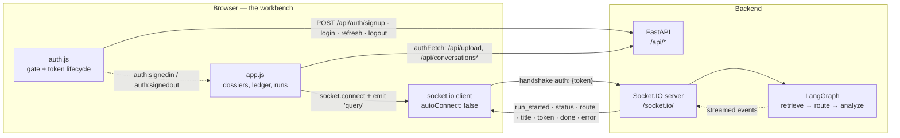
```mermaid
flowchart LR
  subgraph browser["Browser — the workbench"]
    gate["auth.js<br/>gate + token lifecycle"]
    app["app.js<br/>dossiers, ledger, runs"]
    sock["socket.io client<br/>autoConnect: false"]
  end

  subgraph server["Backend"]
    rest["FastAPI<br/>/api/*"]
    sio["Socket.IO server<br/>/socket.io/"]
    lg["LangGraph<br/>retrieve → route → analyze"]
  end

  gate -- "POST /api/auth/signup · login · refresh · logout" --> rest
  app  -- "authFetch: /api/upload, /api/conversations*" --> rest
  app  -- "socket.connect + emit 'query'" --> sock
  sock -- "handshake auth: {token}" --> sio
  sio  -- "run_started · status · route · title · token · done · error" --> sock
  sio  --> lg
  lg -. "streamed events" .-> sio
  gate -. "auth:signedin / auth:signedout" .-> app
```

The two files never call each other. `auth.js` announces `auth:signedin` and
`auth:signedout` as window events; `app.js` listens
([`app.js:1162`](../frontend/app.js#L1162)). That is the entire seam between
them, which is why either can be read on its own.

---

## 2. The files, and the order they load in

Scripts are plain `<script>` tags at the bottom of
[`index.html`](../frontend/index.html) — no bundler, no modules, no `defer`.
They therefore execute strictly in order:

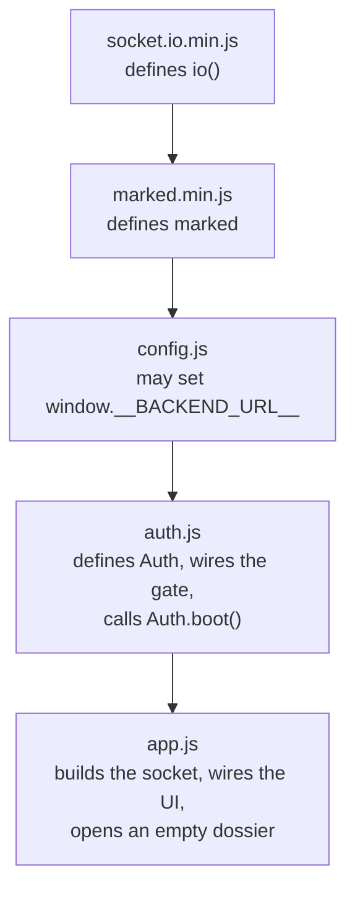
```mermaid
flowchart TD
  A["socket.io.min.js<br/>defines io()"] --> B["marked.min.js<br/>defines marked"]
  B --> C["config.js<br/>may set window.__BACKEND_URL__"]
  C --> D["auth.js<br/>defines Auth, wires the gate,<br/>calls Auth.boot()"]
  D --> E["app.js<br/>builds the socket, wires the UI,<br/>opens an empty dossier"]
```

| File | Owns | Must load before |
| --- | --- | --- |
| `socket.io.min.js` | the `io()` factory | `app.js` |
| `marked.min.js` | markdown → HTML for streamed answers | `app.js` |
| `config.js` | `window.__BACKEND_URL__` | `auth.js`, `app.js` |
| `auth.js` | `window.Auth`, the sign-in gate, the refresh timer | `app.js` |
| `app.js` | the socket, dossiers, runs, the ledger | — |

### The ordering subtlety worth knowing

`auth.js` ends by calling `Auth.boot()`
([`auth.js:233`](../frontend/auth.js#L233)). `boot` is `async`, but the body of
an async function runs synchronously up to its first `await`. So on a **cold
start with no stored session**, `announceOut()` fires *while `auth.js` is still
executing* — before `app.js` has been parsed, and therefore before its
`auth:signedout` listener exists.

That is harmless, and deliberately so:

- The gate's own listener is registered earlier in `auth.js`, so the gate goes up.
- `app.js` would have run `endSession()`, which leaves exactly the state its
  own init already produces: no socket (`autoConnect: false`), one empty
  dossier, cleared stage.

When there *is* a stored refresh token, `boot` awaits the refresh call, so the
`auth:signedin` event lands a network round trip later — long after `app.js`
has loaded and is listening.

---

## 3. Finding the backend: `BACKEND_URL`

Both `auth.js` and `app.js` resolve the backend origin independently, with the
same three-branch rule. They duplicate it on purpose: `auth.js` loads first and
must not depend on `app.js` having run.

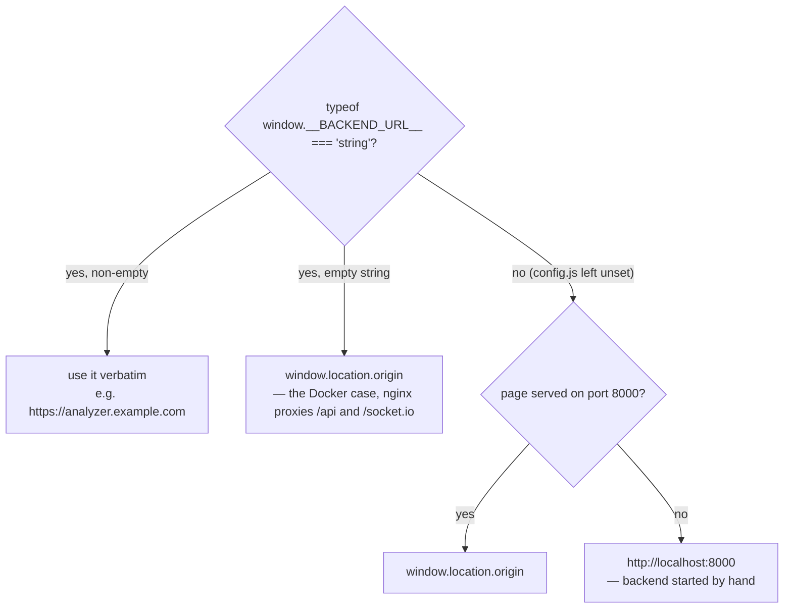
```mermaid
flowchart TD
  Q{"typeof window.__BACKEND_URL__ === 'string'?"}
  Q -- "yes, non-empty" --> ABS["use it verbatim<br/>e.g. https://analyzer.example.com"]
  Q -- "yes, empty string" --> ORIGIN["window.location.origin<br/>— the Docker case, nginx proxies /api and /socket.io"]
  Q -- "no (config.js left unset)" --> P{"page served on port 8000?"}
  P -- yes --> ORIGIN2["window.location.origin"]
  P -- no --> LOCAL["http://localhost:8000<br/>— backend started by hand"]
```

| Deployment | `config.js` | `BACKEND_URL` becomes | CORS? |
| --- | --- | --- | --- |
| Dev, page on a static server | unset | `http://localhost:8000` | cross-origin — handled by `CORSMiddleware` and `cors_allowed_origins` |
| Dev, page served by uvicorn | unset | same origin | none |
| Docker | `config.docker.js` sets `""` | same origin | none — [`nginx.conf`](../frontend/nginx.conf) proxies `/api/` and `/socket.io/` |

The Socket.IO client appends its own `/socket.io/` path to whatever
`BACKEND_URL` resolves to, which is why the nginx `location /socket.io/` block
(with `Upgrade`/`Connection` headers and `proxy_buffering off`) is what keeps
the transport on a real websocket instead of silently degrading to polling.

---

## 4. The socket object, option by option

[`app.js:126`](../frontend/app.js#L126):

```js
const socket = io(BACKEND_URL, {
  transports: ["websocket", "polling"],
  reconnectionAttempts: 20,
  reconnectionDelay: 1500,
  autoConnect: false,
  auth: (cb) => cb({ token: Auth.accessToken }),
});
```

| Option | Value | Why |
| --- | --- | --- |
| `transports` | websocket first, polling second | A streamed answer over long-polling arrives in stutters. Polling stays as the fallback for proxies that will not upgrade. |
| `reconnectionAttempts` | `20` | With a 1.5 s base delay, backoff and the client's 5 s ceiling, about a minute and a half of trying before it gives up and the analyst must reload. |
| `reconnectionDelay` | `1500` | Base delay; the client backs off from there. |
| `autoConnect` | `false` | **The important one.** The backend refuses a handshake without a valid access token, so there is nothing to connect for until sign-in. `startSession()` calls `socket.connect()`. |
| `auth` | a **callback**, not an object | The callback is invoked on *every* attempt, including reconnections. A socket that drops and comes back an hour later hands over the token current at that moment — not the expired one it first opened with. |

That last row is the difference between a session that survives a laptop lid
and one that does not. `auth: { token: Auth.accessToken }` would freeze the
token at page load.

---

## 5. The lifecycle, as a state machine

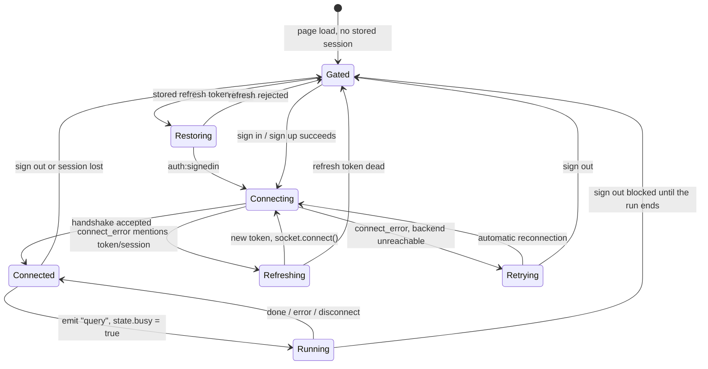
```mermaid
stateDiagram-v2
  [*] --> Gated: page load, no stored session

  Gated --> Restoring: stored refresh token found
  Restoring --> Gated: refresh rejected
  Restoring --> Connecting: auth:signedin

  Gated --> Connecting: sign in / sign up succeeds

  Connecting --> Connected: handshake accepted
  Connecting --> Refreshing: connect_error mentions token/session
  Connecting --> Retrying: connect_error, backend unreachable
  Refreshing --> Connecting: new token, socket.connect()
  Refreshing --> Gated: refresh token dead
  Retrying --> Connecting: automatic reconnection
  Retrying --> Gated: sign out

  Connected --> Running: emit "query", state.busy = true
  Running --> Connected: done / error / disconnect
  Connected --> Gated: sign out or session lost
  Running --> Gated: sign out blocked until the run ends
```

Two flags carry most of this on the client:

- `state.busy` — a run is on the wire; the composer, attaching, dossier
  switching and sign-out are all locked.
- `offline` ([`app.js:139`](../frontend/app.js#L139)) — the last connection
  attempt failed, so the "can't reach the analyzer" toast is not repeated on
  each of the twenty retries.

---

# Every operation

## Op 1 — Cold page load

**Trigger:** the analyst opens the page.
**Channel:** REST only. No socket yet.

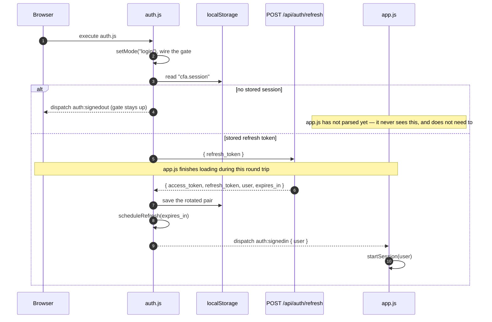
```mermaid
sequenceDiagram
  autonumber
  participant B as Browser
  participant A as auth.js
  participant LS as localStorage
  participant API as POST /api/auth/refresh
  participant App as app.js

  B->>A: execute auth.js
  A->>A: setMode("login"), wire the gate
  A->>LS: read "cfa.session"
  alt no stored session
    A-->>B: dispatch auth:signedout (gate stays up)
    Note over App: app.js has not parsed yet — it never sees this, and does not need to
  else stored refresh token
    A->>API: { refresh_token }
    Note over B,App: app.js finishes loading during this round trip
    API-->>A: { access_token, refresh_token, user, expires_in }
    A->>LS: save the rotated pair
    A->>A: scheduleRefresh(expires_in)
    A-->>App: dispatch auth:signedin { user }
    App->>App: startSession(user)
  end
```

**What the frontend does, in order:**

1. `Auth.boot()` reads `cfa.session` from `localStorage`.
2. The **stored access token is never trusted on its own** — it may have
   expired while the tab was closed. The refresh token is spent instead, which
   doubles as proof the session is still good.
3. `save()` stores the rotated pair and arms the refresh timer.
4. `announceIn()` → `app.js` runs `startSession(user)` (see [Op 3](#op-3--opening-the-connection)).
5. Meanwhile `app.js`'s own last two lines have already run: `newDossier()`
   (which renders the dock, the filing register and the dossier stamp) and
   `autoGrow()`.

---

## Op 2 — Signing in or signing up

**Trigger:** the gate form is submitted ([`auth.js:340`](../frontend/auth.js#L340)).
**Channel:** REST.

**Frontend steps:**

1. `event.preventDefault()`; bail if a submit is already in flight (`busy`).
2. Read `email`, `password`, and `name` when in signup mode.
3. Client-side check, signup only: password ≥ 8 characters — the one rule
   checked here so the analyst is not made to wait for a round trip to hear it.
4. `setBusy(true)` — disables the submit button, swaps its label to
   `SIGNING IN…` / `CREATING…`.
5. `Auth.login()` or `Auth.signup()` → `post()` to `/api/auth/login` or
   `/api/auth/signup`.
6. On success: `save(pair)` → `localStorage` + refresh timer → `announceIn()`,
   then `form.reset()`.
7. On failure: `readError()` turns FastAPI's response into one sentence —
   a string `detail`, or the first entry of a validation-error list with its
   field name. A `TypeError` from `fetch` means the request never reached the
   backend at all, and is reported as such ("Can't reach the analyzer") rather
   than as a credentials problem.
8. `finally` → `setBusy(false)`.

The gate hides itself on `auth:signedin` and re-shows on `auth:signedout`
([`auth.js:376`](../frontend/auth.js#L376)), toggling `body.is-locked`. Nothing
behind the gate is reachable until then — the socket is not connected and no
filing can be staged.

---

## Op 3 — Opening the connection

**Trigger:** `auth:signedin` → `startSession(user)`
([`app.js:1108`](../frontend/app.js#L1108)).
**Channel:** Socket.IO handshake, then REST for the dock.

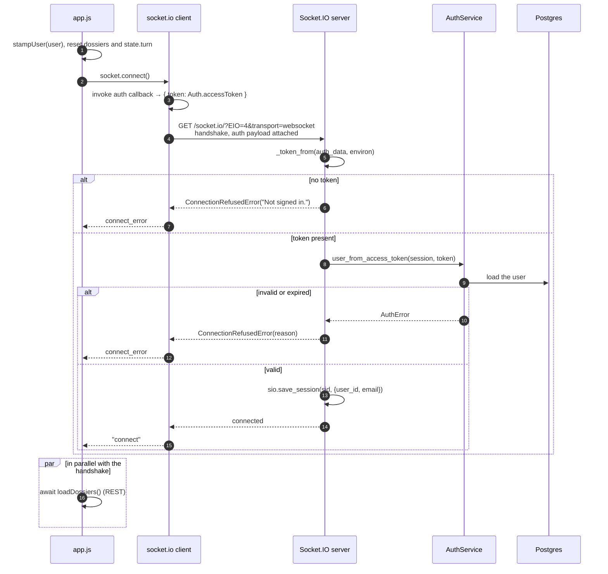
```mermaid
sequenceDiagram
  autonumber
  participant App as app.js
  participant S as socket.io client
  participant SIO as Socket.IO server
  participant Auth as AuthService
  participant DB as Postgres

  App->>App: stampUser(user), reset dossiers and state.turn
  App->>S: socket.connect()
  S->>S: invoke auth callback → { token: Auth.accessToken }
  S->>SIO: GET /socket.io/?EIO=4&transport=websocket<br/>handshake, auth payload attached
  SIO->>SIO: _token_from(auth_data, environ)
  alt no token
    SIO-->>S: ConnectionRefusedError("Not signed in.")
    S-->>App: connect_error
  else token present
    SIO->>Auth: user_from_access_token(session, token)
    Auth->>DB: load the user
    alt invalid or expired
      Auth-->>SIO: AuthError
      SIO-->>S: ConnectionRefusedError(reason)
      S-->>App: connect_error
    else valid
      SIO->>SIO: sio.save_session(sid, {user_id, email})
      SIO-->>S: connected
      S-->>App: "connect"
    end
  end

  par in parallel with the handshake
    App->>App: await loadDossiers()  (REST)
  end
```

**Frontend steps in `startSession`:**

1. `stampUser(user)` — the initial, name and email on the dock.
2. Reset `state.dossiers = []` and `state.turn = null`.
3. **`socket.connect()` first**, before listing dossiers. The connection does
   not depend on the ledger, and a dossier list that fails to load should not
   stop the analyst asking a question.
4. `await loadDossiers()` — see [Op 5](#op-5--restoring-the-dock).
5. **Re-check `Auth.isSignedIn` after the await.** A sign-out (or a second
   sign-in) can land while the list is in flight; whatever happened last is
   what should be on the stage.
6. Open the most recent dossier, or `newDossier()` if the account has none.
7. `userInput.focus()`.

The `connect` handler itself ([`app.js:141`](../frontend/app.js#L141)) is
deliberately quiet: it toasts *"Reconnected"* only if `offline` was set, then
clears the flag. A connection that works is not news.

**What the backend holds after the handshake:** `{user_id, email}` against the
`sid`. Every later `query` on that connection is answered for that account and
reads only that account's filings — the browser never sends a user id, and
could not be believed if it did.

---

## Op 4 — A refused handshake

**Trigger:** `connect_error` ([`app.js:162`](../frontend/app.js#L162)).

A handshake fails in two ways that need opposite responses. Retrying an expired
token just gets refused twenty more times; retrying an unreachable backend is
exactly right.

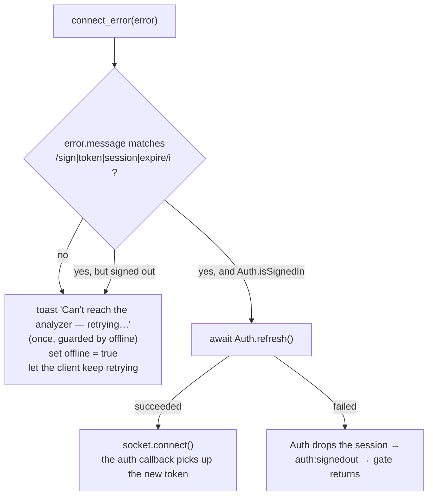
```mermaid
flowchart TD
  E["connect_error(error)"] --> M{"error.message matches<br/>/sign|token|session|expire/i ?"}
  M -- no --> T["toast 'Can't reach the analyzer — retrying…'<br/>(once, guarded by offline)<br/>set offline = true<br/>let the client keep retrying"]
  M -- "yes, and Auth.isSignedIn" --> R["await Auth.refresh()"]
  M -- "yes, but signed out" --> T
  R -- succeeded --> C["socket.connect()<br/>the auth callback picks up the new token"]
  R -- failed --> G["Auth drops the session →<br/>auth:signedout → gate returns"]
```

**Frontend steps:**

1. Test the server's refusal message against `/sign|token|session|expire/i`.
   The backend's refusals read *"Not signed in."*, *"Your session expired"*,
   *"Invalid token"* — all matched.
2. If it looks like a credentials problem **and** the client still believes it
   is signed in: refresh once, then `socket.connect()` again. The `auth`
   callback picks up the new token automatically.
3. If the refresh fails, do nothing more — `Auth` has already cleared the
   session and raised `auth:signedout`, which puts the gate back up. That is
   the only thing left that helps.
4. Otherwise: one toast, `offline = true`, and let the client's own twenty
   reconnection attempts run.

---

## Op 5 — Restoring the dock

**Trigger:** `startSession` → `loadDossiers()`
([`app.js:301`](../frontend/app.js#L301)).
**Channel:** REST — `GET /api/conversations`.

**Frontend steps:**

1. `Auth.authFetch("/api/conversations")` — token attached, one 401 retry.
2. For each row, build a client dossier object:

| Row field | Becomes | Note |
| --- | --- | --- |
| `id` | `dossier.id` | the **client id** the browser minted originally, not the DB primary key |
| `title` | `dossier.title` | the name the analyzer gave it |
| `filings[]` | `dossier.indexed` | the filing register in the dock |
| `message_count` | `dossier.runNo = ceil(count / 2)` | an estimate — a run is a question plus an answer. Replaced by the real numbering when the dossier is opened |
| `message_count === 0` | `dossier.loaded = true` | an empty dossier has nothing to fetch |

3. Rows arrive most-recently-spoken-in first, so `state.dossiers[0]` is what
   goes on the stage.
4. **Messages are not fetched here.** An analyst with forty dossiers should not
   wait for the thirty-nine they are not going to open.
5. If the call fails, `startSession` catches it, toasts, and carries on with an
   empty dossier — the socket is already connected and questions still work.

---

## Op 6 — Opening a stored dossier

**Trigger:** clicking a dossier row in the dock → `openDossier(dossier)`
([`app.js:877`](../frontend/app.js#L877)).
**Channel:** REST — `GET /api/conversations/{id}/messages`.

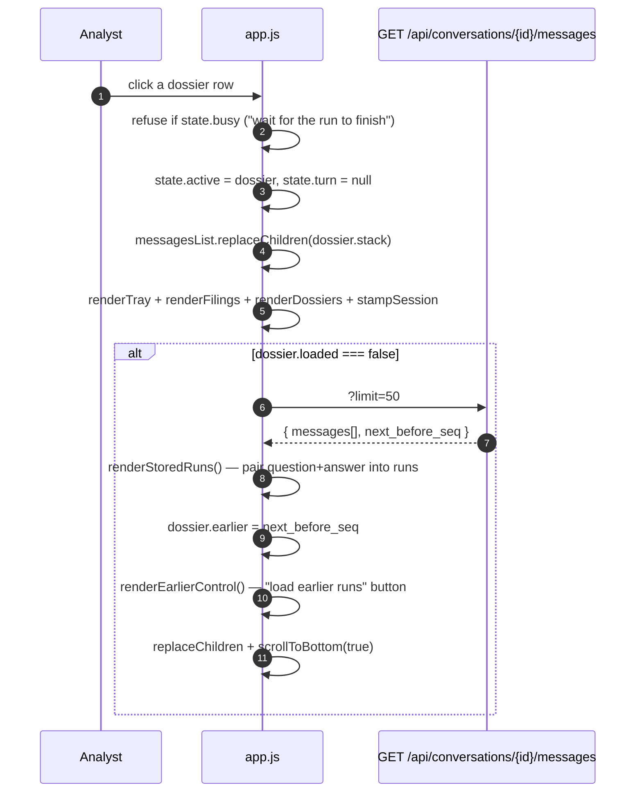
```mermaid
sequenceDiagram
  autonumber
  participant U as Analyst
  participant App as app.js
  participant API as GET /api/conversations/{id}/messages

  U->>App: click a dossier row
  App->>App: refuse if state.busy ("wait for the run to finish")
  App->>App: state.active = dossier, state.turn = null
  App->>App: messagesList.replaceChildren(dossier.stack)
  App->>App: renderTray + renderFilings + renderDossiers + stampSession
  alt dossier.loaded === false
    App->>API: ?limit=50
    API-->>App: { messages[], next_before_seq }
    App->>App: renderStoredRuns() — pair question+answer into runs
    App->>App: dossier.earlier = next_before_seq
    App->>App: renderEarlierControl() — "load earlier runs" button
    App->>App: replaceChildren + scrollToBottom(true)
  end
```

**Frontend steps in `openDossier`:**

1. `state.active = dossier`.
2. **`state.turn = null`** — any run still on the wire belongs to the dossier
   being left. `liveTurn` will now drop everything it sends back
   (see [Op 11](#op-11--liveturn-the-staleness-guard)).
3. `messagesList.replaceChildren(dossier.stack)` — each dossier owns its own
   detached `.run-stack` element, so ledger entries are **moved, not rebuilt**.
   A dossier comes back exactly as it was left, down to the faults recorded on
   individual runs.
4. Redraw the tray (staged filings), the filing register, the dock and the
   dossier stamp.
5. If `!dossier.loaded`, call `hydrateDossier(dossier)`.

**Frontend steps in `hydrateDossier`**
([`app.js:328`](../frontend/app.js#L328)):

1. Guard on `dossier.loading` so two clicks do not fetch twice; set it and
   re-render the dock so the row shows its loading state.
2. Build `?limit=50`, plus `&before_seq=<cursor>` when paging backwards.
3. `404` → the dossier was discarded from another tab. Mark it `loaded` and
   stop; nothing is wrong.
4. `renderStoredRuns()` walks the page in order: a `user` message opens a run,
   the `assistant` message that follows closes it. Pages arrive aligned to
   whole runs, so the walk never splits a pair. An orphaned answer is shown on
   its own rather than dropped.
5. Run numbering is taken from `meta.run` on the stored questions, so the next
   question continues the numbering instead of restarting it.
6. `next_before_seq` is stored as `dossier.earlier`; when it is non-null a
   `load earlier runs` button is prepended, which calls `hydrateDossier` again
   with the cursor and **prepends** the new page.
7. On failure: `loaded = true` anyway, so it does not retry on every open, plus
   a toast. The dossier opens empty and asking a question still works — the run
   is appended to whatever the backend already has, which is the record that
   matters.

---

## Op 7 — Opening a new dossier

**Trigger:** the *New dossier* button → `newDossier()`
([`app.js:899`](../frontend/app.js#L899)).
**Channel:** none. This operation touches no network at all.

**Frontend steps:**

1. Refuse if `state.busy`.
2. `makeDossier()` mints a client id with `crypto.randomUUID()` (dashes
   stripped) and creates a detached `.run-stack` element.
3. Push it onto `state.dossiers` and `openDossier()` it.
4. Close the dock on mobile, toast *"New dossier opened"*.

**The row on the backend does not exist yet.** It is created lazily by
`open_conversation()` on whichever comes first: the first `POST /api/upload`
carrying this `session_id`, or the first `query` event. That is why an analyst
can open five dossiers, use one, and leave four that never reach the database.

The dossiers already open stay open, filings and all — a new one simply starts
empty alongside them.

---

## Op 8 — Attaching a filing

**Trigger:** the attach button, a paste with files, or a drop anywhere on the window.
**Channel:** REST — `POST /api/upload` (multipart). **Not** the socket.

Uploads go over HTTP because a 10-K PDF is tens of megabytes and Socket.IO is
built for many small messages, not one large one. `nginx.conf` raises
`client_max_body_size` to 64m and the read timeout to 300s for exactly this.

### Staging (`stageFiles`, [`app.js:576`](../frontend/app.js#L576))

1. Refuse while `state.busy` — a filing rides along with a question, and there
   is nowhere to put one while a run is already on the wire.
2. Filter by extension against `.pdf`, `.txt`, `.md`, `.csv`; each rejection
   gets its own toast naming the file.
3. Push `{id, file, name, size, status: "staged"}` onto
   `state.active.pending` — the **active dossier's** tray, not a global one.
4. `renderTray()` draws a chip per file, then focus returns to the composer.

Chip states: `staged` (shows the file size) → `uploading` (shows "adding" and a
spinner, and the remove button disappears) → `done` ("ready") or `error`
("failed").

### Sending (`uploadPending`, [`app.js:639`](../frontend/app.js#L639))

Called from `submitQuery`, **before** the `query` event is emitted, so the same
run can read what it just attached.

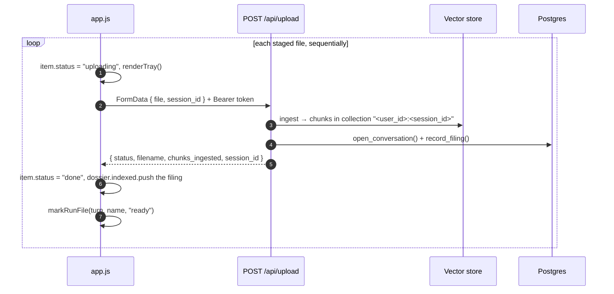
```mermaid
sequenceDiagram
  autonumber
  participant App as app.js
  participant API as POST /api/upload
  participant V as Vector store
  participant DB as Postgres

  loop each staged file, sequentially
    App->>App: item.status = "uploading", renderTray()
    App->>API: FormData { file, session_id } + Bearer token
    API->>V: ingest → chunks in collection "<user_id>:<session_id>"
    API->>DB: open_conversation() + record_filing()
    API-->>App: { status, filename, chunks_ingested, session_id }
    App->>App: item.status = "done", dossier.indexed.push the filing
    App->>App: markRunFile(turn, name, "ready")
  end
```

**Frontend steps per file:**

1. Resolve the target dossier from `turn.sessionId` — **not** `state.active`.
   A run uploads into the dossier it was opened in, even if the analyst has
   since moved on. Every UI redraw is guarded with
   `if (dossier === state.active)`.
2. Build `FormData` with the file and the `session_id`.
3. `Auth.authFetch("/api/upload", {method: "POST", body: formData})` — the token
   is attached and, if it has just expired, refreshed and the upload **replayed**
   rather than lost.
4. Parse the body with `.catch(() => ({}))`. A failure can arrive as a proxy's
   HTML error page, and parsing that would replace the real reason with a
   parser error.
5. On success: mark the chip `done`, push the filing into `dossier.indexed`
   (the dock register), and flip the file's badge on the run itself to "ready".
6. On failure: mark the chip and the run badge `failed`, write a fault line into
   the run, and toast. A `TypeError` is reported as "the analyzer is not
   reachable"; and the file name is only repeated if the backend's own message
   did not already include it, so the analyst reads one sentence rather than two.
7. Files upload **sequentially**, not in parallel — embedding is the slow part
   and firing five at once at a local model helps no one.
8. `uploadPending` returns `false` if any file failed, and `submitQuery` then
   abandons the run without emitting: a question whose filing did not land
   would be answered from nothing.

---

## Op 9 — Asking a question

**Trigger:** Enter (without Shift), the RUN button, or an opening card.
**Channel:** REST for any staged filings, then Socket.IO for the question.

This is the one operation that uses the socket.

### The full round trip

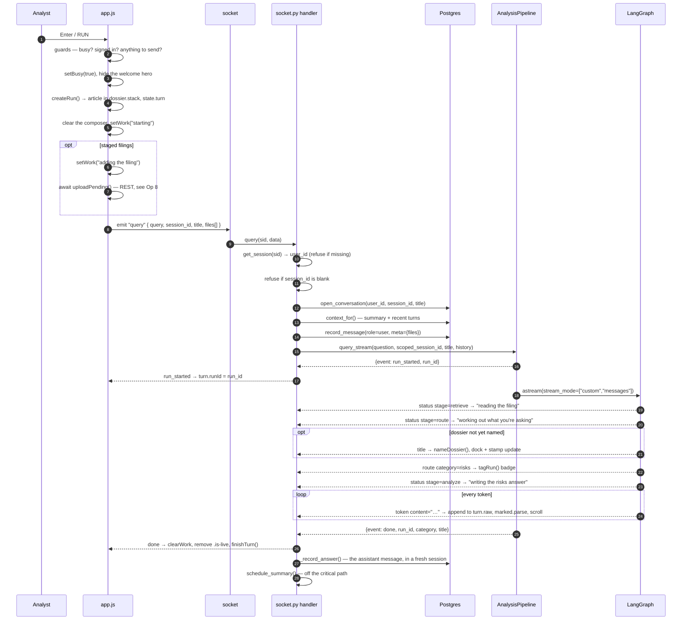
```mermaid
sequenceDiagram
  autonumber
  participant U as Analyst
  participant App as app.js
  participant S as socket
  participant H as socket.py handler
  participant DB as Postgres
  participant P as AnalysisPipeline
  participant G as LangGraph

  U->>App: Enter / RUN
  App->>App: guards — busy? signed in? anything to send?
  App->>App: setBusy(true), hide the welcome hero
  App->>App: createRun() → article in dossier.stack, state.turn
  App->>App: clear the composer, setWork("starting")

  opt staged filings
    App->>App: setWork("adding the filing")
    App->>App: await uploadPending() — REST, see Op 8
  end

  App->>S: emit "query" { query, session_id, title, files[] }
  S->>H: query(sid, data)
  H->>H: get_session(sid) → user_id  (refuse if missing)
  H->>H: refuse if session_id is blank
  H->>DB: open_conversation(user_id, session_id, title)
  H->>DB: context_for() — summary + recent turns
  H->>DB: record_message(role=user, meta={files})
  H->>P: query_stream(question, scoped_session_id, title, history)

  P-->>H: {event: run_started, run_id}
  H-->>App: run_started            → turn.runId = run_id
  P->>G: astream(stream_mode=["custom","messages"])
  G-->>H: status stage=retrieve    → "reading the filing"
  G-->>H: status stage=route       → "working out what you're asking"
  opt dossier not yet named
    G-->>H: title                  → nameDossier(), dock + stamp update
  end
  G-->>H: route category=risks     → tagRun() badge
  G-->>H: status stage=analyze     → "writing the risks answer"
  loop every token
    G-->>H: token content="…"      → append to turn.raw, marked.parse, scroll
  end
  P-->>H: {event: done, run_id, category, title}
  H-->>App: done                   → clearWork, remove .is-live, finishTurn()
  H->>DB: _record_answer() — the assistant message, in a fresh session
  H->>H: schedule_summary() — off the critical path
```

### Frontend steps in `submitQuery` ([`app.js:504`](../frontend/app.js#L504))

1. **Return immediately if `state.busy`.** One run at a time per browser;
   `state.turn` is a single slot, not a map.
2. **Return if `!Auth.isSignedIn`** with a toast. The gate may have gone up
   between opening the page and asking.
3. Read the text — from `overrideText` when an opening card was clicked,
   otherwise from the composer — and snapshot `dossier.pending`.
4. If there is neither text nor a file, just focus the composer and stop.
5. Hide the welcome hero; `setBusy(true)` disables the composer, the send
   button and the attach button, and sets `body.is-busy`.
6. `createRun()` builds the run article, appends it to **this dossier's** stack,
   and returns the `turn` object — which captures `sessionId: dossier.id` for
   its whole life.
7. Clear the composer (only when the text came from it) and reset its height.
8. Upload any staged filings; abandon the run if that fails.
9. `socket.emit("query", {...})`, then `scrollToBottom(true)` to re-arm
   auto-follow.

### The emitted payload

```js
socket.emit("query", {
  query:      text,                    // may be "" if only a file was attached
  session_id: turn.sessionId,          // the dossier, NOT state.active.id
  title:      dossier.title,           // "" until the analyzer names it
  files:      files.map((f) => f.name),// recorded with the question
});
```

| Field | Why the backend needs it |
| --- | --- |
| `query` | The question. Empty is allowed — the handler substitutes `FALLBACK_QUERY` ("Provide an executive summary…") so the router still has something to classify. |
| `session_id` | Scopes retrieval to this dossier's filings and names the conversation the run is written into. **Refused if blank** — a query with no dossier has no filings it is entitled to read. |
| `title` | Sending the name the dossier already has is what stops the analyzer renaming it on every run. The stored name still wins server-side, so a stale client cannot force a rename. |
| `files` | Recorded in the question's `meta`, so a reopened dossier still shows which filings a run was asked against. Capped at 20 server-side. |

Everything is keyed off `turn.sessionId` rather than the live dossier: a run
uploads into, and asks of, the dossier it was opened in — never another.

### What the backend does with the identity

Nothing in the payload identifies the analyst. The handler reads `user_id` off
the socket session saved at handshake, and the pipeline is called with
`scoped_session_id(user_id, session_id)` — `"<user_id>:<client_id>"`. Two
accounts that somehow minted the same client id still get two different vector
collections. The events that come back carry the **client's** id, not the
scoped one; how it is namespaced on the backend is not the browser's business.

---

## Op 10 — Every inbound event

Seven application events plus three transport ones. Each application handler
starts by asking `liveTurn(data)` whether the event is still relevant.

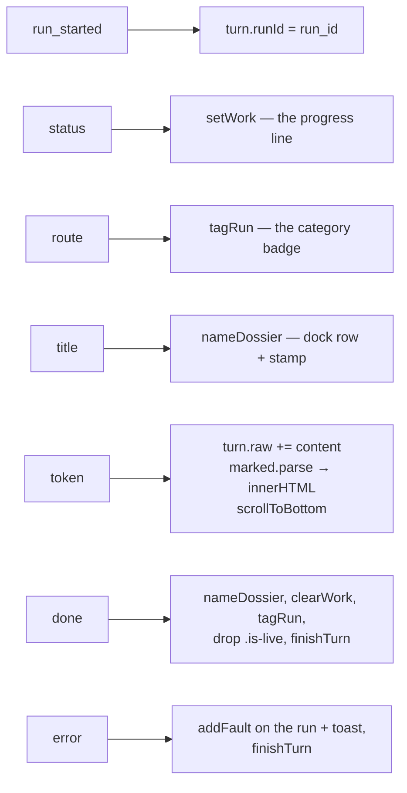
```mermaid
flowchart LR
  RS["run_started"] --> A1["turn.runId = run_id"]
  ST["status"] --> A2["setWork — the progress line"]
  RT["route"] --> A3["tagRun — the category badge"]
  TI["title"] --> A4["nameDossier — dock row + stamp"]
  TK["token"] --> A5["turn.raw += content<br/>marked.parse → innerHTML<br/>scrollToBottom"]
  DN["done"] --> A6["nameDossier, clearWork, tagRun,<br/>drop .is-live, finishTurn"]
  ER["error"] --> A7["addFault on the run + toast,<br/>finishTurn"]
```

### `run_started`

```json
{ "run_id": "8f3c…", "session_id": "a1b2…" }
```

Stores `turn.runId`. Nothing on screen changes — the id is kept so a run on the
analyst's screen can be matched to the backend's log lines
(`Run 8f3c… started: …`) when something needs explaining.

### `status`

```json
{ "stage": "retrieve" | "route" | "analyze", "category": "risks", "session_id": "…" }
```

The one place graph vocabulary is translated into the analyst's
([`app.js:205`](../frontend/app.js#L205)):

| `stage` | Shown in the run's work line |
| --- | --- |
| `retrieve` | "reading the filing" |
| `route` | "working out what you're asking" |
| `analyze` | "writing the *&lt;category&gt;* answer" — via `labelOf(data.category)` |

The pipeline behind an answer is deliberately not surfaced beyond this. No node
names, no chunk counts, no thread ids.

### `route`

```json
{ "category": "risks", "session_id": "…" }
```

`tagRun()` looks the id up in the `CATEGORIES` table, un-hides the run badge,
and sets its label and `data-tone` (which the stylesheet colours). An unknown
id is ignored rather than rendered raw.

The eight categories: `financials`, `compliance`, `risks`, `shareholding`,
`governance`, `mda`, `summary`, `qa`.

### `title`

```json
{ "title": "FY2024 Risk Review", "session_id": "…" }
```

Emitted **only on the first question in a dossier** — the router names the
dossier alongside classifying it, and only when the incoming `title` was blank.

`nameDossier()` ([`app.js:232`](../frontend/app.js#L232)) is keyed off
`data.session_id`, **not** the dossier on screen: the name belongs to the
dossier the run was opened in, whichever one the analyst happens to be looking
at when it lands. It re-renders the dock, and updates the stage's stamp only if
that dossier is the active one.

### `token`

```json
{ "content": "The filing discloses ", "session_id": "…" }
```

The hot path — dozens to thousands per answer
([`app.js:241`](../frontend/app.js#L241)):

1. `clearWork(turn)` — the first token replaces the progress line.
2. `turn.raw += data.content` — **the raw markdown is accumulated**, and the
   whole of it re-parsed each time. Parsing per token would break on
   half-finished syntax (an unclosed `**`, a table mid-row).
3. `turn.body.innerHTML = marked.parse(turn.raw)`, with `escapeHtml` as the
   fallback if `marked` failed to load.
4. `classList.add("streaming")` — the caret the stylesheet animates.
5. `scrollToBottom()` — *soft*: it only moves if the analyst is still parked at
   the bottom (see [`stickToBottom`](../frontend/app.js#L1025)). Scrolling up
   mid-run detaches the view; tokens keep arriving without yanking it back.

A dossier with no filings attached also arrives as a `token` — the `no_filing`
node emits the "attach a filing and ask again" message on the same stream, so
the client needs no special case for it.

### `done`

```json
{ "run_id": "8f3c…", "category": "risks", "title": "FY2024 Risk Review", "session_id": "…" }
```

1. **`nameDossier(data)` runs before the staleness check** — a name is worth
   keeping even when it belongs to a dossier the analyst has already left.
2. Then `liveTurn`; a stale `done` must return here rather than fall through,
   or it would end whichever run is live *now*.
3. `clearWork`, drop the `streaming` class.
4. If nothing streamed, write *"No answer came back for this question."* into
   the body so the run is never left blank.
5. `tagRun()` again — belt and braces, so a run whose `route` was missed still
   carries its tag.
6. Remove `is-live` from the article and call `finishTurn()`, which clears
   `state.turn` and releases the busy lock.

### `error`

```json
{ "message": "…", "session_id": "…" }
```

Sent for: a missing socket session, a blank `session_id`, a ledger that could
not be opened, or an exception raised mid-stream. The frontend clears the work
line, drops `streaming` and `is-live`, appends a `.fault` line **to the run
itself**, toasts, and finishes the turn.

The fault goes on the run and not only in a toast because a toast says it once
and leaves; the ledger has to still explain the failure when the analyst scrolls
back to it tomorrow. The backend records the failed turn too, marked
`status: "error"`, and `fillStoredAnswer` redraws it as the same fault line.

### The three transport events

| Event | Frontend response |
| --- | --- |
| `connect` | Toast *"Reconnected"* only if `offline` was set; clear the flag. |
| `disconnect` | If a run was live: drop `is-live`, toast *"Connection lost — the run was interrupted"*, `finishTurn()` — see [Op 12](#op-12--losing-the-connection-mid-run). |
| `connect_error` | The two-branch decision in [Op 4](#op-4--a-refused-handshake). |

---

## Op 11 — `liveTurn`, the staleness guard

Every application handler passes its payload through
[`liveTurn`](../frontend/app.js#L192) first:

```js
function liveTurn(data) {
  const turn = state.turn;
  if (!turn || turn.sessionId !== state.active.id) return null;
  if (data?.session_id && data.session_id !== state.active.id) return null;
  return turn;
}
```

Two keys must agree before an event may write to the screen:

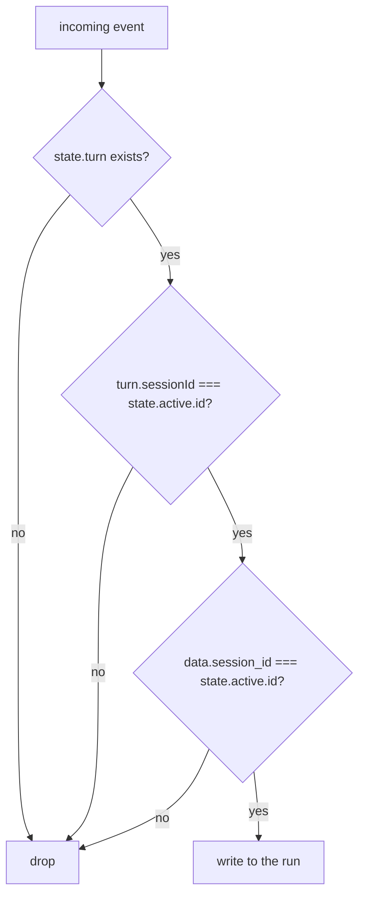
```mermaid
flowchart TD
  E["incoming event"] --> A{"state.turn exists?"}
  A -- no --> D["drop"]
  A -- yes --> B{"turn.sessionId === state.active.id?"}
  B -- no --> D
  B -- yes --> C{"data.session_id === state.active.id?"}
  C -- no --> D
  C -- yes --> W["write to the run"]
```

- `turn.sessionId` — the dossier the run **was opened in**, captured at
  `createRun` and never reassigned.
- `data.session_id` — the dossier the **server** produced the event for. This
  is why the backend stamps `payload["session_id"] = session_id` onto every
  single event before emitting it.

### The scenario it exists for

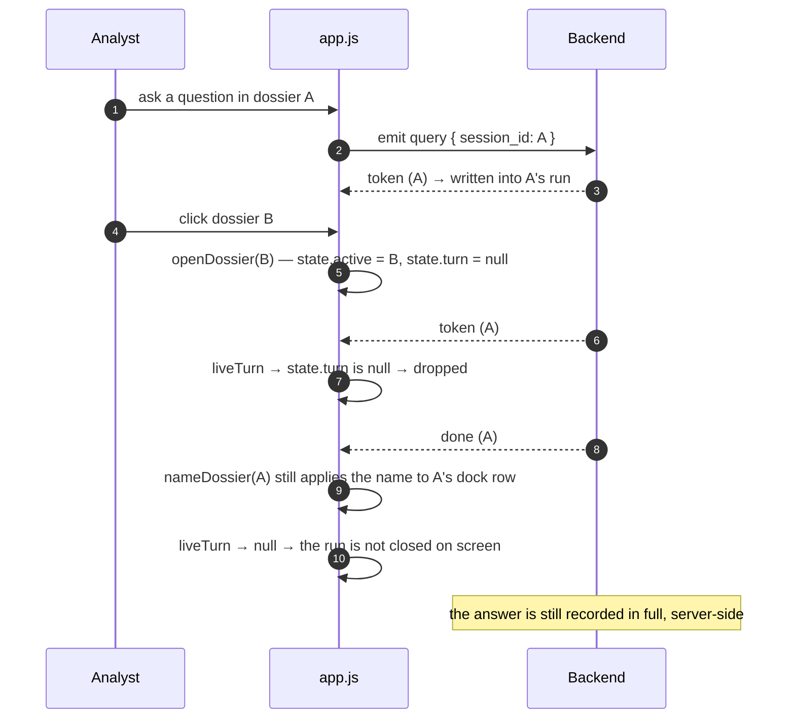
```mermaid
sequenceDiagram
  autonumber
  participant U as Analyst
  participant App as app.js
  participant SIO as Backend

  U->>App: ask a question in dossier A
  App->>SIO: emit query { session_id: A }
  SIO-->>App: token (A) → written into A's run
  U->>App: click dossier B
  App->>App: openDossier(B) — state.active = B, state.turn = null
  SIO-->>App: token (A)
  App->>App: liveTurn → state.turn is null → dropped
  SIO-->>App: done (A)
  App->>App: nameDossier(A) still applies the name to A's dock row
  App->>App: liveTurn → null → the run is not closed on screen
  Note over SIO: the answer is still recorded in full, server-side
```

Nothing is lost: the backend writes the complete answer to the ledger whether
the browser is watching or not, so reopening dossier A shows the finished run.

In practice the busy lock ([§8](#8-the-busy-lock)) makes a mid-run switch
hard to trigger — but the guard is what makes it *safe*, and it also covers a
run cut short by a dropped connection whose events arrive after the analyst has
moved on.

---

## Op 12 — Losing the connection mid-run

**Trigger:** the `disconnect` handler ([`app.js:146`](../frontend/app.js#L146)).

**Frontend steps:**

1. If `state.busy` is false, do nothing — an idle disconnect is not the
   analyst's problem, and the client will reconnect on its own.
2. If a run was live: drop `is-live` from the article (the animated caret
   stops), toast *"Connection lost — the run was interrupted"*, and
   `finishTurn()` so the composer unlocks.
3. The partial answer stays on screen exactly as far as it got.

The run does **not** resume on reconnect, and this is not a bug in the client:
the backend's `query` handler is still running, and will still record the
answer — a reconnected socket is a new `sid` with no way to reattach to a run
that was streaming to the old one. Reopening the dossier fetches the completed
answer from the ledger.

---

## Op 13 — Reconnecting

Handled entirely by the Socket.IO client — up to 20 attempts, backing off from
a 1.5 s base delay to the client's 5 s ceiling — with two client behaviours
layered on:

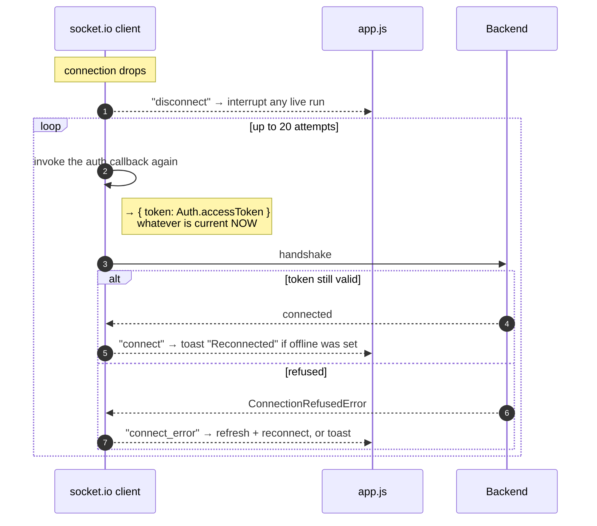
```mermaid
sequenceDiagram
  autonumber
  participant S as socket.io client
  participant App as app.js
  participant SIO as Backend

  Note over S: connection drops
  S-->>App: "disconnect" → interrupt any live run
  loop up to 20 attempts
    S->>S: invoke the auth callback again
    Note right of S: → { token: Auth.accessToken }<br/>whatever is current NOW
    S->>SIO: handshake
    alt token still valid
      SIO-->>S: connected
      S-->>App: "connect" → toast "Reconnected" if offline was set
    else refused
      SIO-->>S: ConnectionRefusedError
      S-->>App: "connect_error" → refresh + reconnect, or toast
    end
  end
```

Because the refresh timer in `auth.js` keeps rotating tokens in the background
whether the socket is up or not, a laptop that wakes after an hour typically
reconnects with a token minted seconds ago. The `connect_error` refresh path is
the backstop for when it does not.

Nothing is replayed on reconnect. The client re-establishes identity and waits;
dossier state is already in memory, and the ledger is the source of truth for
anything that finished while the socket was away.

---

## Op 14 — Discarding a dossier

**Trigger:** the wipe button in the dock → `discardDossier(state.active)`.
**Channel:** REST — `DELETE /api/conversations/{id}`.

**Frontend steps:**

1. Refuse if `state.busy`.
2. `deleteDossier(id)` — `authFetch` DELETE. **Errors are swallowed on
   purpose**: the dossier is gone from the workbench either way, and a record
   left behind on the backend reappears on the next sign-in rather than being
   lost. That is the better way round to fail.
3. Splice it out of `state.dossiers`.
4. Open the neighbour — the next one, or the previous one if it was last.
5. If none are left, `newDossier()`. The workbench always has one dossier open
   rather than an empty stage.
6. Toast *"Dossier discarded"*.

Server-side this removes the messages **and** the vector collection its filings
live in, so nothing it read can leak into the next dossier.

---

## Op 15 — Signing out

**Trigger:** the sign-out button on the dock.
**Channel:** REST — `POST /api/auth/logout`, plus `socket.disconnect()`.

The ordering here matters more than it looks.

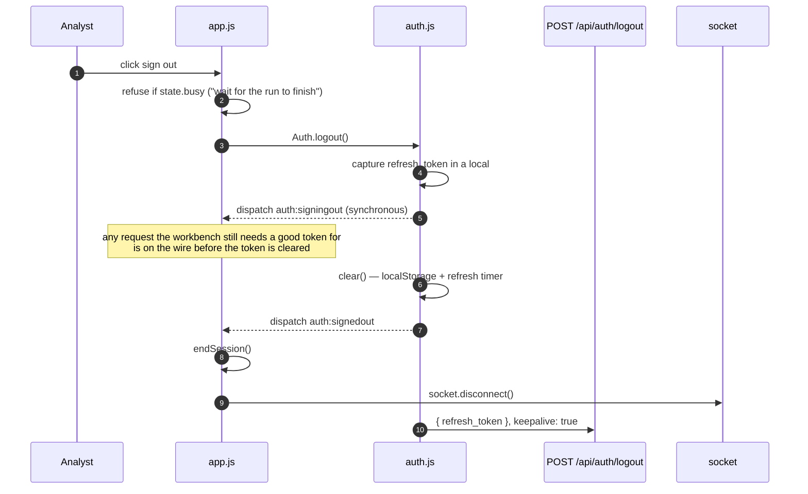
```mermaid
sequenceDiagram
  autonumber
  participant U as Analyst
  participant App as app.js
  participant A as auth.js
  participant API as POST /api/auth/logout
  participant S as socket

  U->>App: click sign out
  App->>App: refuse if state.busy ("wait for the run to finish")
  App->>A: Auth.logout()
  A->>A: capture refresh_token in a local
  A-->>App: dispatch auth:signingout  (synchronous)
  Note over App: any request the workbench still needs a good token for<br/>is on the wire before the token is cleared
  A->>A: clear() — localStorage + refresh timer
  A-->>App: dispatch auth:signedout
  App->>App: endSession()
  App->>S: socket.disconnect()
  A->>API: { refresh_token }, keepalive: true
```

**Why `auth:signingout` exists:** listeners are called synchronously, so
anything the workbench wants to send with a still-valid credential is already
on the wire by the time `clear()` runs.

**Why the local half happens regardless of the request:** a logout that leaves
the analyst signed in because the network was down is worse than one whose
refresh token outlives its own expiry unrevoked. `keepalive: true` lets the
revocation complete even if the page is being unloaded.

**Frontend steps in `endSession`** ([`app.js:1143`](../frontend/app.js#L1143)):

1. `socket.disconnect()`.
2. Clear `state.dossiers` and `state.turn`; `setBusy(false)`.
3. `messagesList.replaceChildren()` and re-show the welcome hero — the whole
   stage, not just the connection, so the next analyst to sign in on this
   browser is not handed the last one's questions.
4. `stampUser(null)`, then `newDossier()` so the workbench is in a clean
   starting state behind the gate.

The gate goes back up on the same `auth:signedout` event, from its own listener
in `auth.js`.

---

## Op 16 — The token lifecycle underneath

Everything above depends on `Auth.accessToken` being current, because that one
getter feeds both `authFetch` and the socket's `auth` callback.

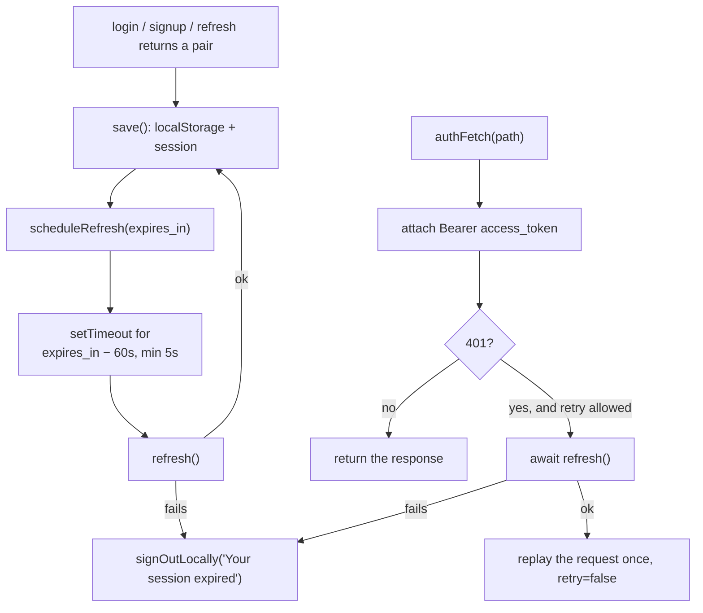
```mermaid
flowchart TD
  L["login / signup / refresh returns a pair"] --> S["save(): localStorage + session"]
  S --> T["scheduleRefresh(expires_in)"]
  T --> D["setTimeout for<br/>expires_in − 60s, min 5s"]
  D --> R["refresh()"]
  R -- ok --> S
  R -- fails --> O["signOutLocally('Your session expired')"]

  F["authFetch(path)"] --> H["attach Bearer access_token"]
  H --> Q{"401?"}
  Q -- no --> RET["return the response"]
  Q -- "yes, and retry allowed" --> R2["await refresh()"]
  R2 -- ok --> RP["replay the request once, retry=false"]
  R2 -- fails --> O
```

Three properties worth stating outright:

1. **Proactive refresh.** The timer fires 60 s before expiry (never sooner than
   5 s from now), so a request rarely meets a 401 in the first place.
2. **Reactive refresh, capped at one retry.** If a freshly minted token is
   still refused, the problem is not staleness and retrying would only spin.
3. **Single-flight.** `refreshing` holds the promise of the rotation already
   under way, so three requests hitting an expired token spend the refresh
   token **once**. Refresh tokens rotate on use, so two concurrent rotations
   would invalidate each other and sign the analyst out.

The socket benefits from all three without knowing about any of them: by the
time its `auth` callback is invoked on a reconnection, `Auth.accessToken` is
whatever the most recent rotation produced.

---

# Reference

## 6. The event contract

### Outbound — browser → server

| Event | When | Payload |
| --- | --- | --- |
| `query` | `submitQuery`, after any uploads | `{ query, session_id, title, files[] }` |

That is the whole outbound surface. No acknowledgement callbacks are used, and
the client never emits anything else — uploads, history and deletion all go
over REST.

### Inbound — server → browser

Every payload carries `session_id` (the client's own id), added by the handler
before emit.

| Event | Payload | Frontend effect | Handler |
| --- | --- | --- | --- |
| `run_started` | `run_id` | `turn.runId = run_id` | [L199](../frontend/app.js#L199) |
| `status` | `stage`, `category?` | progress line on the run | [L205](../frontend/app.js#L205) |
| `route` | `category` | category badge | [L216](../frontend/app.js#L216) |
| `title` | `title` | names the dossier in the dock and the stamp | [L223](../frontend/app.js#L223) |
| `token` | `content` | append → `marked.parse` → soft scroll | [L241](../frontend/app.js#L241) |
| `done` | `run_id`, `category`, `title` | close the run, release the busy lock | [L255](../frontend/app.js#L255) |
| `error` | `message` | fault line on the run + toast, release the lock | [L275](../frontend/app.js#L275) |
| `connect` | — | "Reconnected" toast if it had been offline | [L141](../frontend/app.js#L141) |
| `disconnect` | — | interrupt a live run | [L146](../frontend/app.js#L146) |
| `connect_error` | `error.message` | refresh-and-retry, or "retrying…" | [L162](../frontend/app.js#L162) |

Events are emitted `to=sid` — to one socket, not to a room. The client's own
`liveTurn` filter is a second line of defence, for events that are legitimately
addressed to this browser but no longer to what is on its screen.

### REST endpoints the frontend calls

| Method + path | Called from | Purpose |
| --- | --- | --- |
| `POST /api/auth/signup` | gate | create an account, get a pair |
| `POST /api/auth/login` | gate | get a pair |
| `POST /api/auth/refresh` | `boot`, timer, `authFetch` | rotate the pair |
| `POST /api/auth/logout` | `Auth.logout` | revoke the refresh token |
| `POST /api/upload` | `uploadPending` | ingest a filing into a dossier |
| `GET /api/conversations` | `loadDossiers` | redraw the dock on sign-in |
| `GET /api/conversations/{id}/messages` | `hydrateDossier` | one page of the ledger |
| `DELETE /api/conversations/{id}` | `deleteDossier` | discard a dossier and its filings |

---

## 7. Client state shapes

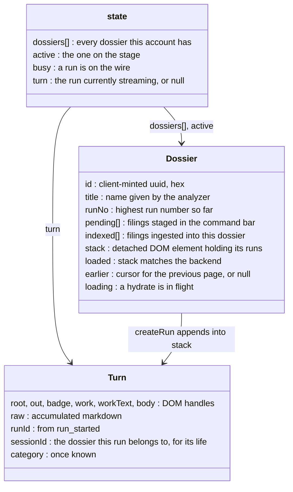
```mermaid
classDiagram
  class state {
    dossiers[] : every dossier this account has
    active : the one on the stage
    busy : a run is on the wire
    turn : the run currently streaming, or null
  }
  class Dossier {
    id : client-minted uuid, hex
    title : name given by the analyzer
    runNo : highest run number so far
    pending[] : filings staged in the command bar
    indexed[] : filings ingested into this dossier
    stack : detached DOM element holding its runs
    loaded : stack matches the backend
    earlier : cursor for the previous page, or null
    loading : a hydrate is in flight
  }
  class Turn {
    root, out, badge, work, workText, body : DOM handles
    raw : accumulated markdown
    runId : from run_started
    sessionId : the dossier this run belongs to, for its life
    category : once known
  }
  state --> Dossier : dossiers[], active
  state --> Turn : turn
  Dossier --> Turn : createRun appends into stack
```

Three invariants hold the design together:

1. **`turn.sessionId` is immutable.** Set at `createRun`, read by `liveTurn`,
   `uploadPending` and `markRunFile`. Nothing reassigns it.
2. **Each dossier owns its DOM.** `dossier.stack` is a detached element, moved
   into `messagesList` on open. Ledger entries are never rebuilt from client
   state, so nothing about a past run can be lost by a re-render.
3. **`state.turn` is a single slot.** Concurrency is prevented on the client by
   the busy lock, not by the server — the backend would happily run two.

---

## 8. The busy lock

`setBusy(true)` ([`app.js:566`](../frontend/app.js#L566)) is set on emit and
cleared by `finishTurn()`, which runs on `done`, on `error`, on `disconnect`
mid-run, and on an upload that failed.

| Action | While `state.busy` |
| --- | --- |
| Send / press Enter | button and textarea disabled; `submitQuery` returns immediately |
| Attach a filing | attach button disabled; `stageFiles` toasts *"Wait for the run to finish before attaching a filing"* |
| Drag a file onto the window | the drop veil never appears |
| Switch dossier | toast *"Wait for the run to finish before switching dossier"* |
| New dossier | returns silently |
| Discard dossier | returns silently |
| Sign out | toast *"Wait for the run to finish before signing out"* |

`body.is-busy` is toggled alongside, for the stylesheet.

---

## 9. Failure matrix

| What goes wrong | Where it is caught | What the analyst sees | Is anything lost? |
| --- | --- | --- | --- |
| No token at handshake | backend `connect` | gate is already up | no |
| Expired token at handshake | `connect_error` | nothing — refreshed and reconnected silently | no |
| Refresh token dead | `Auth.refresh` rejects | gate returns, *"Your session expired"* | no |
| Backend unreachable | `connect_error` | *"Can't reach the analyzer — retrying…"*, once | no |
| `GET /api/conversations` fails | `startSession` | toast, workbench opens with one empty dossier | no — dossiers are still on the server |
| Hydration fails | `hydrateDossier` | toast; the dossier opens empty but is usable | no — new runs append to the stored ledger |
| Hydration 404s | `hydrateDossier` | nothing; treated as loaded | no — it was discarded elsewhere |
| Upload rejected | `uploadPending` | chip `failed`, fault on the run, toast; **no query is emitted** | the filing is not indexed; the question is not asked |
| Ledger cannot be opened | backend, `error` event | fault line + toast | the question is not run |
| Exception mid-stream | backend, `error` event | fault line + toast; partial answer stays | no — the failed turn is recorded, marked `error` |
| Connection drops mid-run | `disconnect` | *"Connection lost — the run was interrupted"* | not server-side: the answer is still recorded and appears on reopen |
| `marked` failed to load | `token` / `fillStoredAnswer` | plain escaped text instead of rendered markdown | no |
| `localStorage` unwritable | `save()` | nothing; the session works for this tab only | it will not survive a reload |

---

## 10. Adding a new event

Server → client, end to end:

1. **Emit it** from the graph node via `_emit("my_event", …)`
   ([`nodes.py`](../backend/Analyzer/analysis/graph/nodes.py)), or yield it from
   `query_stream` ([`pipeline.py`](../backend/Analyzer/analysis/pipeline.py)).
   Custom-stream events flow through untouched.
2. **Check the forwarding loop** in
   [`api/socket.py`](../backend/Analyzer/api/socket.py#L77) — it pops `event`,
   stamps `session_id`, and emits. If the event carries something worth writing
   to the ledger, capture it there alongside `token` / `route` / `done`.
3. **Handle it** in `app.js` next to the others, and **start with
   `liveTurn(data)`**. An event that writes to the run and skips the guard will
   eventually write into the wrong dossier.
4. **Decide whether it survives staleness.** `title` and the name half of `done`
   are handled *before* the guard precisely because they belong to a dossier,
   not to a run on screen. Most events should not do this.
5. **Add it to the table in [§6](#6-the-event-contract)** and to the
   equivalent table in [SOCKETIO.md](SOCKETIO.md#the-event-contract).

Client → server is rarer, and the question to ask first is whether it belongs on
the socket at all: one request with one response is a REST route, and gets
`authFetch`'s token handling and retry for free.

---

## 11. Debugging from the browser

**Turn on the client's own logging** — it prints every packet, the transport in
use, and each reconnection attempt:

```js
localStorage.debug = "socket.io-client:*,engine.io-client:*";
// then reload; localStorage.debug = "" to stop
```

**Inspect live state** — everything is on the module scope of a plain script,
so the console can read it directly:

```js
socket.connected            // is the connection up?
socket.io.engine.transport.name   // "websocket" or "polling"
state.busy                  // is a run on the wire?
state.turn?.sessionId       // which dossier that run belongs to
state.active.id             // which dossier is on screen
state.dossiers.map((d) => [d.id.slice(0, 6), d.title, d.runNo, d.loaded])
Auth.isSignedIn             // is there an access token?
JSON.parse(localStorage["cfa.session"]).user
```

**Watch every inbound event** without editing the file:

```js
socket.onAny((event, data) => console.log("⟵", event, data));
```

**Common symptoms:**

| Symptom | Look at |
| --- | --- |
| Answer arrives in bursts, not smoothly | transport fell back to `polling` — check the nginx `Upgrade`/`Connection` headers and `proxy_buffering off` |
| `connect_error` loops with no toast repeat | expected; `offline` suppresses repeats. Check the Network tab for the handshake's status |
| Handshake 401s forever | the access token is stale in a way refresh cannot fix — check `Auth.isSignedIn` and the `/api/auth/refresh` response |
| Events arrive but nothing renders | `liveTurn` is dropping them: compare `state.turn?.sessionId`, `state.active.id`, and the event's `session_id` |
| The composer stays locked | `finishTurn()` never ran — no `done`, no `error`, no `disconnect`. Check the backend log for the run id from `run_started` |
| The dossier never gets a name | the `title` event only fires for a dossier whose `title` was blank at emit time |
| Answer stops mid-sentence, no error | the connection dropped — reopen the dossier; the full answer is in the ledger |
