# Socket.IO on the backend, operation by operation

The workbench gives an analyst about eighteen distinct things to do — sign in,
open a dossier, attach a filing, ask a question, page back through history,
discard a dossier, sign out.

**Only one of them sends anything over Socket.IO: asking a question.** Two more
open and close the connection. Everything else is a plain HTTP route — or never
reaches the backend at all.

This document walks through every one of those operations and answers the same
three questions each time:

1. Does this reach the Socket.IO layer at all?
2. If yes — which handler runs, and what does it do, line by line?
3. If no — what happens instead, and why was the socket left out of it?

Every code block here is **backend Python**. Nothing in this document is
frontend code.

| Where to look | For |
| --- | --- |
| [DOSSIER-FAQ.md](DOSSIER-FAQ.md) | the simple version — one socket for every dossier, ids, history, in plain answers |
| this file | what the backend does for each thing the analyst does |
| [SOCKETIO.md](SOCKETIO.md) | Socket.IO itself — protocol, handshake, mounting, nginx, scaling |
| [HOW-IT-WORKS.md](HOW-IT-WORKS.md) | the whole system, including the graph, the ledger and the stores |

The files that matter:

- [`api/socket.py`](../backend/Analyzer/api/socket.py) — **the entire Socket.IO surface**, three handlers
- [`main.py`](../backend/Analyzer/main.py) — where the socket server is mounted next to FastAPI
- [`analysis/pipeline.py`](../backend/Analyzer/analysis/pipeline.py) — turns a graph run into a stream of events
- [`analysis/graph/nodes.py`](../backend/Analyzer/analysis/graph/nodes.py) — where most events are born
- [`conversations/service.py`](../backend/Analyzer/conversations/service.py) — the ledger a run is written into

---

## Contents

**Part 1 — The layer itself**
1. [Two doors into one process](#1-two-doors-into-one-process)
2. [The whole Socket.IO surface: three handlers](#2-the-whole-socketio-surface-three-handlers)
3. [What the backend remembers about a connection](#3-what-the-backend-remembers-about-a-connection)
4. [The seven events the server sends](#4-the-seven-events-the-server-sends)

**Part 2 — Every operation**

| # | What the analyst does | Reaches the backend as | Socket.IO? |
| --- | --- | --- | --- |
| [1](#op-1--opening-the-page) | Opens the page | nothing | no |
| [2](#op-2--signing-up-or-signing-in) | Signs up / signs in | `POST /api/auth/signup` · `login` | no |
| [3](#op-3--a-returning-analyst-restoring-a-session) | Returns to a tab (session restore) | `POST /api/auth/refresh` | no |
| [4](#op-4--the-workbench-opens-the-handshake) | Workbench opens | **`connect`** | **yes** |
| [5](#op-5--filling-the-dock) | Dock fills with dossiers | `GET /api/conversations` | no |
| [6](#op-6--clicking-new-dossier) | Clicks **New dossier** | **nothing at all** | **no** |
| [7](#op-7--attaching-a-filing) | Attaches a filing | `POST /api/upload` | no |
| [8](#op-8--asking-the-first-question-in-a-dossier) | Asks the **first** question | **`query`** | **yes** |
| [9](#op-9--asking-a-follow-up-in-the-same-dossier) | Asks a follow-up | **`query`** | yes |
| [10](#op-10--opening-an-old-dossier) | Opens an **old dossier** | `GET /api/conversations/{id}/messages` | no |
| [11](#op-11--loading-earlier-runs) | Loads earlier runs | same, with a cursor | no |
| [12](#op-12--asking-a-question-in-an-old-dossier) | Asks a question in an old dossier | **`query`** | yes |
| [13](#op-13--switching-dossier-while-a-run-is-streaming) | Switches dossier mid-run | nothing | no |
| [14](#op-14--discarding-a-dossier) | Discards a dossier | `DELETE /api/conversations/{id}` | no |
| [15](#op-15--the-connection-drops-mid-run) | Loses the connection | **`disconnect`** | **yes** |
| [16](#op-16--reconnecting) | Reconnects | **`connect`** again | **yes** |
| [17](#op-17--signing-out) | Signs out | `POST /api/auth/logout` + **`disconnect`** | yes |
| [18](#op-18--a-second-tab-or-a-second-device) | Opens a second tab | a second **`connect`** | yes |

**Part 3 — Ids, sessions and the database**
5. [Every dossier has two ids](#5-every-dossier-has-two-ids)
6. [What `sid` has to do with the database](#6-what-sid-has-to-do-with-the-database)
7. [Retrieving the conversation, on every query](#7-retrieving-the-conversation-on-every-query)
8. [Retrieving history when you ask in an old dossier](#8-retrieving-history-when-you-ask-in-an-old-dossier)
9. [Storing messages: what one query writes](#9-storing-messages-what-one-query-writes)

**Part 4 — Reference**
10. [Where each event is born](#10-where-each-event-is-born)
11. [Why every event carries `session_id`](#11-why-every-event-carries-session_id)
12. [Two database sessions per run, on purpose](#12-two-database-sessions-per-run-on-purpose)
13. [Every way the backend refuses or fails](#13-every-way-the-backend-refuses-or-fails)
14. [What the backend deliberately does not do](#14-what-the-backend-deliberately-does-not-do)
15. [Reading the log](#15-reading-the-log)

---

# Part 1 — The layer itself

## 1. Two doors into one process

One Python process serves both protocols. `socketio.ASGIApp` wraps the FastAPI
app: anything addressed to `/socket.io/` is handled by the Socket.IO server,
and everything else falls through to FastAPI.

From [`main.py`](../backend/Analyzer/main.py):

```python
sio = socketio.AsyncServer(
    async_mode="asgi",
    cors_allowed_origins=settings.CORS_ORIGINS if settings.CORS_ORIGINS != ["*"] else "*",
)
register_handlers(sio, analysis_pipeline, auth_service)

# Entry point: `uvicorn main:asgi_app`
asgi_app = socketio.ASGIApp(sio, other_asgi_app=app)
```

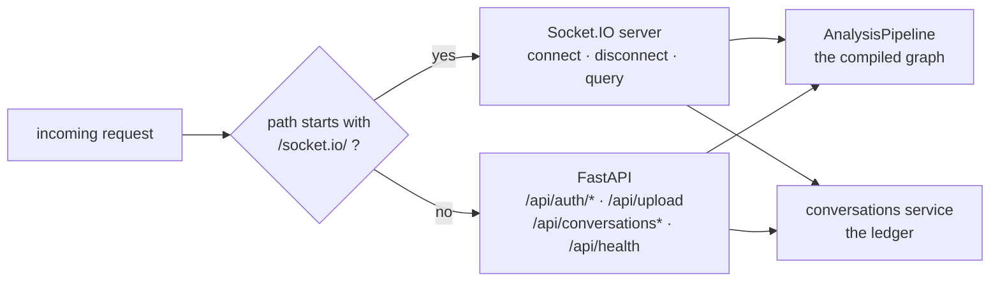

Both doors reach the **same singletons**, built once in
[`container.py`](../backend/Analyzer/container.py): one chat model, one vector
store, one compiled graph, one history service. A filing ingested over HTTP is
immediately searchable by a question asked over the socket, because they are
talking to the same object in the same process.

> The one-line trap: the process must be started as `uvicorn main:asgi_app`.
> Starting `main:app` serves the REST API perfectly and drops every websocket.

---

## 2. The whole Socket.IO surface: three handlers

[`api/socket.py`](../backend/Analyzer/api/socket.py) registers three handlers
and nothing else. That is the complete real-time API.

| Handler | Fires when | What it does |
| --- | --- | --- |
| `connect` | a browser opens the connection | verifies the access token, or refuses the connection outright |
| `query` | the analyst asks a question | runs the graph, streams the answer back, writes both to the ledger |
| `disconnect` | the connection closes | logs it — there is nothing to clean up |

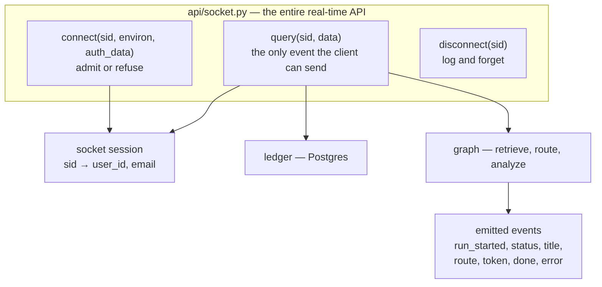

**There is no fourth handler.** The client cannot upload over the socket,
cannot ask for history over it, cannot cancel a run over it, and cannot
subscribe to a dossier over it. Everything except asking a question is a plain
HTTP route — which is what makes most of the operations below say "the socket
does nothing".

---

## 3. What the backend remembers about a connection

Exactly two fields, saved once at handshake:

```python
await sio.save_session(sid, {"user_id": user.id, "email": user.email})
```

and read back at the top of every query:

```python
socket_session = await sio.get_session(sid)
user_id = socket_session.get("user_id") if socket_session else None
```

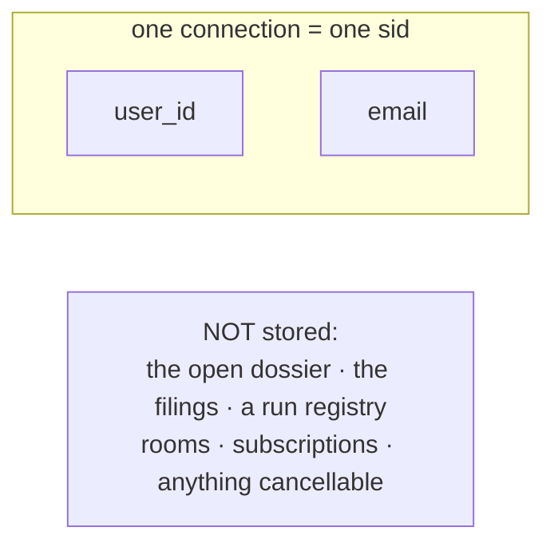

This is the single most useful thing to understand about the design:

- **Identity lives on the connection.** It is established once, at handshake,
  and the browser can never change it or send it.
- **The dossier lives in the payload.** It arrives with each `query`, and the
  connection has no memory of it afterwards.

Which is why switching dossiers, opening a new one, or paging through an old
one needs no socket traffic whatsoever: the connection never knew which dossier
the analyst was looking at in the first place.

---

## 4. The seven events the server sends

All seven are emitted from one loop inside the `query` handler:

```python
async for event in analysis.query_stream(
    question,
    session_id=scoped_session_id(user_id, session_id),
    title=title,
    history=history,
):
    payload = dict(event)
    event_name = payload.pop("event")
    payload["session_id"] = session_id      # the client's own id, always

    if event_name == "token":
        answer.append(payload.get("content", ""))
    elif event_name == "run_started":
        run_id = payload.get("run_id", "")
    elif event_name in {"route", "done"}:
        category = payload.get("category") or category
        title = payload.get("title") or title

    await sio.emit(event_name, payload, to=sid)
```

| Event | Payload | Sent when |
| --- | --- | --- |
| `run_started` | `run_id` | immediately, before any work |
| `status` | `stage` = `retrieve` \| `route` \| `analyze`, plus `category` on analyze | as each graph node begins |
| `title` | `title` | only when the dossier had no name yet |
| `route` | `category` | once the router has classified the question |
| `token` | `content` | for every fragment the model produces |
| `done` | `run_id`, `category`, `title` | after the graph finishes |
| `error` | `message` | instead of, or after, the above when something fails |

Two details in that loop worth naming:

- **`to=sid`** — every event goes to one socket. No rooms, no broadcast. Two
  tabs of the same account are two sids and never see each other's runs.
- **The loop keeps a copy as it forwards.** `answer`, `category`, `run_id` and
  `title` are accumulated on the way past, so what is written to the ledger is
  exactly what the analyst was shown — not a second render of it.

---

# Part 2 — Every operation

## Op 1 — Opening the page

**Socket.IO: not involved. Backend: not involved.**

The page and its assets are static files. In Docker they are served by nginx
from the frontend image; the backend process sees nothing at all.

No connection is opened at this point, and this is deliberate: the backend
refuses any handshake that does not carry a valid access token, so a socket
opened before sign-in would only be refused.

---

## Op 2 — Signing up or signing in

**Socket.IO: not involved.** Plain HTTP.

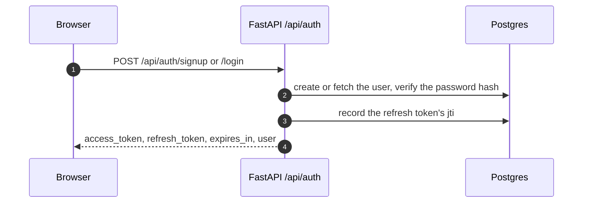

The important consequence for the socket layer: this is where the **access
token** comes from, and that token is the only thing that will get a handshake
admitted a moment later.

```python
async def _issue(self, session: AsyncSession, user: User) -> TokenPair:
    """Mint a pair and record the refresh token's jti. Does not commit."""
    refresh_token, jti, expires_at = create_refresh_token(user.id)
    session.add(RefreshToken(jti=jti, user_id=user.id, expires_at=expires_at))
    return TokenPair(
        access_token=create_access_token(user.id),
        refresh_token=refresh_token,
        expires_in=int(access_lifetime().total_seconds()),
        user=UserOut.model_validate(user),
    )
```

The access token is a signed JWT that is **never looked up in the database** —
that is the point of it. Only its signature, expiry and type are checked.

---

## Op 3 — A returning analyst (restoring a session)

**Socket.IO: not involved.** `POST /api/auth/refresh`.

The browser spends the stored refresh token for a fresh pair. The backend
rotates it — the old one is revoked, a new jti is recorded — and answers with a
new access token.

Why it matters here: the socket handshake that follows carries the **freshly
minted** access token, so a tab left closed overnight reconnects cleanly
without ever being refused.

---

## Op 4 — The workbench opens (the handshake)

**Socket.IO: yes — the `connect` handler.** This is the first of only two
operations that touch the socket layer.

### The handler, in full

```python
@sio.event
async def connect(sid: str, environ: dict, auth_data: dict | None = None) -> None:
    """Admit the connection only if it carries a usable access token."""
    token = _token_from(auth_data, environ)
    if not token:
        logger.info("Handshake from %s refused — no token", sid)
        raise socketio.exceptions.ConnectionRefusedError("Not signed in.")

    try:
        async with SessionLocal() as session:
            user = await auth.user_from_access_token(session, token)
    except AuthError as error:
        logger.info("Handshake from %s refused — %s", sid, error)
        raise socketio.exceptions.ConnectionRefusedError(str(error)) from error

    await sio.save_session(sid, {"user_id": user.id, "email": user.email})
    logger.info("Client connected: %s (user=%s)", sid, user.email)
```

### Where the token is read from

```python
def _token_from(auth_data: dict | None, environ: dict) -> str:
    """Pull the access token out of the handshake."""
    if auth_data:
        token = str(auth_data.get("token") or "").strip()
        if token:
            return token.removeprefix("Bearer ").strip()

    header = environ.get("HTTP_AUTHORIZATION", "")
    if header.startswith("Bearer "):
        return header[7:].strip()
    return ""
```

Two places, because two kinds of client exist: a browser puts the token in
Socket.IO's own `auth` handshake payload; a script or a test with no handshake
payload to fill in can use the `Authorization` header instead.

### What the token check actually verifies

```python
async def user_from_access_token(self, session: AsyncSession, token: str) -> User:
    claims = decode_token(token, "access")          # signature, expiry, type, sub
    user = await session.get(User, str(claims["sub"]))
    if user is None or not user.is_active:
        raise AuthError("This account is no longer active.")
    return user
```

`decode_token` rejects a token that is malformed, expired, tampered with, or
**of the wrong kind** — a refresh token presented as a bearer credential is
refused with "That is not an access token."

### The whole operation

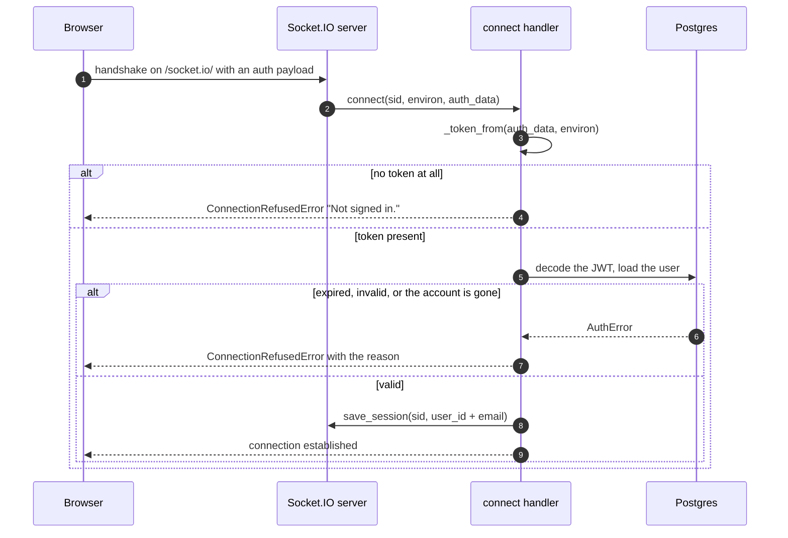

### Why refuse rather than admit-and-reject

Raising `ConnectionRefusedError` makes the **handshake itself** fail, so the
browser is told immediately and can refresh its token and retry. The
alternative — admitting the connection and rejecting each query on it — leaves
a socket that looks healthy and answers nothing.

**Cost:** one database round trip per connection, and only per connection. Every
question asked afterwards reuses the identity saved against the `sid`, with no
further token work.

---

## Op 5 — Filling the dock

**Socket.IO: not involved.** `GET /api/conversations`.

The dossier list is a normal request with a normal response — one shot, no
streaming — so it is a REST route. It returns one row per dossier: the client
id, the title, the message count and the filings attached.

The socket, already connected from [Op 4](#op-4--the-workbench-opens-the-handshake),
sits idle throughout and is told nothing about the result.

---

## Op 6 — Clicking "New dossier"

**Socket.IO: nothing happens. The backend is not contacted at all.**

This is the operation people expect to be chattier than it is, so it is worth
being blunt:

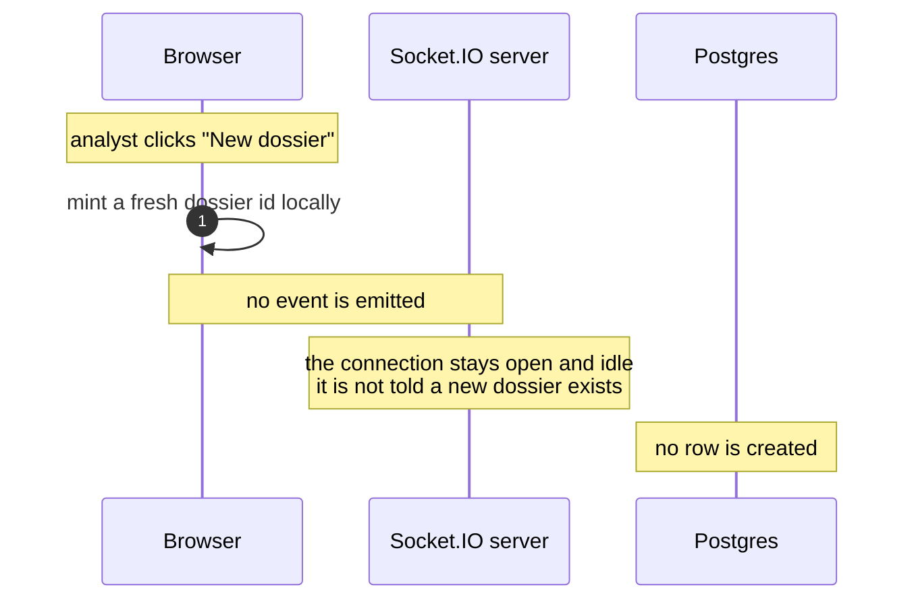

**No event. No room to join. No row.** A dossier is, at this moment, an id the
browser made up and nothing more.

The backend first hears of that id when one of two things happens:

| Whichever comes first | Route | What creates the row |
| --- | --- | --- |
| a filing is attached | `POST /api/upload` | `open_conversation(...)` after the ingest |
| a question is asked | `query` event | `open_conversation(...)` before the graph runs |

```python
async def open_conversation(
    self, session: AsyncSession, user_id: str, client_id: str, title: str = ""
) -> Conversation:
    """The analyst's conversation for ``client_id``, created if it is new.

    The browser mints the dossier id, so the first question in a dossier is
    also what brings its row into being. Always scoped by ``user_id``: an
    id from one account can never resolve to another's conversation.
    """
    conversation = await self.find(session, user_id, client_id)
    if conversation is not None:
        return conversation
    ...
```

**Why this is a good design, not a missing feature:** an analyst who opens five
dossiers and uses one leaves four that never touch the database. Nothing has to
be cleaned up, because nothing was created. And because the id is scoped by
`user_id` on every lookup, an id from one account can never resolve to
another's conversation — the browser minting it is not a security question.

---

## Op 7 — Attaching a filing

**Socket.IO: not involved.** `POST /api/upload`, multipart.

Filings go over HTTP for the obvious reason: a 10-K PDF is tens of megabytes,
and Socket.IO is built for many small messages rather than one large one. In
Docker, nginx is configured for exactly this — `client_max_body_size 64m` and a
300 s read timeout, because embedding a long filing on a local model is not
fast.

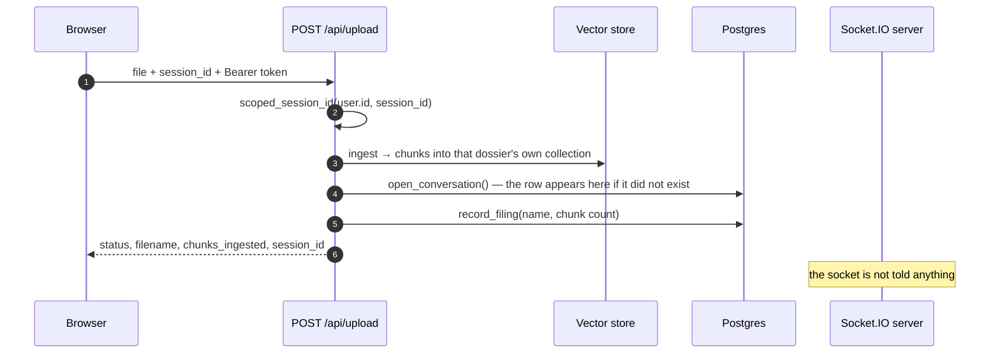

The one thing this shares with the socket layer is the **scoping function**:

```python
def scoped_session_id(user_id: str, session_id: str) -> str:
    """Namespace a browser-supplied chat id under the account that owns it."""
    return f"{user_id}:{session_id}"
```

The upload route indexes into `scoped_session_id(user.id, session_id)`, and the
`query` handler later searches `scoped_session_id(user_id, session_id)`. Same
function, same collection — which is the entire reason a question asked over
the socket can read a filing that arrived over HTTP.

It is also what makes filings unreachable across accounts. Two analysts whose
browsers minted the same dossier id still get two different collections, and
there is no id a signed-in user can send that resolves to someone else's
uploads.

The response deliberately hands back the **browser's** id, not the scoped one:

```python
# The scoped id is a backend detail; the browser gets back the id it sent.
return {**result, "session_id": session_id}
```

---

## Op 8 — Asking the first question in a dossier

**Socket.IO: yes — the `query` handler.** This is the operation the whole
real-time layer exists for. It runs in five stages.

### The shape of it

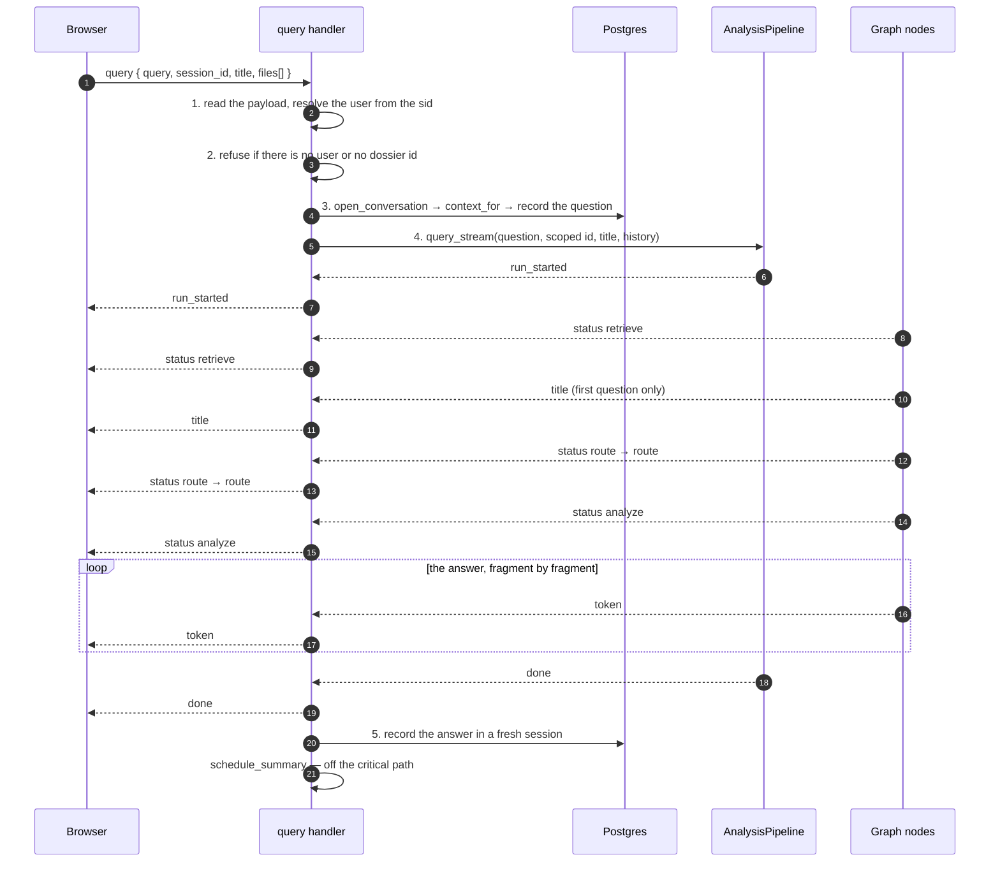

### Stage 1 — Read the payload, resolve the user

```python
question = (data.get("query") or "").strip() or FALLBACK_QUERY
session_id = (data.get("session_id") or "").strip()
title = (data.get("title") or "").strip()
attachments = [str(name) for name in (data.get("files") or [])][:20]

socket_session = await sio.get_session(sid)
user_id = socket_session.get("user_id") if socket_session else None
```

| Field | What the backend does with it |
| --- | --- |
| `query` | The question. **Empty is legal** — a filing attached with no typed question falls back to `FALLBACK_QUERY` ("Provide an executive summary and financial overview of this filing."), because the router still needs something to classify. |
| `session_id` | The dossier. Scopes retrieval, and names the conversation the run is written into. |
| `title` | The name this dossier already carries. Blank means "not named yet". |
| `files` | Names only — the bytes arrived over HTTP already. Capped at 20 and recorded with the question so a reopened dossier still shows what a run was asked against. |

**Note what is *not* in the payload: the user.** The identity comes off the
socket session, established at handshake. The browser cannot send a user id,
and would not be believed if it did.

### Stage 2 — The two refusals

```python
if not user_id:
    # Only reachable if the session went missing after a valid handshake.
    await sio.emit("error",
        {"message": "Your session expired — sign in again.", "session_id": session_id}, to=sid)
    return

# A query with no dossier behind it has no filings it is entitled to
# read, so it is refused rather than answered from nothing.
if not session_id:
    logger.warning("Query from %s carried no session id — refused", sid)
    await sio.emit("error",
        {"message": "This chat has no id — reload the page and try again."}, to=sid)
    return
```

Both refusals come back as an `error` event rather than silence, so the browser
can unlock its composer and show the reason on the run.

### Stage 3 — Open the ledger *before* the graph starts

```python
async with SessionLocal() as db:
    conversation = await history_service.open_conversation(db, user_id, session_id, title)
    conversation_pk = conversation.id
    # The stored name wins over the one the browser sent: the server named
    # this dossier, and a client that has fallen behind should not be able
    # to have it renamed.
    title = conversation.title or title

    # Assembled *before* the question is recorded — it is being asked now,
    # and would otherwise arrive in the prompt twice.
    history = await history_service.context_for(db, conversation)
    await history_service.record_message(
        db, conversation, ROLE_USER, question,
        meta={"files": attachments} if attachments else {},
    )
```

Three decisions live in those few lines:

1. **The row is created here** if this is the dossier's first question — see
   [Op 6](#op-6--clicking-new-dossier).
2. **The stored title wins.** A stale browser cannot rename a dossier by
   sending an old name back.
3. **History is assembled before the question is recorded.** Reverse the two and
   the question the model is being asked would also appear in the history it is
   given as context.

If any of this fails, the run never starts:

```python
except Exception:
    logger.exception("Could not open the ledger for chat %s", session_id)
    await sio.emit("error",
        {"message": "Could not open this dossier's history — try again.",
         "session_id": session_id}, to=sid)
    return
```

### Stage 4 — Stream, forwarding as you go

The forwarding loop from [§4](#4-the-seven-events-the-server-sends) runs here.
What it is iterating over is the pipeline, which drives the compiled graph in
two stream modes at once:

```python
# "custom"   -> status/route events written by the nodes
# "messages" -> the answer's tokens as the LLM produces them
_STREAM_MODES = ["custom", "messages"]

async for mode, chunk in self.graph.astream(
    graph_input, config=config, stream_mode=_STREAM_MODES
):
    if mode == "custom":
        ...
        yield chunk
    elif mode == "messages":
        message, metadata = chunk
        # Only the analysis nodes stream to the user — the router's own
        # LLM call comes through here too and must be dropped.
        if metadata.get("langgraph_node") not in CATEGORIES:
            continue
        content = str(message.text)
        if content:
            yield {"event": "token", "content": content}
```

That filter is load-bearing. The router is an LLM call too, and without the
check its classification reasoning would stream to the analyst as if it were
part of the answer.

### What makes the *first* question different

Only one thing: the dossier has no name, so the router names it while it
classifies:

```python
if title:
    category = await self.router.classify(query)
else:
    category, title = await asyncio.gather(
        self.router.classify(query),
        self.router.name_chat(query),
    )
    _emit("title", title=title)
```

Naming runs **alongside** the classification, not after it, so the first
question in a dossier does not wait any longer for its answer than the ones
that follow. Every later run arrives carrying that name and leaves it alone —
which is why `title` is an event you see once per dossier and never again.

### The other first-question case: no filing attached

If nothing has been ingested into this dossier, retrieval comes back empty and
the graph routes to a terminal node instead of an analysis one:

```python
async def no_filing(self, state: FilingState) -> FilingState:
    """Terminal node for a chat that has nothing indexed."""
    logger.info("No filing in this chat — asking for one instead of answering")
    _emit("token", content=NO_FILING_MESSAGE)
    return {"answer": NO_FILING_MESSAGE, "category": DEFAULT_CATEGORY}
```

It emits its message **as a `token` event**, so the client needs no special
case: it is just an answer that happens to say "attach a filing and ask again".
Without this node the analysis prompt would run on an empty context and the
model would invent a plausible-looking report out of nothing.

### Stage 5 — Record the answer, always

```python
await _record_answer(
    conversation_pk, "".join(answer),
    category=category, run_id=run_id, title=title, failure=failure,
)
```

```python
async def _record_answer(conversation_pk, answer, category, run_id, title, failure) -> None:
    """Write the answer — or the reason there wasn't one — into the ledger."""
    try:
        async with SessionLocal() as db:
            conversation = await db.get(Conversation, conversation_pk)
            if conversation is None:  # deleted mid-run
                return

            if title and title != conversation.title:
                conversation = await history_service.set_title(db, conversation, title)

            content = answer.strip() or failure or "No answer came back for this question."
            await history_service.record_message(
                db, conversation, ROLE_ASSISTANT, content,
                status=STATUS_ERROR if failure else STATUS_OK,
                meta={...category, run_id, error...},
            )

        # Only once the answer is safely stored, and only after it has been
        # delivered: folding old turns is another model call, and no analyst
        # should be kept waiting on it.
        history_service.schedule_summary(conversation_pk)
    except Exception:
        logger.exception("Could not record the answer for conversation %s", conversation_pk)
```

Four properties of this function:

- **It runs whether the stream succeeded or not.** A failed run is recorded and
  marked `status="error"` — the analyst should see on their next visit that the
  question was asked and did not land, rather than find it missing.
- **It never raises.** Losing the record of an answer the analyst has already
  read is not worth turning into an error they have to act on.
- **It tolerates the dossier being deleted mid-run** — `if conversation is None:
  return`. See [Op 14](#op-14--discarding-a-dossier).
- **Summarisation is scheduled after delivery**, never before it.

---

## Op 9 — Asking a follow-up in the same dossier

**Socket.IO: yes — the same `query` handler, with no special case for it.**

Three things differ from [Op 8](#op-8--asking-the-first-question-in-a-dossier),
and all three are consequences of state that already exists rather than
different code paths:

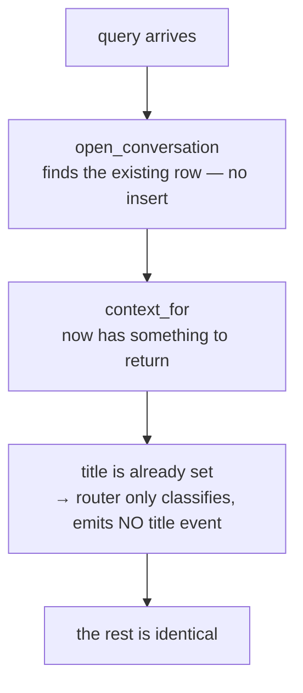

### What `context_for` gives the run

```python
async def context_for(self, session, conversation) -> ContextHistory:
    """Context history: the summary plus the tail that fits the budget.

    Four things narrow it, in order — anything already folded into the
    summary is dropped, then the runs that failed, then all but the last
    ``context_messages`` turns, then whatever does not fit ``context_tokens``.
    """
```

So a follow-up is answered with: the rolling summary of everything old, plus
the most recent turns that fit the token budget. Failed runs are excluded —
they stay in the ledger for the analyst to see, but conditioning the next
answer on an error message would only teach the model to apologise.

### And what the client sends that keeps the name stable

The browser sends the dossier's existing `title` back with every question. The
handler prefers the stored one anyway, then passes it into the pipeline, where
a non-empty title means "already named" and the naming call is skipped. That is
the whole mechanism: a dossier is named once, on the question that opened it.

**Streaming, retrieval, forwarding and recording are byte-for-byte the same as
the first question.** There is no "conversation continues" flag anywhere.

---

## Op 10 — Opening an old dossier

**Socket.IO: nothing happens.** `GET /api/conversations/{id}/messages`.

Reopening a dossier is a paginated read of the ledger, and a paginated read is a
request-response — so it is a REST route, not an event.

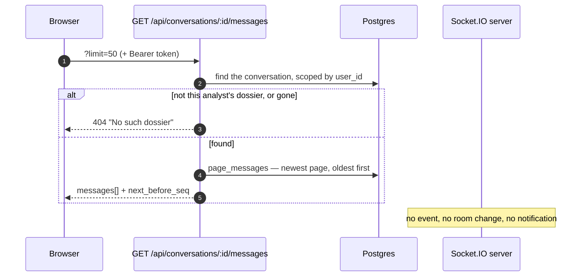

### The part people expect and that does not exist

There is **no "switch dossier" event**, no room to leave, no subscription to
move. The connection was never told which dossier was open
([§3](#3-what-the-backend-remembers-about-a-connection)), so there is nothing to
update. The next `query` simply carries a different `session_id`, and the
handler treats it exactly like any other.

That is what makes an old dossier and a new one indistinguishable to the socket
layer:

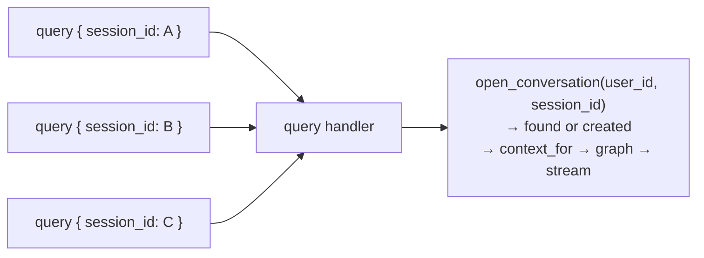

### Display history vs. context history

Two different things, easily confused:

| | Read by | Contains | Sized by |
| --- | --- | --- | --- |
| **display** history | `GET .../messages` | everything that was ever said, untrimmed, including failed runs | a page cursor (`before_seq`) |
| **context** history | `context_for` inside the `query` handler | a summary plus the recent successful turns | a token budget |

The analyst sees the first. The model is given the second. Reopening a dossier
fetches the first and has no effect on the second.

---

## Op 11 — Loading earlier runs

**Socket.IO: nothing happens.** The same REST route with a cursor.

```python
messages = await history.page_messages(session, conversation, limit=limit, before_seq=before_seq)

# There is an earlier page only if this one did not reach the first
# message. Reading the oldest seq off the page beats a second COUNT query.
oldest = messages[0].seq if messages else None
next_before_seq = oldest if oldest is not None and oldest > 1 else None
```

History is read backwards from the end, one page at a time. `next_before_seq` is
the cursor for the page *before* this one, and is null once the start is
reached.

---

## Op 12 — Asking a question in an old dossier

**Socket.IO: yes — and there is nothing new to say about it.**

The handler does not know or care that this dossier is old. `open_conversation`
finds the existing row instead of creating one; `context_for` returns a summary
plus a tail rather than nothing; the title is already set so no `title` event is
emitted. Every other line of the handler is the same.

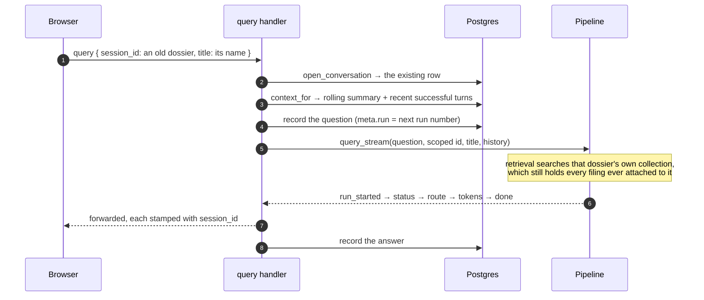

The filings are still there because a dossier's vector collection is keyed by
`scoped_session_id(user_id, session_id)` and nothing deleted it. Dossiers
outlive the process: on startup the backend prunes only collections whose
dossier no longer exists.

---

## Op 13 — Switching dossier while a run is streaming

**Socket.IO: nothing happens on the backend. The run continues.**

The backend has no idea the analyst navigated away. It keeps emitting to the
same `sid`, because that is where the question came from.

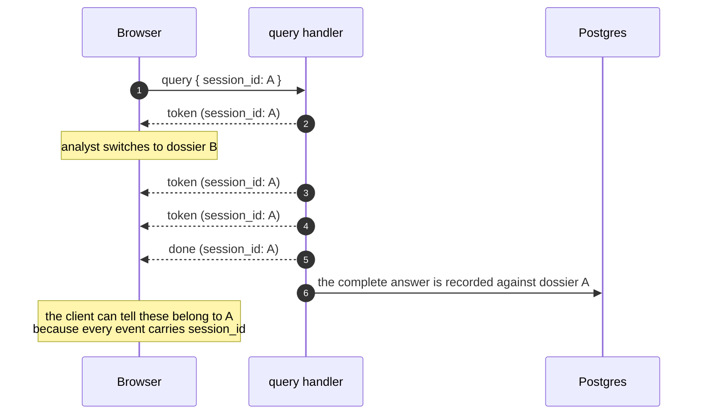

This is precisely why the handler stamps every payload:

```python
payload["session_id"] = session_id
```

The backend's contribution is to make each event **self-describing**, so a
client that has moved on can tell a late answer from one meant for what is on
screen now. What the client does with that is its own business — the answer is
recorded in full either way, and reopening dossier A shows the finished run.

---

## Op 14 — Discarding a dossier

**Socket.IO: not involved.** `DELETE /api/conversations/{id}`.

```python
@router.delete("/{session_id}")
async def delete_conversation(session_id, user, session, analysis, history):
    """Discard a dossier: its messages, and the filings it could read.

    Both halves go, and in that order — a conversation whose messages were kept
    while its filings were dropped would answer follow-ups out of a summary of
    documents it can no longer cite.
    """
    deleted = await history.delete_conversation(session, user.id, session_id)
    dropped = analysis.delete_session(scoped_session_id(user.id, session_id))
    ...
```

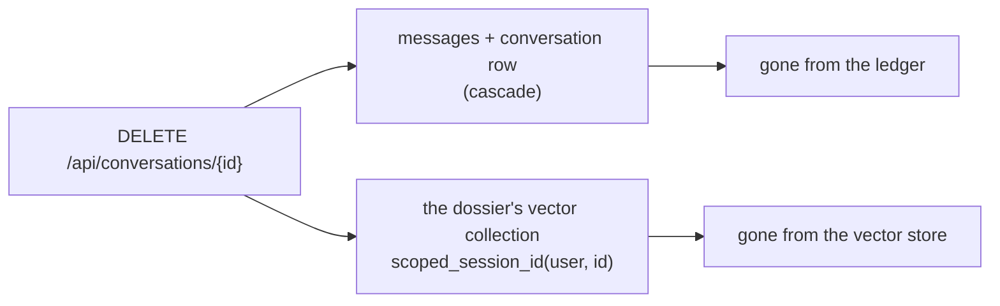

### The interesting case: discarding a dossier whose run is still streaming

Nothing interrupts the run — the socket layer has no registry of runs to look
in. The graph finishes, the answer is emitted, and then the recording step finds
its conversation missing:

```python
conversation = await db.get(Conversation, conversation_pk)
if conversation is None:  # deleted mid-run
    return
```

It returns quietly. No error, no orphaned row, no exception surfaced to the
analyst who deliberately threw that dossier away.

---

## Op 15 — The connection drops mid-run

**Socket.IO: yes — the `disconnect` handler, which does almost nothing.**

```python
@sio.event
async def disconnect(sid: str) -> None:
    logger.info("Client disconnected: %s", sid)
```

That is the entire handler, and the brevity is the point: there is nothing to
clean up. No rooms to leave, no per-connection resources to release beyond the
session dict that python-socketio drops on its own.

**The run keeps going.** It is an ordinary coroutine driving the graph; the
disconnect does not cancel it. Emits aimed at a `sid` that is gone are dropped
by the server without raising.

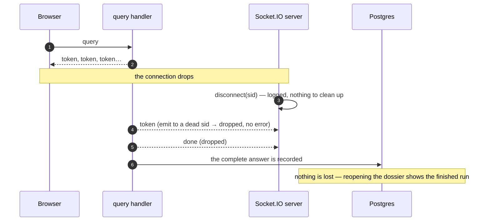

Two consequences worth stating plainly:

1. **Nothing is lost server-side.** The answer the analyst stopped seeing is
   written to the ledger in full and appears when they reopen the dossier.
2. **The run is not resumable.** A reconnection is a **new `sid`** with no way
   to reattach to a stream that was addressed to the old one. Recovery is not
   "resume the run", it is "read the ledger" — which is why the ledger exists.

---

## Op 16 — Reconnecting

**Socket.IO: yes — a fresh `connect`, identical to
[Op 4](#op-4--the-workbench-opens-the-handshake).**

The backend cannot tell a reconnection from a first connection, and does not
try. The token is verified again, a new `sid` is issued, and the identity is
saved against it.

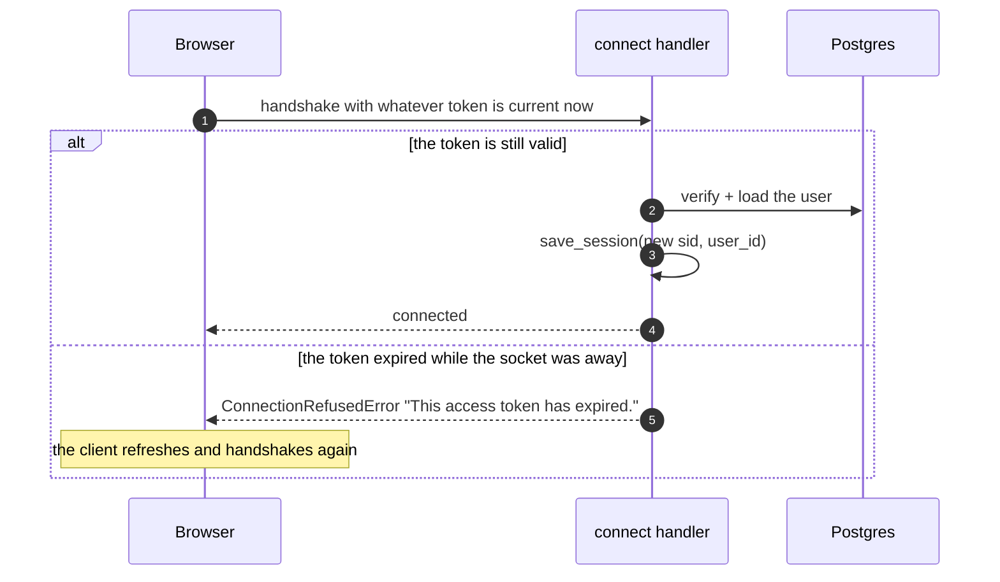

Because the refusal message names the reason, a client can tell a credentials
problem from an unreachable backend and respond differently — refresh and retry
for the first, keep retrying for the second.

Nothing is replayed on reconnect. There is no queue of missed events, and no
attempt to catch a client up: the ledger is the record, and reading it is a REST
call.

---

## Op 17 — Signing out

**Socket.IO: the connection closes, which fires `disconnect`.**
The revocation itself is HTTP: `POST /api/auth/logout`.

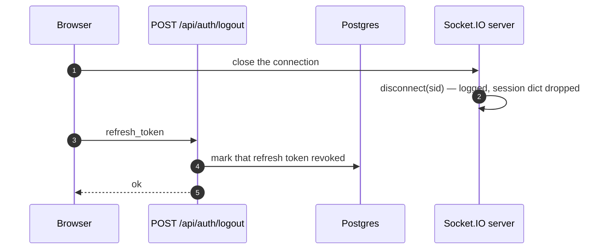

An important limitation, and it is by design:

> Revoking the refresh token does **not** kill an access token that is already
> in flight. Access tokens are not looked up in the database — that is what
> makes them cheap — so a signed-out session's access token stays usable until
> its own short expiry.

Practically: a socket already connected is not forcibly closed by signing out
elsewhere, and a handshake attempted within that window would still be admitted.
The window is the access token's lifetime, which is why it is short. If you need
immediate revocation, the hook is `revoke_all`, plus a disconnect of that
account's sockets — neither is wired in today.

---

## Op 18 — A second tab, or a second device

**Socket.IO: yes — a second, entirely independent connection.**

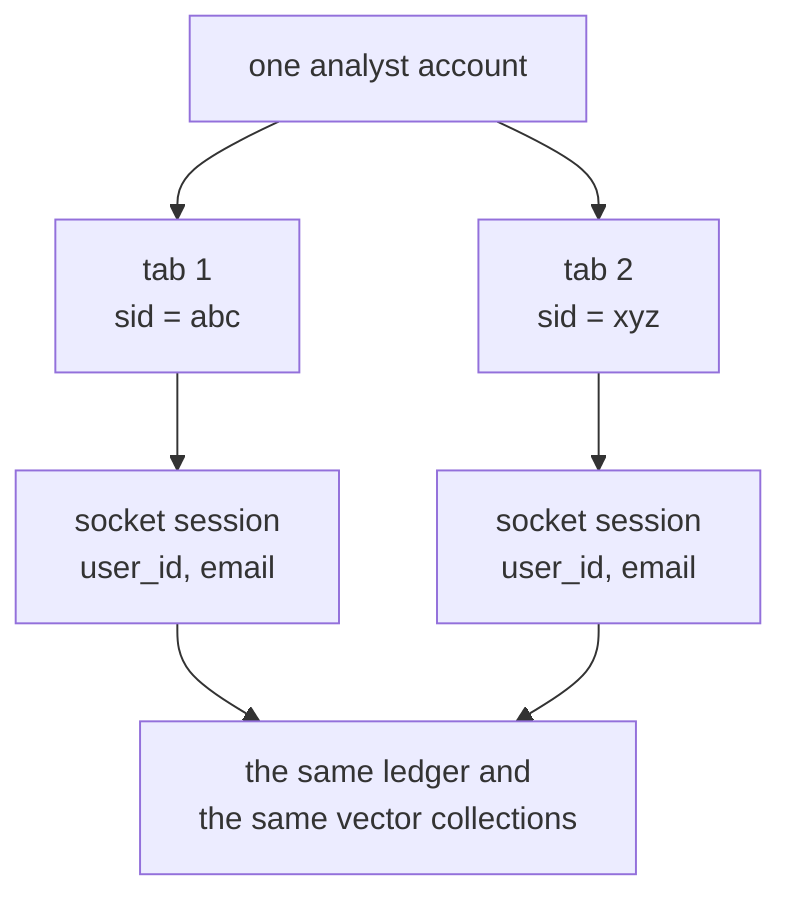

- Each tab handshakes separately and gets its own `sid` and its own saved
  session.
- Events go `to=sid`, so a run started in tab 1 streams **only** to tab 1. Tab 2
  sees nothing live.
- Both tabs share the durable state. A dossier created in one appears in the
  other on its next `GET /api/conversations`; a filing attached in one is
  searchable by a question asked in the other; a dossier discarded in one makes
  the other's next read of it return 404.
- Two questions asked at the same moment in the same dossier are two independent
  runs. Each gets its own `run_id` and its own graph thread id, so they never
  share state:

```python
# A fresh thread id per run, so concurrent runs never share state.
config = {"configurable": {"thread_id": run_id}}
```

Their messages are appended to the same conversation in whatever order they
finish. Nothing serialises them server-side.

---

# Part 3 — Ids, sessions and the database

Part 2 said *what* happens for each operation. This part answers the four
questions underneath all of them: which ids exist, what a `sid` has to do with
any of it, how a conversation and its history are read back out of Postgres, and
what a single question writes.

Full coverage of the schema and every statement the app issues is in
[DB-OPERATIONS.md](DB-OPERATIONS.md); this part covers only what the Socket.IO
layer itself touches.

---

## 5. Every dossier has two ids

**Yes — every dossier has a unique id. In fact it has two, one minted on each
side of the wire.**

```python
class Conversation(SQLModel, table=True):
    __tablename__ = "conversations"
    __table_args__ = (
        # The pair is what is unique, not the client id alone.
        UniqueConstraint("user_id", "client_id", name="uq_conversation_owner_client"),
        Index("ix_conversation_owner_recent", "user_id", "last_message_at"),
    )

    id: str = Field(default_factory=_uuid, primary_key=True, max_length=32)
    user_id: str = Field(foreign_key="users.id", index=True, ondelete="CASCADE", max_length=32)
    client_id: str = Field(max_length=64)
```

| | `client_id` | `id` |
| --- | --- | --- |
| minted by | **the browser**, when the analyst clicks *New dossier* | **the backend**, when the row is first created |
| the backend learns it | on the first `query` or upload carrying it | it generates it |
| unique | **per account** — `UNIQUE (user_id, client_id)` | globally — it is the primary key |
| used by | Socket.IO payloads, REST paths, the stamp on every event | `messages.conversation_id`, the summariser, everything internal |
| ever sent to the browser | yes — it *is* the browser's own id | **no** |

### Why the browser's id is not unique on its own

Two analysts can independently mint the same id — unlikely with a UUID4, but
nothing stops it, and nothing about a browser-generated value can be trusted.
So **nothing is ever looked up by `client_id` alone**. Every query pairs it with
the owner:

```python
result = await session.exec(
    select(Conversation)
    .where(Conversation.user_id == user_id)
    .where(Conversation.client_id == client_id)
)
```

The `user_id` in that query comes off the socket session, never off the payload
— which is what makes a dossier id safe to let the browser choose.

### The three jobs the dossier id does on a query

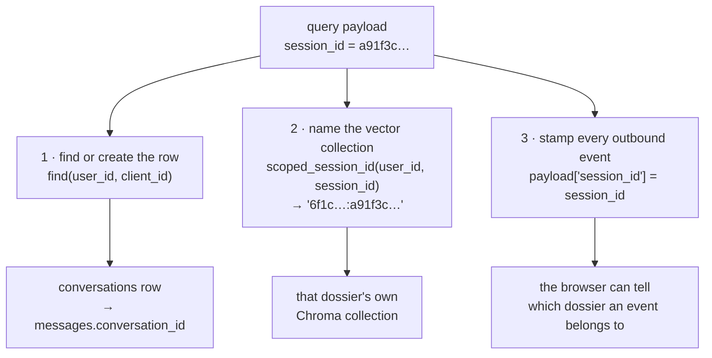

Job 2 is the one that keeps filings apart:

```python
def scoped_session_id(user_id: str, session_id: str) -> str:
    """Namespace a browser-supplied chat id under the account that owns it."""
    return f"{user_id}:{session_id}"
```

Two accounts that somehow picked the same dossier id still get two different
collections, and there is no id a signed-in user can send that resolves to
someone else's uploads.

Job 3 is one line in the forwarding loop, and the reason a client can tell a
late answer from a current one — see
[§11](#11-why-every-event-carries-session_id).

### One id, four entry points

The same `client_id` addresses the dossier everywhere:

| Where | How it arrives |
| --- | --- |
| `query` event | `data["session_id"]` |
| `POST /api/upload` | a form field, `session_id` |
| `GET /api/conversations/{id}/messages` | the path segment |
| `DELETE /api/conversations/{id}` | the path segment |

All four resolve it the same way — `(user_id from the credential, client_id from
the request)` — so a filing uploaded over HTTP and a question asked over the
socket land on the same row and the same collection.

---

## 6. What `sid` has to do with the database

**Nothing is stored under a `sid`. It never appears in a query, a column or a
row.**

A `sid` is python-socketio's handle for one open connection. It exists in
process memory, it changes on every reconnect, and it is thrown away when the
connection closes. What makes it useful is the one thing saved against it at
handshake — a `user_id`, which *is* a database key.

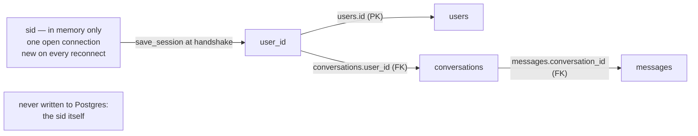

| | `sid` | `user_id` | `client_id` |
| --- | --- | --- | --- |
| lives in | process memory | Postgres | Postgres |
| lifetime | one connection | the account | the dossier |
| survives a reconnect | **no** | yes | yes |
| appears in a SQL query | **never** | constantly | always paired with `user_id` |

The only database read the handshake itself performs is the user lookup:

```python
claims = decode_token(token, "access")          # no database involved
user = await session.get(User, str(claims["sub"]))   # one primary-key read
if user is None or not user.is_active:
    raise AuthError("This account is no longer active.")
```

Then the result is pinned to the connection, in memory:

```python
await sio.save_session(sid, {"user_id": user.id, "email": user.email})
```

### What follows from that

- **A run is attributed to the account, not to the connection.** Two tabs, a
  reconnect halfway through, a laptop that slept — all irrelevant to what gets
  written, because every write is keyed by `user_id` and `conversation_id`.
- **Nothing in the schema records which socket asked a question.** If you ever
  needed per-connection auditing, the place for it is `messages.meta`, which is
  `jsonb` and already carries the `run_id`.
- **A `sid` cannot be used to find anything.** There is no "sessions" table, no
  presence tracking, and nothing to clean up when a connection closes — which
  is why the `disconnect` handler is one line.

---

## 7. Retrieving the conversation, on every query

Every `query` — first question or thousandth — begins by resolving the dossier
row. There is no cache in front of this and no "current conversation" held
anywhere: it is looked up fresh each time, from the id in the payload and the
user id on the socket.

```python
async def open_conversation(
    self, session: AsyncSession, user_id: str, client_id: str, title: str = ""
) -> Conversation:
    conversation = await self.find(session, user_id, client_id)
    if conversation is not None:
        return conversation

    conversation = Conversation(
        user_id=user_id, client_id=client_id, title=title.strip()[:200]
    )
    session.add(conversation)
    try:
        await session.commit()
    except Exception:
        # Two questions raced into the same new dossier and the unique
        # constraint caught the second. The row the winner wrote is the one
        # both should use.
        await session.rollback()
        existing = await self.find(session, user_id, client_id)
        if existing is None:
            raise
        return existing

    await session.refresh(conversation)
    logger.info("Opened conversation %s (user=%s)", conversation.id, user_id)
    return conversation
```

```mermaid
flowchart TD
  Q["query arrives with session_id"] --> F["SELECT * FROM conversations<br/>WHERE user_id = ? AND client_id = ?"]
  F -->|"a row"| R["use it — an existing dossier<br/>(old or new, the code cannot tell)"]
  F -->|"no row"| I["INSERT a conversation row"]
  I -->|"committed"| N["a brand-new dossier<br/>logged as 'Opened conversation …'"]
  I -->|"unique violation — a race"| RB["ROLLBACK, then SELECT again<br/>use the row the winner wrote"]
```

Three things this guarantees:

1. **Scoping is not optional.** The lookup is by `(user_id, client_id)`, so a
   dossier id from one account can never resolve to another's conversation.
2. **A new dossier costs one INSERT, and only when it is first used.** See
   [Op 6](#op-6--clicking-new-dossier).
3. **Concurrent first questions cannot create two rows.** The unique constraint
   decides it, not a prior `SELECT` and not a lock.

Immediately after, the handler prefers the **stored** title:

```python
# The stored name wins over the one the browser sent: the server named
# this dossier, and a client that has fallen behind should not be able
# to have it renamed.
title = conversation.title or title
```

---

## 8. Retrieving history when you ask in an old dossier

This is the operation people mean when they say "does it remember?". The answer
is assembled in `context_for`, called **before the question is recorded** and
before the graph starts.

> Reopening a dossier in the browser does not load history for the model. That
> is the *display* history, a separate paged read
> ([Op 10](#op-10--opening-an-old-dossier)). The model's history is built fresh
> on every question, whether or not the analyst ever scrolled back.

### The funnel

```mermaid
flowchart TD
  A["the dossier's hot tail<br/>Redis if warm, else<br/>SELECT … ORDER BY seq DESC LIMIT 40"] --> B["drop everything already folded<br/>seq ≤ summary_through_seq"]
  B --> C["drop failed runs<br/>status = 'error', and the question they answered"]
  C --> D["keep the last HISTORY_CONTEXT_MESSAGES<br/>default 10"]
  D --> E["trim to HISTORY_CONTEXT_TOKENS<br/>default 1500, minus the summary's own tokens<br/>oldest dropped first"]
  E --> F["ContextHistory<br/>summary + messages + tokens"]
  F --> G["graph_input:<br/>query, session_id, title, summary, history"]
```

### Where the tail comes from

```python
async def _recent(self, session, conversation) -> list[dict]:
    """The conversation's hot tail, from the cache if it is there."""
    cached = await self.cache.recent(conversation.id)
    if cached is not None:
        return cached

    window = max(self.context_messages, settings.REDIS_HOT_WINDOW)
    result = await session.exec(
        select(Message)
        .where(Message.conversation_id == conversation.id)
        .order_by(col(Message.seq).desc())
        .limit(window)
    )
    tail = [_cacheable(m) for m in reversed(result.all())]
    await self.cache.prime(conversation.id, tail)
    return tail
```

- **Ordered by `seq`, not `created_at`.** Two messages written in the same
  millisecond would otherwise order by coin toss, and pagination needs a total
  order.
- **Read newest-first with a `LIMIT`, then reversed in Python** — so an old
  dossier with two thousand messages still reads forty rows.
- **Redis is optional and fail-soft.** Key `cfa:conv:<conversation_id>:tail`,
  the last 40 messages, one hour TTL touched on each read. Lose it, flush it, or
  never configure it, and the only difference is that the read goes to Postgres.

### The filters, and why each exists

```python
fresh = [
    m for m in tail
    if m["seq"] > conversation.summary_through_seq
    # A failed run is kept in the ledger so the analyst can see it, but
    # conditioning the next answer on an error message would only
    # teach the model to apologise.
    and m.get("status", STATUS_OK) == STATUS_OK
]
# A question whose run failed is dropped along with the failure: on its
# own it reads as something the analyzer was asked and declined to
# answer, which is not what happened and not worth conditioning on.
answered = [
    message
    for index, message in enumerate(fresh)
    if message["role"] != ROLE_USER
    or (index + 1 < len(fresh) and fresh[index + 1]["role"] == ROLE_ASSISTANT)
]

window = answered[-self.context_messages :]

# Newest first while trimming, so what is dropped is always the oldest.
budget = self.context_tokens - estimate_tokens(conversation.summary)
```

| Filter | Removes | Because |
| --- | --- | --- |
| `seq > summary_through_seq` | anything already compressed | it is in the summary — sending both wastes the budget |
| `status == "complete"` | failed answers | an error message teaches the model to apologise |
| the pairing pass | a question whose answer failed | alone it reads as a question the analyzer refused |
| `[-context_messages:]` | all but the last 10 messages | a prompt is a fixed size, a dossier is not |
| the token budget | the oldest of what remains | the summary's own tokens come out of the same 1500 |

### What the run is handed

```python
graph_input = {
    "query": query,
    "session_id": session_id,     # already scoped: "<user_id>:<client_id>"
    "title": title,
    "summary": history.summary,
    "history": history.messages,
}
```

and the log line naming exactly how much context it got:

```
Run 7c44… started: 'How did that compare…' (session=6f1c…:a91f3c…, history=8 msg/~1180 tokens)
```

So a follow-up in a three-hundred-message dossier is answered from **a rolling
summary plus about eight recent messages** — never from three hundred.

### The rolling summary that keeps it bounded

The summary is written by a background task scheduled *after* the answer is
delivered, so nothing waits on it:

```python
result = await session.exec(
    select(Message)
    .where(Message.conversation_id == conversation_id)
    .where(col(Message.seq) > conversation.summary_through_seq)
    .order_by(col(Message.seq))
)
pending = list(result.all())
if len(pending) <= self.summary_threshold:      # default 24
    return

# The recent turns stay verbatim — they are what the next
# question is most likely to be about.
fold = pending[: -self.context_messages] or pending
summary = (await self.summarizer(conversation.summary, _transcript(fold))).strip()
...
conversation.summary = summary
conversation.summary_through_seq = fold[-1].seq
conversation.summary_tokens = estimate_tokens(summary)
```

Three columns on `conversations` hold it: `summary`, `summary_through_seq`, and
`summary_tokens`. The first filter in the funnel is what reads
`summary_through_seq` back.

---

## 9. Storing messages: what one query writes

**Every question writes exactly two message rows** — the question before the
graph runs, the answer after the stream ends — in **two separate database
sessions**, with the whole run in between
([§12](#12-two-database-sessions-per-run-on-purpose)).

```mermaid
sequenceDiagram
  autonumber
  participant H as query handler
  participant DB as Postgres
  participant R as Redis (optional)

  Note over H,DB: session 1 — before the graph
  H->>DB: SELECT the conversation by (user_id, client_id)
  H->>DB: INSERT it if this is the dossier's first use
  H->>DB: SELECT the tail for context_for
  H->>DB: SELECT count(*) user messages → meta.run
  H->>DB: SELECT max(seq) → the next position
  H->>DB: INSERT the question row + UPDATE the conversation counters
  H->>R: append the question to the cached tail

  Note over H: the graph runs — no connection held

  Note over H,DB: session 2 — after the stream
  H->>DB: SELECT the conversation by primary key
  H->>DB: UPDATE the title, if the router named it this run
  H->>DB: SELECT count(*) is skipped — assistant rows carry no run number
  H->>DB: SELECT max(seq) → the next position
  H->>DB: INSERT the answer row + UPDATE the conversation counters
  H->>R: append the answer to the cached tail
```

### The write itself

```python
async def record_message(
    self, session, conversation, role, content, status=STATUS_OK, meta=None
) -> Message:
    """Append one message to the ledger, and to the cached tail.

    Written in the same transaction as the conversation's counters, so the
    row count and ``message_count`` cannot disagree.
    """
    meta = dict(meta or {})
    if role == ROLE_USER and "run" not in meta:
        # The ledger numbers runs, not messages, and a client that has
        # paged back into an old dossier has no way to work out where in
        # the count it is standing. Stamped once, at write time.
        meta["run"] = await self._run_number(session, conversation.id)

    next_seq = await self._next_seq(session, conversation.id)
    message = Message(
        conversation_id=conversation.id,
        seq=next_seq,
        role=role,
        content=content,
        tokens=estimate_tokens(content),
        status=status,
        meta=meta,
    )
    conversation.message_count = next_seq
    conversation.last_message_at = message.created_at

    session.add(message)
    session.add(conversation)
    await session.commit()
    await session.refresh(message)

    await self.cache.append(conversation.id, _cacheable(message))
    return message
```

### What each column gets

| Column | The question row | The answer row |
| --- | --- | --- |
| `conversation_id` | the resolved conversation's **`id`** (not the client id) | same |
| `seq` | `max(seq) + 1`, read from the messages themselves | the next one after it |
| `role` | `"user"` | `"assistant"` |
| `content` | the question — or `FALLBACK_QUERY` if a filing was attached with none | the joined `token` stream, or the failure text |
| `tokens` | estimated at write time, and later spent by the context budget | same |
| `status` | `"complete"` | `"complete"`, or `"error"` if the run failed |
| `meta` | `{"files": [...]}` when filings were attached | `{"category", "run_id"}`, plus `"error"` on a failure |
| `meta.run` | the run number: `COUNT(user messages) + 1` | not set — runs are numbered by their question |

Two counters on the conversation move in the **same transaction** as the insert:
`message_count = seq` and `last_message_at`, the latter being what the dock's
"most recent first" ordering reads.

### Why `seq` is read from the messages, not the counter

```python
async def _next_seq(self, session, conversation_id: str) -> int:
    """The next free position in a conversation.

    Read from the messages themselves rather than the conversation's
    counter, so a counter that has drifted cannot hand out a position that
    is already taken.
    """
```

And `UNIQUE (conversation_id, seq)` is the backstop: if two writers ever did
claim the same position, the second one fails rather than corrupting the order
that pagination depends on.

### The answer write, including the failure case

```python
content = answer.strip() or failure or "No answer came back for this question."
await history_service.record_message(
    db, conversation, ROLE_ASSISTANT, content,
    status=STATUS_ERROR if failure else STATUS_OK,
    meta={... "category", "run_id", "error" ...},
)
```

| Outcome | Question row | Answer row |
| --- | --- | --- |
| normal run | written | written, `status="complete"` |
| run failed mid-stream | written | written, `status="error"`, `meta.error` set |
| nothing streamed | written | written, "No answer came back for this question." |
| ledger could not be opened | **not written** | not written — the graph never ran |
| dossier deleted mid-run | written, then cascaded away | not written — `_record_answer` returns quietly |

A failed run is deliberately kept: the analyst should see on their next visit
that the question was asked and did not land. The context funnel in
[§8](#8-retrieving-history-when-you-ask-in-an-old-dossier) then filters it back
out, so it is a record without being an influence.

### Later, and off the critical path

```python
history_service.schedule_summary(conversation_pk)
```

One more possible write per run, in its own session, and only once a dossier has
more than `HISTORY_SUMMARY_THRESHOLD` (24) unfolded messages: an `UPDATE` of the
three summary columns. It never blocks an answer, and failing it costs nothing
but a longer tail next time.

---

# Part 4 — Reference

## 10. Where each event is born

Events are produced at three different depths and all leave through one loop:

```mermaid
flowchart TD
  subgraph n["graph nodes — analysis/graph/nodes.py"]
    N1["_emit('status', stage=...)"]
    N2["_emit('title', title=...)"]
    N3["_emit('route', category=...)"]
    N4["_emit('token', ...) — the no_filing node only"]
  end
  subgraph p["pipeline — analysis/pipeline.py"]
    P1["yield run_started — before the graph starts"]
    P2["yield token — from the 'messages' stream mode"]
    P3["yield done — after the graph finishes"]
  end
  subgraph h["handler — api/socket.py"]
    H1["error — refusals and exceptions"]
    H2["the forwarding loop:<br/>pop 'event', stamp session_id, emit to=sid"]
  end
  n -- "custom stream mode" --> p
  p --> H2
  H1 --> out["the browser"]
  H2 --> out
```

The node-level helper is three lines:

```python
def _emit(event: str, **payload: Any) -> None:
    """Write an event onto the graph's custom stream, for the UI to pick up."""
    get_stream_writer()({"event": event, **payload})
```

A node writes a plain dict onto LangGraph's custom stream; the pipeline yields
it through untouched; the handler stamps it and emits it. **No node knows a
socket exists**, which is what lets the same pipeline be driven by a test, a
script or a different transport.

---

## 11. Why every event carries `session_id`

One line in the forwarding loop:

```python
payload["session_id"] = session_id
```

Three reasons, all on the server's side of the argument:

1. **A late event must be identifiable.** An answer can take a minute. By the
   time it lands the analyst may be looking at another dossier, and an event
   that does not say what it belongs to can only be guessed at.
2. **The id sent back is the client's own.** Not
   `scoped_session_id(user_id, session_id)`. How a dossier is namespaced under
   an account is a backend detail, and leaking it would tell every browser what
   the internal user id is.
3. **It costs nothing.** One string per event, on a payload that already exists.

---

## 12. Two database sessions per run, on purpose

A run touches the database twice, in two separate short-lived sessions, with the
whole graph run in between them:

```mermaid
flowchart LR
  A["session 1 — before the graph<br/>open_conversation<br/>context_for<br/>record the question"] --> B["session CLOSED"]
  B --> C["the graph runs<br/>seconds to a minute or more<br/>no database connection held"]
  C --> D["session 2 — after the stream<br/>record the answer<br/>set the title if it changed"]
```

> An answer can take a minute, and a pooled connection held open across it is a
> connection nothing else can use.

Holding one session across the whole run would be simpler to write and would
quietly cap the number of concurrent analysts at the size of the connection
pool.

---

## 13. Every way the backend refuses or fails

| Situation | Where | What the backend does | What reaches the browser |
| --- | --- | --- | --- |
| Handshake with no token | `connect` | log, refuse | `connect_error` — "Not signed in." |
| Handshake with an expired or invalid token | `connect` | log, refuse | `connect_error` with the reason |
| Handshake with a refresh token by mistake | `decode_token` | refuse | "That is not an access token." |
| Account deleted or deactivated | `user_from_access_token` | refuse | "This account is no longer active." |
| `query` with no socket session | `query` | emit `error`, return | `error` — "Your session expired" |
| `query` with a blank `session_id` | `query` | log a warning, emit `error`, return | `error` — "This chat has no id" |
| Ledger cannot be opened | `query` | log the exception, emit `error`, return — **the graph never runs** | `error` |
| Exception mid-stream | `query` | log, emit `error`, **then still record the failed turn** | `error` + whatever streamed |
| Dossier deleted mid-run | `_record_answer` | return quietly | nothing |
| Recording the answer fails | `_record_answer` | log the exception, swallow it | nothing — the answer was already delivered |
| Summarisation fails | `schedule_summary` | logged by the task's done-callback | nothing |

The pattern: **anything that happens before the answer is delivered becomes an
`error` event; anything that happens after it is logged and swallowed.** Once
the analyst has read the answer, a bookkeeping failure is not theirs to act on.

---

## 14. What the backend deliberately does not do

| Not implemented | Why |
| --- | --- |
| **Rooms** | Every emit is `to=sid`. Rooms would matter for broadcasting to several viewers of one dossier; nothing here does that. |
| **Acknowledgement callbacks** | The client never needs a per-event receipt — `done` and `error` are the receipts. |
| **A cancel event** | There is no run registry to look a run up in. A cancelled run's answer would still be worth recording, so cancelling would save nothing but tokens. |
| **Resuming an interrupted run** | A reconnection is a new `sid`. Recovery is a read of the ledger. |
| **Server-side queuing of a busy client** | Nothing stops two runs at once; each gets its own `run_id` and thread id. Serialising is the client's choice, not a backend rule. |
| **Pushing dossier changes to other tabs** | No live invalidation. Other tabs pick up changes on their next REST read. |
| **Uploads over the socket** | Large binaries belong on HTTP, where nginx limits and timeouts already apply. |
| **Sticky-session-free scaling** | With more than one worker, Socket.IO needs a message queue and sticky routing — see [SOCKETIO.md](SOCKETIO.md). |

---

## 15. Reading the log

The Socket.IO layer narrates itself. One complete question, from sign-in to
recorded answer, looks like this:

```
INFO  api.socket            Client connected: kJ8xw2… (user=analyst@firm.com)
INFO  analysis.routes       Uploaded acme-10k.pdf -> 214 chunks (user=6f1c…)
INFO  api.socket            Query from kJ8xw2… (chat=a91f3c…): 'List and categorize all Item 1A risk factors'
INFO  conversations.service Opened conversation 0d2b… (user=6f1c…)
INFO  analysis.pipeline     Run 7c44… started: 'List and categorize…' (session=6f1c…:a91f3c…, history=0 msg/~0 tokens)
INFO  analysis.graph.nodes  Running Risks analysis
INFO  analysis.pipeline     Run 7c44… finished (category=risks)
INFO  api.socket            Client disconnected: kJ8xw2…
```

What each line tells you:

| Line | Confirms |
| --- | --- |
| `Client connected: <sid> (user=…)` | the handshake was admitted and identity is on the socket |
| `Handshake from <sid> refused — …` | the token was missing or bad — the reason is on the line |
| `Uploaded <file> -> N chunks` | the filing is in the dossier's collection and searchable |
| `Query from <sid> (chat=…)` | the event arrived and passed both guards |
| `Opened conversation <id>` | this was the dossier's **first** write — the row was just created |
| `Run <id> started: … (session=…, history=N msg/~T tokens)` | how much context the model was actually given |
| `No filing in this chat` | retrieval was empty — the `no_filing` node answered instead |
| `Running <Category> analysis` | which node the router dispatched to |
| `Run <id> finished (category=…)` | the graph completed and `done` was emitted |
| `Query from <sid> failed` | an exception mid-stream — an `error` event went out, and the failed turn was still recorded |
| `Could not record the answer for conversation <id>` | the answer reached the analyst but not the ledger |
| `Client disconnected: <sid>` | the socket closed — nothing was cleaned up because nothing needed to be |

The `run_id` in the log is the same one sent to the browser as `run_started`, so
a run an analyst is looking at can always be matched to its lines here.
