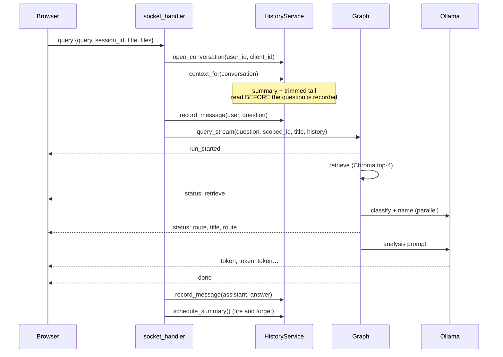

# How the Corporate Filing Analyzer works

A walkthrough of what actually happens inside the app, organised around the
things an analyst does: signing in, opening a dossier, attaching a filing,
asking a question, coming back tomorrow.

This is the *behaviour* document. Setup, configuration values and the API
reference live in the [README](../README.md); nothing here repeats them.

---

## Contents

- [The pieces](#the-pieces)
- [Two ids for one dossier](#two-ids-for-one-dossier)
- [Startup](#startup)
- [Signing in](#signing-in)
- [Opening the workbench](#opening-the-workbench)
- [Clicking "New dossier"](#clicking-new-dossier)
- [Attaching a filing](#attaching-a-filing)
- [Asking a question](#asking-a-question)
- [Inside the graph](#inside-the-graph)
- [How history is retrieved](#how-history-is-retrieved)
- [The rolling summary](#the-rolling-summary)
- [Reopening a dossier](#reopening-a-dossier)
- [Switching dossiers mid-run](#switching-dossiers-mid-run)
- [Discarding a dossier](#discarding-a-dossier)
- [Signing out](#signing-out)
- [Where everything is stored](#where-everything-is-stored)
- [What happens when things fail](#what-happens-when-things-fail)

---

## The pieces

| Piece | What it is | Where |
|---|---|---|
| Workbench | Plain HTML/CSS/JS, no build step, two vendored libraries | `frontend/` |
| API | FastAPI for HTTP, Socket.IO for the streaming chat, one ASGI app | `backend/Analyzer/main.py` |
| Graph | LangGraph: `retrieve → router → <category>` | `backend/Analyzer/graph/` |
| Ledger | SQLModel async — accounts, conversations, messages | `backend/Analyzer/models/` |
| Vector store | Chroma, one collection per dossier | `backend/data/chroma_db/` |
| Cache | Redis, optional, holds each conversation's recent tail | `backend/Analyzer/core/cache.py` |
| Model | Ollama on the host — `llama3.1` to answer, `nomic-embed-text` to embed | not in the stack |

The database is the source of truth for everything that has been said. Redis
holds a copy of the hot tail and is allowed to be absent, cold, or switched
off. Chroma holds the filing text; nothing else does.

`main.py` mounts both protocols as one ASGI app:

```python
asgi_app = socketio.ASGIApp(sio, other_asgi_app=app)
```

so `uvicorn main:asgi_app` serves the REST API *and* the websockets. Mounting
`main:app` instead would silently drop every socket — which is why the
Dockerfile's `CMD` names `asgi_app` explicitly.

---

## Two ids for one dossier

Almost every confusing thing in this codebase becomes clear once these are
separated:

**`client_id`** — minted by the browser (`newId()` in `app.js`, a UUID4 with
the dashes stripped). This is the id in every URL path, every socket payload,
and every event that comes back. It is unique *per account only*: two analysts
can independently mint the same one.

**`Conversation.id`** — the row's primary key, generated server-side. What
`messages.conversation_id` points at. The browser never sees it.

Because `client_id` is only unique per account, nothing ever looks a
conversation up by it alone. Every query is `WHERE user_id = ... AND
client_id = ...`, enforced by a unique constraint:

```python
UniqueConstraint("user_id", "client_id", name="uq_conversation_owner_client")
```

The same reasoning governs the vector store. `scoped_session_id()` in
`services/chat_service.py` binds the owner into the id before it ever reaches
Chroma:

```python
def scoped_session_id(user_id: str, session_id: str) -> str:
    return f"{user_id}:{session_id}"
```

which is then SHA-256'd into a collection name. There is no id a signed-in user
can send that resolves to another account's filings — not by guessing, not by
collision.

---

## Startup

### Backend

`lifespan` in `main.py`, in order:

1. **`init_db()`** — creates tables if absent. On SQLite it also `mkdir`s the
   parent directory and registers a `connect` listener that issues
   `PRAGMA foreign_keys=ON` on every connection. SQLite ignores foreign keys
   unless asked, per connection, so without this the `ON DELETE CASCADE` on
   `refresh_tokens.user_id` would be decorative.
2. **`message_cache.connect()`** — no `REDIS_URL`, missing package, bad URL or
   unreachable server all log and continue. The cache is simply off.
3. **`_prune_orphaned_filings()`** — reads every `(user_id, client_id)` pair
   still in `conversations`, maps them through `scoped_session_id()`, and hands
   the list to `VectorService.prune_to()`. Any `chat-*` collection not on that
   list is dropped.

Point 3 is worth dwelling on. Collections **outlive the process**, because the
dossiers they belong to do. What gets cleared is only what nothing points at
any more: a dossier deleted while the backend was down, or a crash between
ingesting a file and recording it. Everything an analyst can still open is
kept. If pruning throws, it is logged and swallowed — untidy disk is not worth
costing someone their app at startup.

### Frontend

`index.html` loads `auth.js` before `app.js`. Each resolves the backend URL
independently (auth.js cannot depend on app.js having run):

```js
if (typeof window.__BACKEND_URL__ === "string") {
  return window.__BACKEND_URL__ || window.location.origin;
}
return window.location.port === "8000" ? window.location.origin
                                       : "http://localhost:8000";
```

`config.js` sets `__BACKEND_URL__`. The checked-in copy sets nothing (dev
fallback to `:8000`); the Docker image swaps in `config.docker.js`, which sets
`""` — meaning this page's own origin, because nginx proxies `/api` and
`/socket.io` through to the backend. One origin in the browser means CORS,
preflights and the socket handshake all stop being cross-origin problems.

`app.js` then calls `newDossier()` once at the bottom of the file, so the stage
is never empty even before sign-in, and `auth.js` calls `Auth.boot()`.

---

## Signing in

### The two tokens

| | Access | Refresh |
|---|---|---|
| Lifetime | `ACCESS_TOKEN_EXPIRE_MINUTES` (15) | `REFRESH_TOKEN_EXPIRE_DAYS` (14) |
| Sent | On every request | Only to `/api/auth/refresh` |
| Stored server-side | No | Yes — its `jti`, in `refresh_tokens` |
| Revocable | No (expires on its own) | Yes |

Both are signed with `JWT_SECRET_KEY` and carry a `type` claim that is checked
on the way in. An access token presented at the refresh endpoint is refused,
and vice versa — that check is the entire point of the claim.

Leave `JWT_SECRET_KEY` unset and `_secret()` generates a throwaway key, loudly,
that dies with the process. Every login is invalidated on restart. Fine for
local work; the warning exists because it must not reach a deployment.

### Refresh rotation and reuse detection

Spending a refresh token revokes it and issues a new pair. So a token arriving
a second time is either a replay or a stolen copy racing the real client, and
those cannot be told apart. `AuthService.refresh` therefore:

```python
if not record.is_usable:
    await self.revoke_all(session, record.user_id)
```

Every session that user has is dropped. The thief is locked out; the owner
pays one re-login.

### Not leaking which addresses exist

`login` compares against a dummy bcrypt hash when the email is unknown, so an
unregistered address costs the same time as a wrong password. Wrong password,
unknown address and disabled account all return the identical message.

### The client side

`auth.js` keeps the pair in `localStorage` under `cfa.session` and runs two
mechanisms so the analyst never sees an expiry:

- **A timer** that refreshes `REFRESH_LEAD_MS` (60s) before the access token
  expires, so requests rarely meet a 401 at all.
- **`authFetch`**, which on a 401 refreshes once and retries. Capped at one
  retry: if a freshly minted token is still refused, staleness is not the
  problem and retrying would only spin.

Concurrent callers share one in-flight refresh (`refreshing` holds the promise).
Without that, three requests hitting an expired token would spend the refresh
token three times, and the first two rotations would invalidate the third —
logging the analyst out.

`Auth.boot()` does not trust the stored access token, which may well have
expired while the tab was closed. It spends the refresh token for a fresh pair,
which doubles as proof the session is still good.

Sign-in and sign-out are announced as `auth:signedin` / `auth:signedout` window
events rather than by calling into `app.js`, so neither file knows the other's
shape.

---

## Opening the workbench

`startSession(user)` fires on `auth:signedin`:

```
stampUser()  →  socket.connect()  →  GET /api/conversations  →  openDossier(first)
```

The socket is opened **first**, deliberately: it does not depend on the ledger,
and a dossier list that fails to load should not stop the analyst asking a
question.

### The socket handshake carries identity

```js
const socket = io(BACKEND_URL, { autoConnect: false, auth: (cb) => cb({ token: Auth.accessToken }) });
```

`auth` is a *callback*, not a fixed object, so it is invoked on every attempt
including reconnections. A socket that drops and comes back an hour later hands
over the token current at that moment, not the expired one it opened with.

Server-side, `connect` in `socket_handler.py` resolves the token to a user and
saves `{user_id, email}` against the sid. No token, or a bad one, raises
`ConnectionRefusedError` — the handshake fails rather than admitting a
connection that would reject every query.

`connect_error` on the client distinguishes the two failure kinds by matching
the message against `/sign|token|session|expire/i`. A rejected token is
refreshed and the connection retried; anything else is the analyzer being
unreachable, which retrying does fix.

### Restoring the dock

`GET /api/conversations` returns every dossier, most recently spoken in first
(`ORDER BY last_message_at DESC`, served by the
`ix_conversation_owner_recent` index). Each row becomes a client-side dossier
object with its title and filing register — but **not** its runs:

```js
dossier.runNo  = Math.ceil((row.message_count || 0) / 2);
dossier.loaded = !row.message_count;
```

The run tally is estimated from the message count (a run is a question plus an
answer) so the dock can show a number immediately. The runs themselves are
fetched lazily, the first time each dossier is opened — an analyst with forty
dossiers should not wait for the thirty-nine they will not look at.

The most recent dossier goes on the stage; a first-time analyst gets an empty
one from `newDossier()`.

---

## Clicking "New dossier"

`newChatBtn` → `newDossier()`. What it does is almost entirely *not* what you
might expect, so here it is in full:

```js
function newDossier() {
  const dossier = makeDossier();   // client-side object, fresh newId()
  state.dossiers.push(dossier);
  openDossier(dossier);
  return dossier;
}
```

**No network request is made.** No row is created. No Chroma collection is
created. A new dossier is, at this instant, nothing but a UUID and an empty
`<div class="run-stack">` held in browser memory.

What `openDossier()` then does:

- sets `state.active` to the new dossier;
- sets **`state.turn = null`** — any run still on the wire belongs to the
  dossier being left, and `liveTurn()` will now drop everything it sends back;
- swaps the new (empty) stack into `messagesList` via `replaceChildren`;
- unhides the welcome hero, since the stack has no children;
- re-renders the staging tray, the filing register and the dock;
- stamps the header with `DOSSIER <first 6 chars, uppercased>`;
- skips hydration, because a brand-new dossier is already `loaded: true`.

The dossiers already open **stay open**, filings and all. Their ledger entries
are not rebuilt when you come back — each dossier owns its own detached
`stack` element, so returning to one restores it exactly as it was left, down
to the faults recorded on individual runs.

The button is a no-op while `state.busy` is true.

### When the row actually appears

The `conversations` row is created lazily, by whichever of these happens first:

| Action | Path | Calls |
|---|---|---|
| Uploading a filing | `POST /api/upload` | `history.open_conversation()` after the ingest succeeds |
| Asking a question | socket `query` | `history_service.open_conversation()` before the graph starts |

`open_conversation()` is find-or-create, always scoped by `user_id`. It also
handles the race where two questions arrive into the same new dossier at once —
the unique constraint catches the second, and the loser rolls back and re-reads
the row the winner wrote:

```python
except Exception:
    await session.rollback()
    existing = await self.find(session, user_id, client_id)
    if existing is None:
        raise
    return existing
```

So a new dossier that is opened and never used costs exactly nothing: close the
tab and it was never anywhere but memory.

---

## Attaching a filing

Files are **staged**, not uploaded, when you attach them. `stageFiles()` filters
by extension (`.pdf .txt .md .csv`), pushes each onto `dossier.pending`, and
draws a chip in the tray. Nothing leaves the browser yet — a filing rides along
with a question, so attaching while a run is in flight is refused.

The upload happens inside `submitQuery()`, *before* the question is emitted, so
the same run can read what it just attached:

```js
if (files.length) {
  setWork(turn, "adding the filing");
  const ok = await uploadPending(files, turn);
  if (!ok) { /* abort the run */ }
}
```

`uploadPending` posts each file to `/api/upload` through `authFetch` (so an
expiry mid-upload is refreshed and the upload replayed rather than lost) and
keys everything off `turn.sessionId` rather than the live dossier — a run
uploads into, and asks of, the dossier it was opened in, even if the analyst
has since switched.

### Server side

`POST /api/upload` requires `session_id` as a form field. Then:

1. `VectorService.ingest_file()` — PDF via `pypdf` (one document per non-empty
   page), or UTF-8 decode for text formats.
2. `RecursiveCharacterTextSplitter`, 1000 characters with 200 overlap.
3. `aadd_documents()` into the collection named
   `chat-<sha256(user_id:client_id)[:32]>`.
4. **Only then** `open_conversation()` + `record_filing()` — the register never
   lists a filing that is not actually searchable.

PDFs fail in specific, nameable ways, and each comes back as a `ValueError`
carrying a reason the analyst can act on:

| Condition | Message |
|---|---|
| `PyPdfError` on open | "…is not a readable PDF — the file looks corrupt or incomplete." |
| Encrypted, empty password fails | "…is password protected. Remove the password and upload it again." |
| No page yielded text | "…No readable text found… Scanned PDFs need to be run through OCR." |
| One page throws | Skipped, counted, logged — one broken page does not cost the filing |

`ValueError` becomes a 400; anything else (the embedding model unreachable, say)
becomes a 500 whose `detail` names the file — which is what surfaces in the
browser as `Could not add mock_10k_filing.txt: …`.

The response echoes back the **client's** `session_id`, not the scoped one. The
namespacing is a backend detail.

---

## Asking a question

The whole path, end to end:



### Before the graph

The question is recorded **after** `context_for()` is read. Reading it the other
way round would put the question in the prompt twice — once as history, once as
the question.

Both reads happen in one short-lived `SessionLocal()` block that closes before
the graph starts. An answer can take a minute, and a pooled connection held
open across it is a connection nothing else can use.

An empty question with a file attached falls back to:

> "Provide an executive summary and financial overview of this filing."

because the router still needs something to classify.

The **stored** title wins over the one the browser sent — the server named this
dossier, and a client that has fallen behind should not be able to rename it.

### The event stream

Every event carries the `session_id` it was produced for. The client's
`liveTurn()` uses it as a two-part gate:

```js
if (!turn || turn.sessionId !== state.active.id) return null;
if (data?.session_id && data.session_id !== state.active.id) return null;
```

A run must have been opened in the dossier on screen *and* the server must have
stamped the event with that same dossier. Anything else — a run cut short by a
dropped connection whose events arrive after the analyst moved on — is dropped
rather than written into whatever is on screen now.

`title` and `done` are the exceptions: `nameDossier()` runs *before* the
staleness check, keyed off the id in the event, because a name is worth keeping
even for a dossier the analyst has already left.

Progress is translated into the analyst's terms; nothing about graph internals
reaches the UI except the category tag:

| `status.stage` | Shown as |
|---|---|
| `retrieve` | "reading the filing" |
| `route` | "working out what you're asking" |
| `analyze` | "writing the *<category>* answer" |

### After the answer

`_record_answer()` writes the assistant message in its own fresh session. It
**never raises** — losing the record of an answer the analyst has already read
is not worth turning into an error they must act on.

A failed run is still recorded, with `status="error"` and the reason in
`meta.error`. The analyst should see on their next visit that the question was
asked and did not land, rather than find it missing. It is kept out of what
later runs are *sent*, though — see below.

Then `schedule_summary()` fires, off the critical path.

---

## Inside the graph

```
                                     ┌─> financials ─┐
    START ─> retrieve ─┬─> router ───┼─> risks ──────┼─> END
                       │             └─> …6 more ────┘
                       └─> no_filing ───────────────────> END
```

Compiled with **no checkpointer** — a run goes straight through with nothing to
pause on. Each run gets a fresh `thread_id` (the run id), so concurrent runs
never share state.

### `retrieve`

Top-4 chunks from *this dossier's* collection, joined and clipped to 3000
characters. No fallback to other dossiers: if nothing has been uploaded here,
the answer is built without a filing rather than out of someone else's.

Retrieval runs **before** routing so the router classifies with the filing in
hand and the analysis node inherits the same context.

### `no_filing`

If `retrieve` produced nothing, the run short-circuits here with a fixed message
asking for a filing. Without this branch the analysis prompt would run on an
empty context and the model would invent a plausible-looking report out of
nothing.

### `router`

Two LLM calls, and on the first run of a dossier they are issued in parallel:

```python
category, title = await asyncio.gather(
    self.router.classify(query),
    self.router.name_chat(query),
)
```

so the opening question does not wait longer for its answer than the ones that
follow. A dossier is named **once**; every later run arrives carrying the name
and the `if title:` branch skips naming entirely.

Both calls are defensive about small-model output. `classify` strips
punctuation and takes the first word that is a known category, falling back to
`qa`. `_clean_title` drops chat-template role echoes (llama3.1 likes to open
with a bare `assistant`), strips `Title:` lead-ins and wrapping punctuation,
collapses whitespace, and clips to 42 characters on a word boundary. Naming
never raises — a dossier that cannot be named still has to get its answer, so
it falls back to "Untitled dossier".

### The analysis nodes

Eight of them, one per category, all built by the same factory with
`node.__name__ = category`. That name is what LangGraph reports as
`langgraph_node`, and it is how `ChatService.query_stream` decides which tokens
belong to the analyst:

```python
if metadata.get("langgraph_node") not in CATEGORIES:
    continue
```

The router's own LLM call streams through the same channel and would otherwise
leak its answer into the UI.

Categories are defined in exactly one place — `core/categories.py` — so the
router, the graph and `config/prompts.yaml` cannot drift apart.

---

## How history is retrieved

**Two different histories come out of one table.** Keeping them apart is the
whole design of `HistoryService`.

### Display history — everything

`GET /api/conversations/{client_id}/messages`. Untrimmed, in order, paged. The
analyst's record of what was asked and answered should not change shape as a
dossier gets long.

Paged **from the end backwards** — opening a dossier should show the last thing
said — and cursored on `seq`, not an offset, so a message arriving mid-scroll
cannot shift the page under the reader.

Pages are **aligned to whole runs**:

```python
while len(messages) > 1 and messages[0].role != ROLE_USER:
    messages.pop(0)
```

An answer whose question fell on the previous page is left for that page to
carry. Costs at most one message off the front, and means the client can pair
question with answer within one page — `renderStoredRuns()` is a straight walk,
never a stitch across two pages.

`next_before_seq` is the cursor for the page *before* this one, and is null once
`seq == 1` is reached. That null is what removes the "load earlier runs" button.

### Context history — what the model is actually sent

`HistoryService.context_for()`. Four filters, in order:

1. **Already summarised** — drop anything at or below
   `conversation.summary_through_seq`. It is represented by the summary now.
2. **Failed runs** — drop anything with `status != "complete"`. Conditioning the
   next answer on an error message only teaches the model to apologise.
3. **A question whose run failed** — dropped along with the failure. On its own
   it reads as something the analyzer was asked and declined to answer, which is
   not what happened:
   ```python
   answered = [m for i, m in enumerate(fresh)
               if m["role"] != ROLE_USER
               or (i + 1 < len(fresh) and fresh[i + 1]["role"] == ROLE_ASSISTANT)]
   ```
4. **The window and the budget** — last `HISTORY_CONTEXT_MESSAGES` (10), then
   trimmed to `HISTORY_CONTEXT_TOKENS` (1500) *minus what the summary costs*.
   Walked newest-first so what falls off is always the oldest, and at least one
   message is always kept.

The token pass reads the counts stored on each row, which is what they are for.
They are estimates — `core/tokens.py` takes the larger of chars/3.6 and
words×1.35, erring high on purpose. A history trimmed slightly too hard still
answers; one trimmed too softly overflows the window and fails.

### Where the tail comes from

```python
cached = await self.cache.recent(conversation.id)
if cached is not None:
    return cached
# ... otherwise read the DB and prime the cache
```

The Redis key holds the tail as a list, newest last, trimmed to
`REDIS_HOT_WINDOW`. Because the whole key expires at once, a key that exists
holds the *full* window — a hit never has to wonder whether it is looking at a
partial tail.

Three details that follow from that:

- **`append` does not create the key.** A conversation nobody has read would end
  up cached as a one-message tail, which a later read would take for the whole
  window. Only `prime` creates it.
- **Reads touch the TTL**, so an active dossier stays hot and an abandoned one
  falls out on its own.
- **A Redis error disables the cache** rather than raising. Reconnecting per
  request would mean paying a timeout per request for as long as Redis is down;
  the database is both correct and faster than that. The cache returns on
  restart.

`_widen_hot_window` in `config.py` forces `REDIS_HOT_WINDOW >=
HISTORY_CONTEXT_MESSAGES`. A cache holding fewer messages than a run asks for
answers every request as a miss — worse than no cache, because you pay the
round trip *and* read the database.

### How the history reaches the prompt

`AnalysisService._history_message()` builds **one system message**, not a run of
alternating turns:

```
Earlier in this dossier (background — the filing above is the source of fact):

Summary of earlier exchanges:
…

Recent exchanges:
Analyst: …
Analyzer: …

Use this only to resolve what the analyst is referring to and to avoid
repeating yourself. Do not treat it as evidence about the filing.
```

The reason is that half the category prompts carry the question *inside* the
system message. Replaying history as real turns would land it after the question
in some categories and before it in others; one labelled block reads the same
way in both. Each message is clipped to 800 characters so one long report inside
the budget cannot crowd out the turns around it.

For the report-style prompts that take only `{context}`, the question is
appended afterwards as "Analyst request: … Produce the report above, giving
extra emphasis to this request."

---

## The rolling summary

Fired by `schedule_summary()` after the answer has been delivered — never
before the next one. Summarising is another LLM call, and no analyst should wait
on last week's history being compressed.

```python
if self.summarizer is None or conversation_id in self._summarising:
    return
self._summarising.add(conversation_id)
task = asyncio.create_task(self._summarise(conversation_id))
self._summary_tasks.add(task)
```

Two guards worth noting. `_summarising` stops a burst of questions starting the
same fold several times. `_summary_tasks` holds a **strong reference** — asyncio
only keeps a weak one to a running task, so a fold with no reference anywhere
can be garbage collected mid-await and simply never finish.

The fold itself:

- Runs only when more than `HISTORY_SUMMARY_THRESHOLD` (24) messages sit
  unsummarised.
- Leaves the last `HISTORY_CONTEXT_MESSAGES` verbatim — they are what the next
  question is most likely to be about.
- Is **cumulative**: the summariser is given the previous summary plus only the
  turns since, so the cost does not grow with conversation length.
- Clips each message to 1200 characters for the summariser's own context, and
  the resulting summary to 1500 characters, since it rides in every subsequent
  prompt.
- On failure, logs and leaves the summary alone. The conversation still answers;
  it just carries a longer unsummarised tail until the next attempt. A bad
  summary would silently distort every answer that followed, so "not yet" is the
  right outcome.

The summariser is wired in at `api/deps.py`, after the chat service exists:

```python
history_service.attach_summarizer(chat_service.summary.summarise)
```

The same model that answers also keeps the summaries.

---

## Reopening a dossier

Clicking a row in the dock calls `openDossier()`. If `dossier.loaded` is false,
`hydrateDossier()` fetches the newest page and draws it.

`renderStoredRuns()` walks the page pairing user messages with the answer that
follows. A stored answer with `status === "error"` is drawn as a fault block
rather than as prose. `meta.category` restores the category tag; `meta.files`
restores the filing chips on the run; `meta.run` restores the run number.

That `meta.run` is stamped at write time, in `record_message`:

```python
if role == ROLE_USER and "run" not in meta:
    meta["run"] = await self._run_number(session, conversation.id)
```

The ledger numbers **runs**, not messages, and a client that has paged back into
an old dossier has no way to work out where in the count it is standing — so the
server records it once, when it knows.

Hydration failure is not fatal: `dossier.loaded` is set to `true` anyway (so it
does not retry on every open), a toast explains, and asking a question still
works — the run appends to whatever the backend already has, which is the record
that matters.

---

## Switching dossiers mid-run

You cannot, and the refusal is explicit:

```js
if (state.busy) {
  showToast("Wait for the run to finish before switching dossier", "info");
  return;
}
```

A run reads and answers within one dossier; switching mid-run would leave it
writing into a ledger that is no longer on screen. The same guard blocks new
dossiers, discarding, attaching files and signing out while busy.

If the connection drops mid-run, `disconnect` removes the `is-live` class,
toasts, and calls `finishTurn()` — the run is over from the browser's point of
view. The backend, meanwhile, still records whatever it has.

---

## Discarding a dossier

`clearChatBtn` → `discardDossier()` → `DELETE /api/conversations/{client_id}`.

Both halves go, in this order:

```python
deleted = await history.delete_conversation(session, user.id, session_id)
dropped = chat.delete_session(scoped_session_id(user.id, session_id))
```

Messages cascade off the conversation row; the cache key is dropped; then the
Chroma collection. A conversation whose messages were kept while its filings
were dropped would answer follow-ups out of a summary of documents it can no
longer cite.

Client-side, the dossier is spliced out and its neighbour opened. **The
workbench always has one dossier open**, so discarding the last one calls
`newDossier()` rather than leaving an empty stage.

A failed DELETE is swallowed. The dossier is gone from the workbench either way,
and a record left behind on the backend reappears on the next sign-in rather
than being lost — the better way round to fail.

---

## Signing out

`Auth.logout()` dispatches **`auth:signingout` before clearing the session**.
Listeners run synchronously, so any request the workbench needs to get out —
ones needing a credential that is still good — are already on the wire by the
time `clear()` runs.

Then the local half happens unconditionally, and the server call is best-effort
with `keepalive: true`. A logout that leaves the analyst signed in because the
network was down is worse than one whose refresh token outlives its own expiry
unrevoked.

`endSession()` in app.js clears the whole stage, not just the connection, so the
next analyst on this browser is not handed the last one's questions on screen.

Note the asymmetry: revoking a refresh token does **not** invalidate outstanding
access tokens. They are not looked up in the database — that is the point of
them — so revocation takes effect on the access token's own short expiry.

---

## Where everything is stored

| Data | Store | Survives restart? | Survives dossier delete? |
|---|---|---|---|
| Accounts, password hashes | `users` | yes | — |
| Refresh token `jti`s | `refresh_tokens` | yes | cascades on account delete |
| Dossiers, titles, filing register | `conversations` | yes | no |
| Every message + token count | `messages` | yes | no (cascades) |
| Rolling summary | `conversations.summary` | yes | no |
| Filing text + embeddings | Chroma `chat-<hash>` | yes | no |
| Recent message tail | Redis | no (and fine) | key dropped |
| Staged-but-unsent files | Browser memory | no | no |
| A never-used new dossier | Browser memory | no | — |

`Message.meta` is a JSON column, `jsonb` on Postgres. What hangs off a message
varies by what produced it — attached filings, the run that answered, the reason
a run failed — and none of it is queried structurally, so it lives there rather
than as a column each new kind of message would add.

`Message.seq` orders a conversation, not `created_at`: two messages in the same
millisecond would be a coin toss, and pagination needs a total order.
`_next_seq()` reads the max from `messages` rather than the conversation's
counter, so a counter that has drifted cannot hand out a position already taken.

---

## What happens when things fail

| Failure | Behaviour |
|---|---|
| Redis down or absent | Cache disabled, every read goes to the database. Correct, just slower. |
| Summariser call fails | Logged. Conversation keeps a longer unsummarised tail, retried after the next run. |
| Pruning fails at startup | Logged. Orphaned collections stay on disk; nothing can reach them. |
| Naming a dossier fails | Falls back to "Untitled dossier". The answer is unaffected. |
| Router returns nonsense | Falls back to the `qa` category. |
| No filing in the dossier | `no_filing` node returns a fixed "attach a filing" message. |
| Answer recording fails | Logged only. The analyst has already read the answer. |
| Run fails mid-stream | Recorded with `status="error"`, shown as a fault, excluded from future context. |
| Access token expires mid-request | `authFetch` refreshes once and retries. |
| Access token expires on the socket | `connect_error` → refresh → reconnect with the new token. |
| Refresh token reused | Every session for that user is revoked. |
| Backend unreachable | `fetch` rejects with `TypeError`; the UI says so specifically rather than blaming the file or the credentials. |
| Ollama unreachable | Upload returns a 500 whose detail names the file; queries surface as an `error` event. |

The pattern throughout: **anything that is not the analyst's answer fails soft.**
Housekeeping, caching, summarising and naming all degrade rather than propagate.
The things that do fail loudly are the ones where continuing would produce a
wrong answer — an unreadable filing, a missing dossier id, an expired session.
