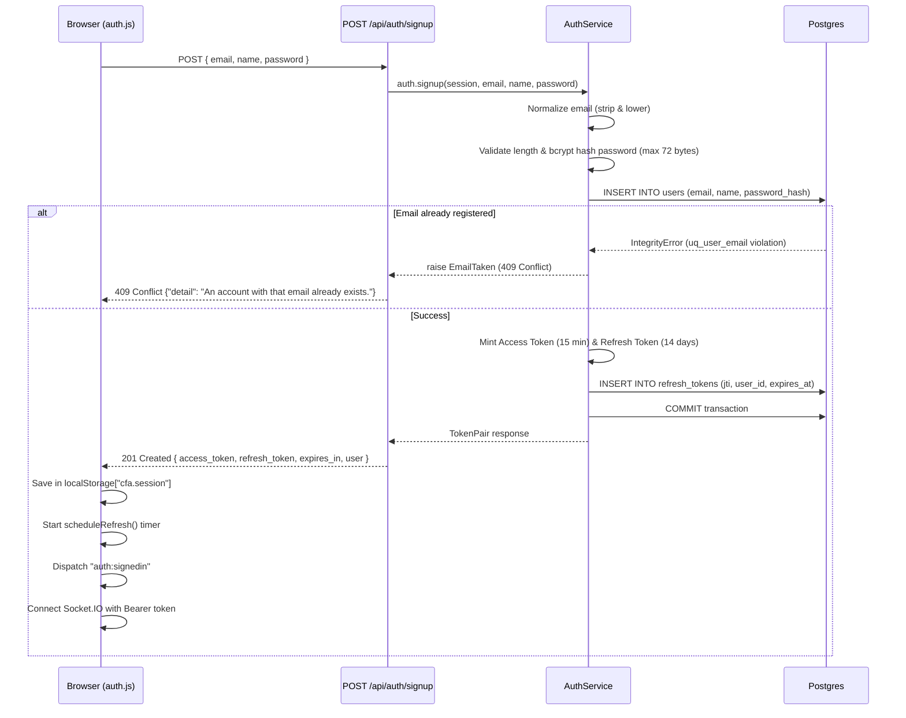
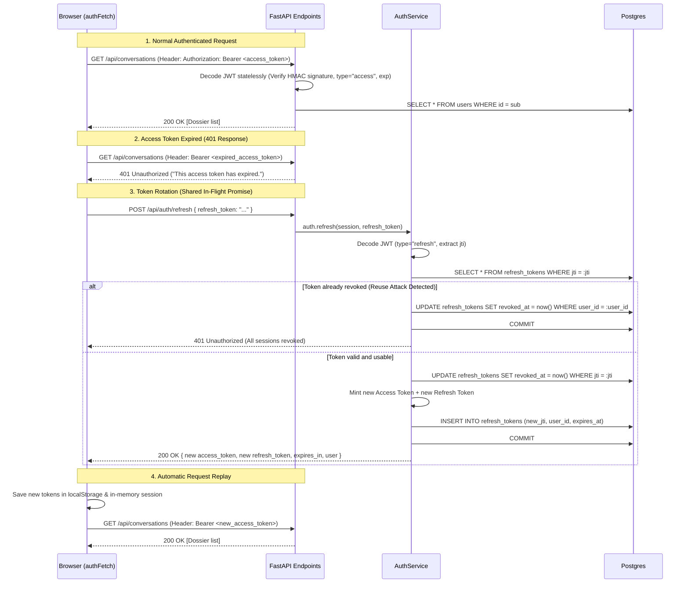
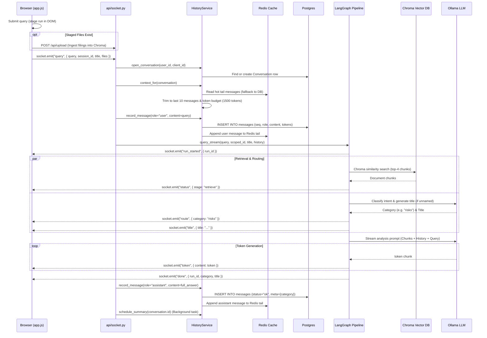
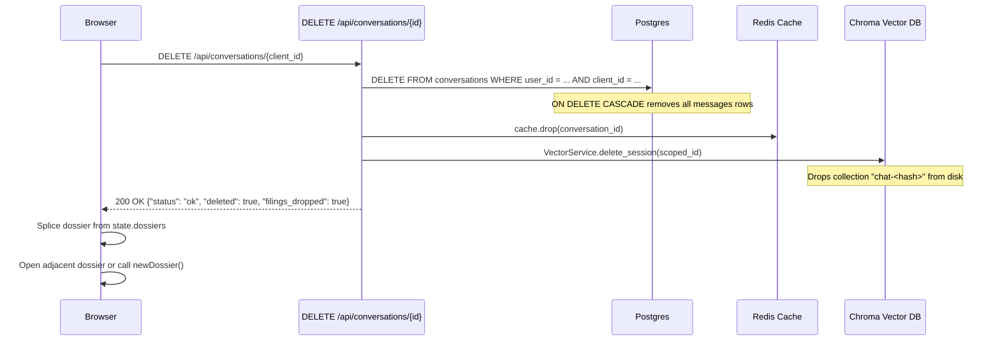

# How the Corporate Filing Analyzer works

A comprehensive walkthrough of what actually happens inside the app, organized around the
actions an analyst takes: signing up, logging in, opening a new dossier, reopening an old dossier,
attaching filings, asking questions, deleting dossiers, and managing sessions.

This is the *architecture and behavior* document. Setup, configuration values, and the general
reference live in the [README](../README.md); the real-time transport — how Socket.IO is mounted
onto FastAPI and how events are streamed — is in [SOCKETIO.md](SOCKETIO.md), and what the backend
does for each workbench operation, handler by handler, is in
[FRONTEND-SOCKETIO.md](FRONTEND-SOCKETIO.md); and the schema, with every
statement the app issues against it, is in [DB-OPERATIONS.md](DB-OPERATIONS.md).

---

## Contents

- [The pieces](#the-pieces)
- [Two ids for one dossier](#two-ids-for-one-dossier)
- [Startup](#startup)
- [Signup: What happens in the background](#signup-what-happens-in-the-background)
- [Login & Frontend Caching](#login--frontend-caching)
- [JWT Architecture & Token Lifecycle](#jwt-architecture--token-lifecycle)
- [Opening the workbench](#opening-the-workbench)
- [Clicking "New dossier"](#clicking-new-dossier)
- [Reopening an "Old dossier" (Hydration & Pagination)](#reopening-an-old-dossier-hydration--pagination)
- [Attaching a filing](#attaching-a-filing)
- [Asking a question in a dossier (New or Old)](#asking-a-question-in-a-dossier-new-or-old)
- [Inside the graph](#inside-the-graph)
- [How history is retrieved](#how-history-is-retrieved)
- [The rolling summary](#the-rolling-summary)
- [Switching dossiers mid-run](#switching-dossiers-mid-run)
- [Discarding / Deleting a dossier](#discarding--deleting-a-dossier)
- [Complete CRUD Matrix](#complete-crud-matrix)
- [Signing out](#signing-out)
- [Where everything is stored](#where-everything-is-stored)
- [What happens when things fail](#what-happens-when-things-fail)

---

## The pieces

| Piece | What it is | Where |
|---|---|---|
| Workbench | Plain HTML/CSS/JS, no build step, zero heavy frameworks | `frontend/` |
| API | FastAPI for HTTP, Socket.IO for the streaming chat, one ASGI app | `backend/Analyzer/main.py` |
| Graph | LangGraph: `retrieve → router → <category>` | `backend/Analyzer/analysis/graph/` |
| Ledger | SQLModel async over Postgres — accounts, dossiers, messages, refresh tokens | `backend/Analyzer/auth/models.py`, `backend/Analyzer/conversations/models.py` |
| Vector store | Chroma, one isolated collection per dossier | `backend/data/chroma_db/` |
| Cache | Redis, optional, holds each conversation's hot tail | `backend/Analyzer/conversations/cache.py` |
| Model | Ollama on the host — `llama3.1` to answer, `nomic-embed-text` to embed | Host machine |

Postgres is the source of truth for all users, dossiers, and messages. Redis holds a copy of the hot tail and is allowed to be absent, cold, or switched off. Chroma holds the filing text and vector embeddings; nothing else does.

`main.py` mounts both protocols as one ASGI app:

```python
asgi_app = socketio.ASGIApp(sio, other_asgi_app=app)
```

so `uvicorn main:asgi_app` serves the REST API *and* the websockets. Mounting `main:app` instead would silently drop every socket connection — which is why the Dockerfile's `CMD` names `asgi_app` explicitly.

---

## Two ids for one dossier

Almost every confusing thing in this codebase becomes clear once these two IDs are separated:

1. **`client_id`** — minted by the browser (`newId()` in `app.js`, a UUID4 with dashes stripped). This is the id in every URL path, every socket payload, and every event that comes back. It is unique *per account only*: two analysts can independently mint the same one.
2. **`Conversation.id`** — the row's primary key (UUID), generated server-side. What `messages.conversation_id` foreign keys point at. The browser never sees it.

Because `client_id` is only unique per account, nothing ever looks a conversation up by it alone. Every query is `WHERE user_id = ... AND client_id = ...`, enforced by a unique constraint:

```python
UniqueConstraint("user_id", "client_id", name="uq_conversation_owner_client")
```

The same reasoning governs the vector store. `scoped_session_id()` in `analysis/pipeline.py` binds the owner into the id before it ever reaches Chroma:

```python
def scoped_session_id(user_id: str, session_id: str) -> str:
    return f"{user_id}:{session_id}"
```

which is then SHA-256'd into a collection name (`chat-<hash>`). There is no id a signed-in user can send that resolves to another account's filings — not by guessing, not by collision.

---

## Startup

### Backend

`lifespan` in `main.py`, in order:

1. **`init_db()`** — imports the table modules so SQLModel's metadata knows about them, then creates any that are absent. Nothing more: Postgres enforces the `ON DELETE CASCADE` on `refresh_tokens.user_id` and `messages.conversation_id` itself, and the connection pool is built when `db/engine.py` is imported. Versioned migrations would go in front of this (Alembic); table-creation on boot is enough for one service.
2. **`message_cache.connect()`** — no `REDIS_URL`, missing package, bad URL or unreachable server all log and continue. The cache is simply off.
3. **`_prune_orphaned_filings()`** — reads every `(user_id, client_id)` pair still in `conversations`, maps them through `scoped_session_id()`, and hands the list to `VectorService.prune_to()`. Any `chat-*` collection not on that list is dropped.

Collections **outlive the process**, because the dossiers they belong to do. What gets cleared at startup is only what nothing points at any more: a dossier deleted while the backend was down, or a crash between ingesting a file and recording it in Postgres. Everything an analyst can still open is kept. If pruning throws, it is logged and swallowed — untidy disk is not worth costing someone their app at startup.

### Frontend

`index.html` loads `auth.js` before `app.js`. Each resolves the backend URL independently:

```js
if (typeof window.__BACKEND_URL__ === "string") {
  return window.__BACKEND_URL__ || window.location.origin;
}
return window.location.port === "8000" ? window.location.origin
                                       : "http://localhost:8000";
```

`config.js` sets `__BACKEND_URL__`. In development, it falls back to `:8000`. In Docker, `config.docker.js` sets `""` — meaning this page's own origin, because nginx proxies `/api` and `/socket.io` through to the backend. One origin in the browser means CORS, preflights and the socket handshake all stop being cross-origin problems.

`app.js` then calls `newDossier()` once at the bottom of the file (so the stage is never empty even before sign-in), and `auth.js` calls `Auth.boot()`.

---

## Signup: What happens in the background

When a new analyst opens an account:



### 1. What is sent by the frontend:
* **Endpoint**: `POST /api/auth/signup`
* **Headers**: `Content-Type: application/json`
* **Payload**:
```json
{
  "email": "analyst@example.com",
  "name": "Alex Mercer",
  "password": "SecurePassword123"
}
```

### 2. Backend processing:
1. **Normalization**: `email` is trimmed and converted to lowercase (`email.strip().lower()`).
2. **Password Validation**:
   - Must be at least 8 characters (validated by Pydantic schema and frontend).
   - UTF-8 byte length is checked to be $\le 72$ bytes. Bcrypt silently truncates after 72 bytes, which would make two long passwords sharing a 72-byte prefix interchangeable; the backend explicitly rejects oversized passwords with a `422 Unprocessable Content`.
3. **Hashing**: Hashed via `bcrypt.hashpw(encoded, bcrypt.gensalt())`.
4. **Database Insertion**:
   - Constructs a `User` model and executes `session.flush()`.
   - If the email is already in use, the unique index on `User.email` raises `IntegrityError`. The backend rolls back and raises `EmailTaken`, returning **`409 Conflict`**.
5. **Token Issuance**:
   - Generates a short-lived **Access Token** (15 minutes).
   - Generates a long-lived **Refresh Token** (14 days) with a random UUID `jti`.
   - Records the `jti` in the `refresh_tokens` table.
   - Commits the transaction.

### 3. What is received back:
* **HTTP Status**: `201 Created`
* **Response Payload**:
```json
{
  "access_token": "eyJhbGciOiJIUzI1NiIsInR5cCI6IkpXVCJ9...",
  "refresh_token": "eyJhbGciOiJIUzI1NiIsInR5cCI6IkpXVCJ9...",
  "expires_in": 900,
  "user": {
    "id": "u_01j7abc123456789...",
    "email": "analyst@example.com",
    "name": "Alex Mercer"
  }
}
```

### 4. Client-side actions:
* `auth.js` stores the session in `localStorage` under `cfa.session`.
* Schedules an automatic background refresh timer `REFRESH_LEAD_MS` (60s) before access token expiry.
* Fires `window.dispatchEvent(new CustomEvent("auth:signedin"))`.
* `app.js` catches the event, unlocks the workbench, starts the Socket.IO connection with the access token, and loads the analyst's dossiers.

---

## Login & Frontend Caching

### 1. What is sent during login:
* **Endpoint**: `POST /api/auth/login`
* **Payload**:
```json
{
  "email": "analyst@example.com",
  "password": "SecurePassword123"
}
```

### 2. Backend processing & timing protection:
1. Normalizes email and queries `User` by email.
2. **Preventing User Enumeration**: If the email is not found, the backend runs `verify_password(password, _DUMMY_HASH)` against a dummy bcrypt hash. This ensures non-existent accounts take the exact same computation time (~100ms) as real accounts with wrong passwords, preventing attackers from discovering registered emails via timing attacks.
3. If user exists, verifies `bcrypt.checkpw(password, user.password_hash)` and ensures `user.is_active` is true.
4. Mints a fresh Access Token and Refresh Token, saves the refresh token's `jti` in `refresh_tokens`, and returns the `TokenPair` payload.

### 3. What the frontend caches:
The workbench maintains a clean separation between auth tokens and runtime UI state:

| Storage Location | What is cached | Lifecycle |
|---|---|---|
| **`localStorage["cfa.session"]`** | `{ access_token, refresh_token, user }` | Survives tab closes, reloads, and browser restarts. |
| **`auth.js` in-memory state** | Active `session` object, background refresh timer ID, in-flight refresh promise | Lives for the lifetime of the page tab. |
| **`app.js` in-memory state** | `state.dossiers` array, `state.active` dossier, `state.turn`, detached DOM run-stacks | Cleared on sign-out or page reload. |
| **Browser DOM** | Detached `<div class="run-stack">` elements for each open dossier | Preserved in JS memory while switching between dossiers. |
| **Filings & Messages** | **Not stored in browser localStorage** | Stored securely on the server (Postgres + Chroma) and fetched on demand. |

---

## JWT Architecture & Token Lifecycle



### Access Token vs Refresh Token

| Property | Access Token | Refresh Token |
|---|---|---|
| **Lifetime** | 15 minutes (`ACCESS_TOKEN_EXPIRE_MINUTES`) | 14 days (`REFRESH_TOKEN_EXPIRE_DAYS`) |
| **Payload Claims** | `{"sub": user_id, "type": "access", "jti": uuid, "iat": ..., "exp": ...}` | `{"sub": user_id, "type": "refresh", "jti": uuid, "iat": ..., "exp": ...}` |
| **Transmission** | `Authorization: Bearer <token>` on all HTTP requests & Socket.IO handshake | Sent only to `POST /api/auth/refresh` and `POST /api/auth/logout` |
| **Database Lookup** | **No** (stateless HMAC verification; only verifies user existence) | **Yes** (`jti` verified in `refresh_tokens` table) |
| **Revocation** | Expires naturally (short lifetime) | Explicitly revoked in database upon rotation or logout |

### Rotation & Reuse Detection
* Refresh tokens are **single-use**: trading a refresh token revokes it (`revoked_at = utcnow()`) and issues a brand-new token pair.
* If a revoked refresh token is presented a second time, it indicates either a packet replay or a stolen token racing against the legitimate user.
* Because the server cannot tell the attacker apart from the owner, it executes **`revoke_all(user_id)`** — revoking every active refresh token for that user across all devices. The thief is locked out, and the owner simply signs in again.

### Frontend Concurrency Lock
If three API requests hit the server simultaneously when an access token expires:
1. `authFetch` intercepts the first `401`.
2. It assigns the in-flight refresh promise to `refreshing`.
3. The other two requests await the same `refreshing` promise instead of making second and third refresh calls.
4. This prevents multiple refresh token rotations from invalidating each other.

---

## Opening the workbench

`startSession(user)` fires on the `auth:signedin` event:

```
stampUser()  →  socket.connect()  →  GET /api/conversations  →  openDossier(first)
```

The socket is opened **first**, deliberately: it does not depend on the database ledger, and a dossier list that fails to load should not stop the analyst from asking questions.

### The socket handshake carries identity

```js
const socket = io(BACKEND_URL, {
  autoConnect: false,
  auth: (cb) => cb({ token: Auth.accessToken })
});
```

`auth` is a callback, so it is evaluated on every reconnection attempt. If a connection drops and reconnects later, it sends the current access token, not the expired one.

Server-side, `connect` in `api/socket.py` resolves the token to a user and saves `{user_id, email}` against the socket `sid`. If the token is missing or invalid, it raises `ConnectionRefusedError` to reject unauthenticated connections immediately.

### Restoring the dock

`GET /api/conversations` returns all dossiers for the logged-in user, most recently active first (`ORDER BY last_message_at DESC`).

Each row becomes a client-side dossier object with its title and filing list, but **not** its message history:

```js
dossier.runNo  = Math.ceil((row.message_count || 0) / 2);
dossier.loaded = !row.message_count;
```

The run tally is estimated from the message count (each run is a user question + assistant answer). Runs are fetched lazily the first time each dossier is opened so an analyst with dozens of dossiers doesn't download hundreds of messages upfront.

---

## Clicking "New dossier"

When the analyst clicks `+ New`:

```js
function newDossier() {
  const dossier = makeDossier();   // client-side object, fresh newId()
  state.dossiers.push(dossier);
  openDossier(dossier);
  return dossier;
}
```

### Crucial Architectural Design:
* **No network request is made.**
* **No database row is inserted.**
* **No Chroma collection is created.**

A new dossier is simply a client-side JavaScript object with a fresh UUID and an empty detached `<div class="run-stack">` DOM element.

### What `openDossier()` does:
1. Sets `state.active` to the new dossier.
2. Sets **`state.turn = null`** (disconnecting any background stream from the previous dossier).
3. Replaces `messagesList` children with the new dossier's DOM stack via `replaceChildren`.
4. Shows the welcome hero card.
5. Updates staging tray, filing register, and sidebar badges.
6. Displays the header stamp: `DOSSIER <first 6 chars of client_id>`.

### When the database row actually appears:
The database row in `conversations` is created **lazily** on the first action that requires server persistence:

| Action | API / Event | Server Handler |
|---|---|---|
| Uploading a filing | `POST /api/upload` | `history.open_conversation()` after file vectorization succeeds |
| Asking a question | Socket `query` event | `history_service.open_conversation()` before graph execution |

If an analyst opens a new dossier and closes the browser tab without uploading a file or asking a question, **zero bytes of orphan data** are left on the server.

---

## Reopening an "Old dossier" (Hydration & Pagination)

When the analyst clicks an existing dossier in the sidebar dock:

1. **Busy Guard**: If `state.busy` is true (a question is currently streaming), switching is refused to avoid cross-wiring outputs.
2. **DOM Swap**: `messagesList.replaceChildren(dossier.stack)` immediately swaps in the existing runs if already loaded in this browser session.
3. **Lazy Hydration (First Open)**:
   If `dossier.loaded` is `false`, `hydrateDossier(dossier)` fetches the newest page of runs:
   ```
   GET /api/conversations/{session_id}/messages?limit=30
   ```
4. **Backend Message Pagination**:
   - Queries `messages` table filtered by `conversation_id`, ordered by `seq DESC`.
   - **Run Alignment**: If the oldest message on a page is an assistant answer whose user question fell on the preceding page, it is popped off so runs are never broken in half.
   - Computes `next_before_seq` (the cursor for loading older runs).
5. **Frontend Rendering (`renderStoredRuns`)**:
   - Walks messages pairing user questions with assistant answers into `<article class="run">` elements.
   - Parses answer markdown with `marked`.
   - Restores metadata tags: category badge (`Financials`, `Risks`, etc.), timestamp, run number (`RUN 01`), and attached filing chips.
   - If `next_before_seq` is not null, prepends a **"load earlier runs"** button at the top of the stack.

---

## Attaching a filing

Files are **staged locally**, not uploaded immediately when attached. `stageFiles()` filters extensions (`.pdf`, `.txt`, `.md`, `.csv`), adds them to `dossier.pending`, and draws chips in the command bar tray.

The upload happens inside `submitQuery()`, **before** the question is emitted, so the subsequent analysis run can immediately search what was just uploaded:

```js
if (files.length) {
  setWork(turn, "adding the filing");
  const ok = await uploadPending(files, turn);
  if (!ok) { /* abort run */ }
}
```

### Server-side Ingestion (`POST /api/upload`):
1. **Extraction**:
   - PDF: parsed page-by-page via `pypdf` (extracts text and skips blank/corrupt pages).
   - Text/MD/CSV: decoded as UTF-8.
2. **Chunking**: `RecursiveCharacterTextSplitter` divides text into 1,000-character chunks with 200-character overlap.
3. **Vectorization**: Embedded via `nomic-embed-text` and stored in Chroma collection `chat-<sha256(user_id:client_id)[:32]>`.
4. **Registration**: Calls `open_conversation()` and `record_filing()` in Postgres, adding metadata (name, chunk count, timestamp) to `conversation.filings`.

---

## Asking a question in a dossier (New or Old)

The complete end-to-end execution flow:



### 1. Context Assembly (Before the Graph)
* `HistoryService.context_for()` reads the rolling summary and recent message tail.
* Failed runs (`status != "complete"`) and their accompanying questions are filtered out so errors do not pollute future context.
* History is formatted into a single background system block to avoid confusing the model with conflicting prompt turns.

### 2. LangGraph Execution
* **`retrieve` Node**: Searches Chroma for top-4 chunks matching the query in this dossier's collection.
* **`no_filing` Branch**: If no filings exist in the dossier, returns a clear instruction to attach a filing rather than hallucinating financial data.
* **`router` Node**: Classifies query into one of 8 categories (`financials`, `compliance`, `risks`, `shareholding`, `governance`, `mda`, `summary`, `qa`). If this is the dossier's first query, names the dossier in parallel.
* **Analysis Node**: Evaluates the category prompt, injecting retrieved chunks, rolling summary, and recent context.

### 3. Post-Run Persistence & Rolling Summary
* Assistant answer is saved to the `messages` table and pushed to Redis.
* `schedule_summary()` checks if unsummarized messages exceed threshold (24). If so, an asynchronous background task folds older messages into `conversation.summary`.

---

## Inside the graph

```
                                     ┌─> financials ─┐
    START ─> retrieve ─┬─> router ───┼─> risks ──────┼─> END
                       │             └─> …6 more ────┘
                       └─> no_filing ───────────────────> END
```

Compiled with **no checkpointer** — a run goes straight through without pausing. Each run gets a fresh `thread_id` (the UUID `run_id`), ensuring concurrent runs never collide.

Categories are strictly defined in `analysis/categories.py` and mapped to prompts in `config/prompts.yaml`.

---

## How history is retrieved

Two distinct views of history are generated from the same `messages` table:

### 1. Display History (For the Analyst)
* **Endpoint**: `GET /api/conversations/{session_id}/messages`
* Complete, untrimmed, chronological ledger paged backwards from newest to oldest by sequence number `seq`.

### 2. Context History (For the LLM Prompt)
* **Method**: `HistoryService.context_for()`
* Bounded strictly by token and message limits:
  1. Drops messages already incorporated into `conversation.summary`.
  2. Drops failed runs and unanswered user prompts.
  3. Takes the last 10 messages (`HISTORY_CONTEXT_MESSAGES`).
  4. Trims to 1,500 tokens (`HISTORY_CONTEXT_TOKENS`) minus the summary cost.

---

## The rolling summary

Triggered in the background after an answer completes:

```python
if self.summarizer is None or conversation_id in self._summarising:
    return
self._summarising.add(conversation_id)
task = asyncio.create_task(self._summarise(conversation_id))
self._summary_tasks.add(task)
```

* Runs when $> 24$ messages sit unsummarized.
* Preserves the most recent 10 messages verbatim.
* **Cumulative**: compresses existing summary + newly unsummarized turns, keeping LLM prompt size bounded regardless of conversation length.

---

## Switching dossiers mid-run

Switching dossiers while a query is running is prevented:

```js
if (state.busy) {
  showToast("Wait for the run to finish before switching dossier", "info");
  return;
}
```

This prevents streaming tokens from one dossier from being written into another dossier's active DOM stack.

---

## Discarding / Deleting a dossier

When an analyst clicks `Clear` / Discard:

```
DELETE /api/conversations/{client_id}
```



### Deletion steps in strict order:
1. **Postgres**: Deletes the `Conversation` row. Foreign keys with `ON DELETE CASCADE` automatically delete all child rows in `messages`.
2. **Redis Cache**: Drops the hot tail key `cfa:conv:{conversation_id}:tail` (`cfa` is `REDIS_KEY_PREFIX`).
3. **Chroma Vector Store**: Drops collection `chat-<hash>`, wiping all chunk embeddings from disk.
4. **Client Workbench**: Removes dossier from sidebar dock and opens the nearest neighbor (or creates a new blank dossier if none remain).

---

## Complete CRUD Matrix

| Operation | Action / Trigger | Protocol & Endpoint | Request Body / Params | Backend Operations | Frontend UI State |
|---|---|---|---|---|---|
| **Create Dossier** | Click "+ New" | Client-side (lazy) | None | Zero backend ops initially; persisted on 1st message or file upload | Creates JS object, allocates new UUID, swaps empty DOM stack |
| **Read (List)** | App launch / Login | `GET /api/conversations` | Headers: `Authorization: Bearer <token>` | `SELECT * FROM conversations WHERE user_id = ... ORDER BY last_message_at DESC` | Renders sidebar dock list with titles, filing counts, and estimated run tallies |
| **Read (Messages)** | Select old dossier | `GET /api/conversations/{id}/messages` | `?limit=30&before_seq=...` | Reads paged rows from `messages`, aligns whole runs, computes pagination cursor | Renders question/answer runs, parses markdown, attaches category tags |
| **Update (Rename)** | First query or manual | `PATCH /api/conversations/{id}` | `{"title": "FY24 Revenue Review"}` | Updates `title` in `conversations` table | Updates header stamp and sidebar row label |
| **Upload Filing** | Attach & Send | `POST /api/upload` | Multipart Form: `file`, `session_id` | Parses PDF/TXT, splits chunks, saves embeddings in Chroma, appends to `conversation.filings` | Renders filing chip in tray, updates active filing badge |
| **Ask / Stream** | Send query | Socket.IO `query` event | `{query, session_id, title, files}` | LangGraph retrieves Chroma chunks, routes category, streams tokens, saves answer to Postgres & Redis | Streams live text into markdown body, renders category badge |
| **Delete Dossier** | Click "Clear" / Discard | `DELETE /api/conversations/{id}` | Headers: `Authorization: Bearer <token>` | Cascades delete in Postgres `conversations`/`messages`, drops Redis key, deletes Chroma collection | Slices dossier from dock, mounts neighbor or fresh dossier |

---

## Signing out

1. `Auth.logout()` dispatches **`auth:signingout`** window event.
2. Synchronous event listeners finish any pending work while the access token is still valid.
3. `localStorage.removeItem("cfa.session")` removes tokens from browser storage.
4. Makes a best-effort `POST /api/auth/logout` with `keepalive: true` to mark the refresh token as revoked in the database.
5. `endSession()` in `app.js` disconnects Socket.IO, clears all in-memory dossiers, and resets the UI to a blank stage.

---

## Where everything is stored

| Data | Store | Survives restart? | Survives dossier delete? |
|---|---|---|---|
| Accounts, password hashes | Postgres `users` | Yes | N/A (cascades on account delete) |
| Refresh token `jti`s | Postgres `refresh_tokens` | Yes | Cascades on account delete |
| Dossiers, titles, filing register | Postgres `conversations` | Yes | Deleted |
| Every message + token count | Postgres `messages` | Yes | Deleted (cascades) |
| Rolling summary | `conversations.summary` | Yes | Deleted |
| Filing text + vector embeddings | Chroma `chat-<hash>` | Yes | Collection dropped |
| Hot message tail | Redis `cfa:conv:*:tail` | No (cache only) | Key dropped |
| Staged-but-unsent files | Browser memory | No | Cleared |
| Empty new dossier | Browser memory | No | Cleared |

---

## What happens when things fail

| Failure Scenario | System Behavior |
|---|---|
| **Redis down / unreachable** | Cache disabled automatically; all reads go directly to Postgres without errors. |
| **Summarizer LLM fails** | Logged and swallowed; unsummarized tail is preserved and retried on the next run. |
| **Pruning fails at startup** | Logged and swallowed; orphaned Chroma collections remain safely isolated on disk. |
| **Dossier naming fails** | Falls back to "Untitled dossier"; answer generation continues unaffected. |
| **Router fails classification** | Falls back to default `qa` category. |
| **No filings attached** | `no_filing` node returns a polite prompt asking to upload a filing. |
| **Answer recording fails** | Logged; the analyst has already received the streamed answer in the UI. |
| **Run fails mid-stream** | Stamped with `status="error"`, displayed as a fault block in UI, and omitted from future LLM history context. |
| **Access token expires mid-request** | `authFetch` transparently refreshes tokens once and retries the request. |
| **Access token expires on socket** | `connect_error` triggers token refresh and reconnects with new token. |
| **Refresh token reused** | Every session for that user account is revoked immediately across all devices. |
| **Backend unreachable** | Fetch fails with `TypeError`; UI displays explicit server connection error toast. |
| **Ollama unreachable** | File upload returns 500 naming the file; chat query emits an error toast. |
