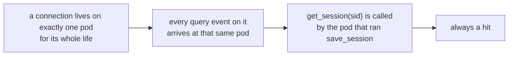
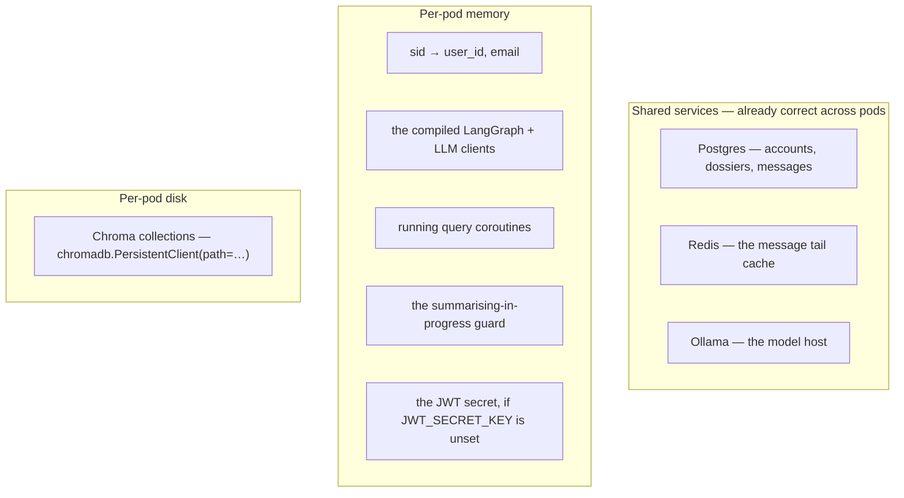
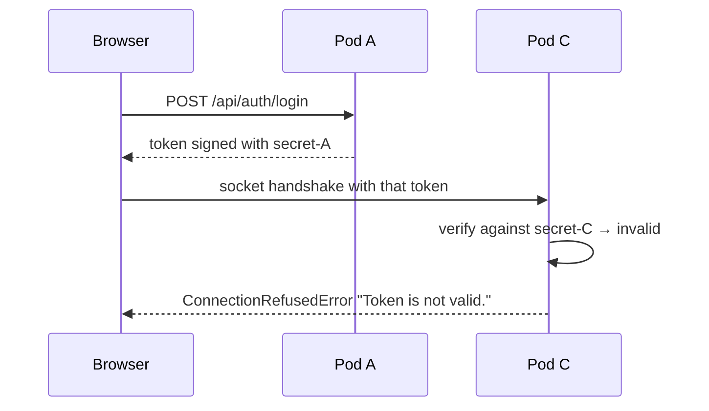
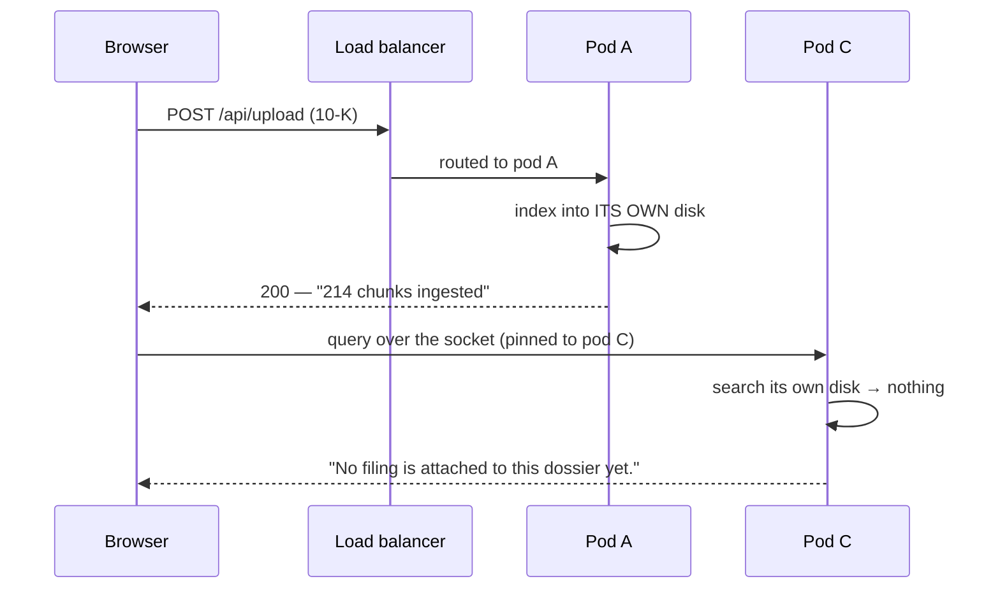
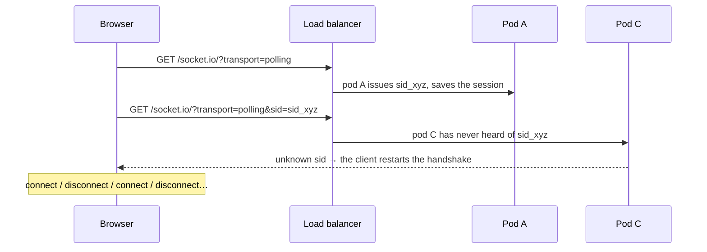
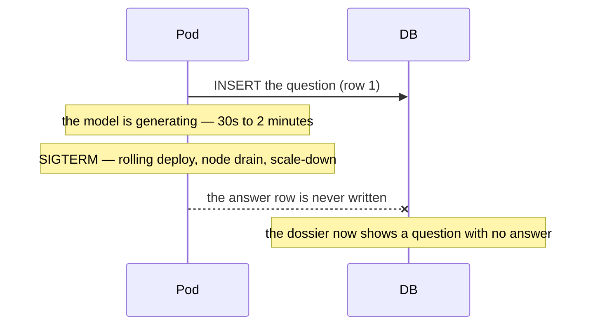
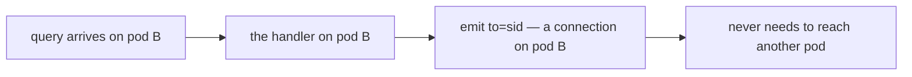
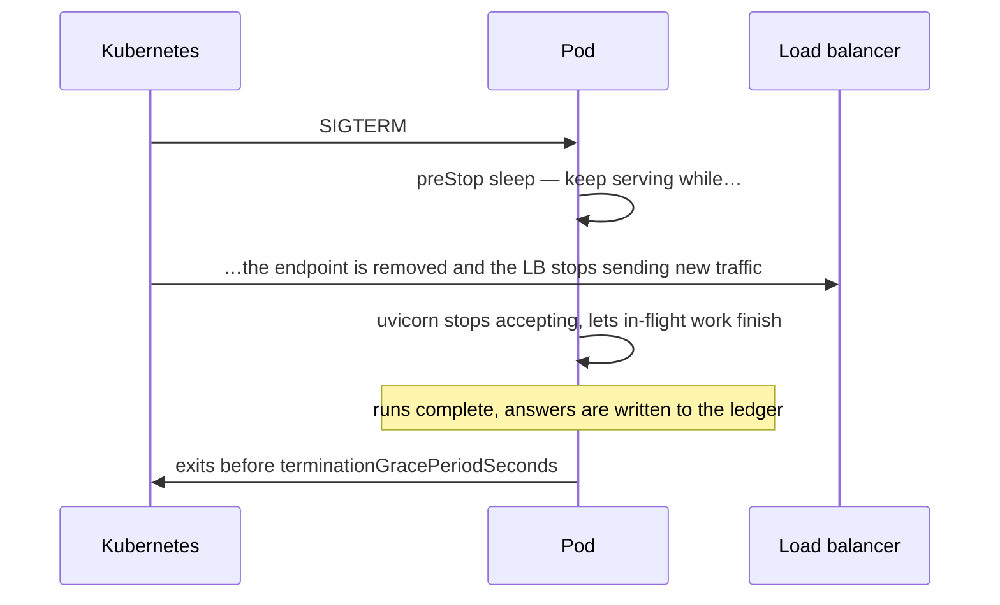
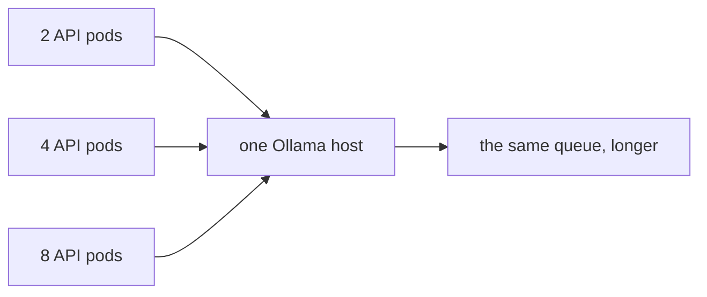

# Running more than one instance

What breaks when this app goes from one process to many — on EKS, on ECS, or
just `--workers 4` — and what to do about each thing, in the order that matters.

The short version, before any detail:

> **This is a single-instance app today, and Socket.IO is not the reason.**
> The socket layer is the *easiest* part to scale. The two things that actually
> break first are the JWT signing key and the embedded vector store, and
> neither has anything to do with WebSockets.

| Where to look | For |
| --- | --- |
| **this file** | what breaks with N instances, and the fix for each |
| [SOCKETIO.md](SOCKETIO.md#running-more-than-one-worker) | the short version, in the Socket.IO guide |
| [FRONTEND-SOCKETIO.md](FRONTEND-SOCKETIO.md) | what the backend does per operation |
| [DB-OPERATIONS.md](DB-OPERATIONS.md) | every database read and write |

---

## Contents

1. [The verdict table](#1-the-verdict-table)
2. [What `save_session` really does — and why it is *not* the problem](#2-what-save_session-really-does--and-why-it-is-not-the-problem)
3. [Everything this app keeps in process memory](#3-everything-this-app-keeps-in-process-memory)
4. [Break #1 — The JWT signing key](#break-1--the-jwt-signing-key)
5. [Break #2 — The embedded vector store](#break-2--the-embedded-vector-store)
6. [Break #3 — Handshake routing](#break-3--handshake-routing)
7. [Break #4 — In-flight runs die on a rollout](#break-4--in-flight-runs-die-on-a-rollout)
8. [Break #5 — Broadcasting (not a problem *yet*)](#break-5--broadcasting-not-a-problem-yet)
9. [Smaller things that also change](#9-smaller-things-that-also-change)
10. [Sticky sessions on EKS, concretely](#10-sticky-sessions-on-eks-concretely)
11. [The Redis client manager](#11-the-redis-client-manager)
12. [Graceful shutdown for minute-long answers](#12-graceful-shutdown-for-minute-long-answers)
13. [A working EKS manifest](#13-a-working-eks-manifest)
14. [Should you scale out at all?](#14-should-you-scale-out-at-all)
15. [How to verify it actually works](#15-how-to-verify-it-actually-works)

---

## 1. The verdict table

| # | Component | At 1 instance | At N instances | Fix | Must fix before scaling? |
| --- | --- | --- | --- | --- | --- |
| 1 | **JWT signing key** | fine (random key if unset) | tokens from one pod are rejected by every other | set `JWT_SECRET_KEY` from a Secret | **yes — blocker** |
| 2 | **Chroma vector store** | fine (embedded, on disk) | a filing uploaded to pod A is invisible to pod B | run Chroma as a service | **yes — blocker** |
| 3 | **Socket.IO handshake** | fine | polling handshakes split across pods → reconnect loops | sticky sessions, or WebSocket-only | **yes** |
| 4 | **In-flight runs** | lost on restart | lost on every rollout, more often | long graceful termination | **yes** |
| 5 | **`emit` / rooms** | fine — nothing broadcasts | still fine **today**; breaks the day you add broadcast | `AsyncRedisManager` | not yet |
| 6 | `save_session` | fine | fine — read only by the pod holding the connection | none | no |
| 7 | Postgres pool | 5 + 10 | × N pods against one `max_connections` | size the pool, or PgBouncer | check |
| 8 | Redis message cache | shared | shared — already correct | none | no |
| 9 | Rolling summaries | one at a time | two pods may fold the same dossier | none (last write wins) | no |
| 10 | Ollama | the bottleneck | **still** the bottleneck, now with N clients | scale the model host | think first |

Items 6 and 8 are the ones people expect to break and that do not. Items 1 and 2
are the ones nobody mentions and that break immediately.

---

## 2. What `save_session` really does — and why it is *not* the problem

```python
await sio.save_session(sid, {"user_id": user.id, "email": user.email})
```

It stores a dictionary against one connection id, in the Socket.IO server's own
store — by default, a plain dict in **this process's memory**. Later handlers
read it back:

```python
socket_session = await sio.get_session(sid)
user_id = socket_session.get("user_id") if socket_session else None
```

Two facts about it are worth stating precisely, because the general advice about
Socket.IO sessions does not apply cleanly here.

### It is per-process, and that is fine here

The usual warning is "sessions are not visible across processes". True — but in
this app **no other process ever needs to read one**:



A `sid` and its session are created, read and destroyed by one process. There is
no code path where pod B reads a session pod A wrote. Replicating sessions into
Redis would buy nothing.

The one way it *appears* to break is if the connection itself gets split across
pods during the handshake — which is a routing problem
([Break #3](#break-3--handshake-routing)), not a session problem. Fix the
routing and the session is correct by construction.

### Every connection is already in a room of one

Socket.IO puts each connection into an implicit room named after its own `sid`.
That is what makes this work:

```python
await sio.emit(event_name, payload, to=sid)
```

`to=sid` is "emit to the room containing exactly this one connection". So the
app *does* use rooms — one per connection, automatically, and never a named one.
This matters for scaling only because **the process doing the emitting is always
the process holding that connection** ([Break #5](#break-5--broadcasting-not-a-problem-yet)).

---

## 3. Everything this app keeps in process memory

Worth knowing exactly, because "what breaks at N instances" is precisely "what
is in this list and is not shared".



| In memory | Where | Breaks at N pods? |
| --- | --- | --- |
| `sid → {user_id, email}` | Socket.IO's default store | **no** — never read by another pod |
| the compiled graph, model clients | `container.py` singletons | no — stateless, rebuilt per pod |
| in-flight run coroutines | the `query` handler | only on shutdown ([Break #4](#break-4--in-flight-runs-die-on-a-rollout)) |
| `_summarising` dedupe set | `HistoryService` | harmless duplicate folds |
| an ephemeral JWT secret | `auth/security.py` | **yes — hard break** |
| Chroma collections | on the pod's own disk | **yes — hard break** |

---

## Break #1 — The JWT signing key

**Severity: blocker. Symptom: random 401s and refused handshakes, roughly
`(N-1)/N` of the time.**

If `JWT_SECRET_KEY` is unset, each process invents its own:

```python
def _secret() -> str:
    """The signing key, generating a throwaway one only for local runs."""
    if settings.JWT_SECRET_KEY:
        return settings.JWT_SECRET_KEY
    global _EPHEMERAL_SECRET
    if _EPHEMERAL_SECRET is None:
        _EPHEMERAL_SECRET = secrets.token_urlsafe(64)
        logger.warning(
            "JWT_SECRET_KEY is not set — signing with a random key that dies "
            "with this process. …"
        )
    return _EPHEMERAL_SECRET
```

With three pods there are three different secrets. A token minted by pod A fails
signature verification everywhere else:



**Fix:** one shared secret, from a Kubernetes Secret:

```yaml
env:
  - name: JWT_SECRET_KEY
    valueFrom:
      secretKeyRef:
        name: cfa-secrets
        key: jwt-secret
```

The warning line is the thing to grep for after any deploy:

```
WARNING  auth.security  JWT_SECRET_KEY is not set — signing with a random key…
```

If that appears in a production log, authentication is already unreliable —
even on one pod, where every restart signs everybody out.

---

## Break #2 — The embedded vector store

**Severity: blocker. Symptom: "No filing is attached to this dossier yet" for
filings the analyst just uploaded successfully.**

Filings are the one thing the app keeps on its own disk:

```python
self._client = chromadb.PersistentClient(path=persist_directory)
```

`PersistentClient` is an **embedded** database — a library reading a local
directory, not a client talking to a server. Each pod therefore has its own,
private copy.

Uploads go over plain HTTP and are load-balanced like any other request, while
the question travels over a socket that is pinned to one pod. Those are two
different routing decisions, so they land on different pods routinely:



The database row says the filing exists — `record_filing` wrote it — so the
dock lists a filing that no longer answers anything. Confusing in exactly the
way that wastes an afternoon.

### Why shared storage is not the fix

Mounting one EFS volume into every pod looks like it should work. It does not:
Chroma's embedded mode keeps its index in SQLite, and several processes writing
one SQLite file over NFS is the textbook way to corrupt it. The same objection
applies to two uvicorn workers in one pod.

### The actual fix

Run Chroma as a service, so every pod talks to **one** store over HTTP:

```yaml
# a chroma deployment + service, then point the app at it
CHROMA_HOST: chroma.default.svc.cluster.local
CHROMA_PORT: "8000"
```

```python
# analysis/retrieval/vector_store.py — the one line that changes
self._client = chromadb.HttpClient(host=settings.CHROMA_HOST, port=settings.CHROMA_PORT)
```

Chroma's own persistence then belongs to that one deployment (a PVC, one
writer), and every API pod becomes stateless. A managed vector database is the
same change with a different client.

Until that is done, **N > 1 is not a configuration choice — it is a bug.**

---

## Break #3 — Handshake routing

**Severity: high. Symptom: reconnect loops, "session expired" toasts, works at
low traffic and fails under load.**

A Socket.IO connection may start life as a sequence of HTTP polling requests
that must all reach the same process:



The client here asks for `transports: ["websocket", "polling"]` — WebSocket
first, polling as the fallback. A WebSocket that upgrades cleanly is **one** TCP
connection and cannot split. Polling is the path that breaks, and it is exactly
the path taken by clients behind proxies that refuse upgrades — i.e. the ones
you cannot see from your desk.

**Two fixes, and you want the first:**

1. **Sticky sessions** at the ingress — see
   [§10](#10-sticky-sessions-on-eks-concretely). Keeps polling working.
2. **WebSocket-only** — configure the client with `transports: ["websocket"]`.
   Simpler, and immune to the split, but it gives up the fallback: a corporate
   proxy that blocks upgrades leaves those users with nothing.

Note that even a WebSocket-only deployment wants stickiness for the reconnect
after a pod comes back.

---

## Break #4 — In-flight runs die on a rollout

**Severity: medium, but it leaves a visible mark in the ledger.**

A question writes two rows: the question before the graph runs, the answer after
the stream ends. Kill the process in between and only the first exists.



More pods means more rollouts touching more concurrent runs, so what was rare at
one instance becomes routine.

**Fixes, in order of value:**

- **Give the pod time to finish.** Default `terminationGracePeriodSeconds` is 30
  — shorter than a single answer. See
  [§12](#12-graceful-shutdown-for-minute-long-answers).
- **Deploy when it is quiet**, or use a `PodDisruptionBudget` to avoid draining
  several at once.
- **Optionally, sweep on startup**: a question whose conversation has no
  following assistant row could be marked `status="error"` with "interrupted by
  a restart". Not implemented today — worth it only once rollouts are frequent.

What is *not* lost: filings, dossiers, every completed answer, and the client's
own recovery path. The browser reconnects on its own and the ledger is read
back; only the interrupted answer is gone.

---

## Break #5 — Broadcasting (not a problem *yet*)

**Severity: none today. It becomes a blocker the day someone adds a feature.**

The usual horror story is that `emit(room="chat_general")` silently reaches only
the users on the emitting pod. That cannot happen here, because **this app never
emits to anyone but the asker**:

```python
await sio.emit(event_name, payload, to=sid)
```

Every event is produced by the very handler that received the question, in the
process holding that connection. There is no cross-pod delivery to get wrong.



**When it stops being true.** Any of these turns it into a real cross-pod
problem overnight:

- the same analyst on two devices (`room=f"user:{id}"`)
- shared dossiers, where colleagues watch a run stream live
- an admin broadcast
- a background job that pushes a notification to a connected user

At that point you need [the Redis client manager](#11-the-redis-client-manager),
and the day to add it is the day you write the first `enter_room` — not after
the bug reports.

---

## 9. Smaller things that also change

### Postgres connections multiply

Each pod opens its own pool: `DB_POOL_SIZE` (5) plus `DB_MAX_OVERFLOW` (10).

| Pods | Worst case connections | Against a default `max_connections = 100` |
| --- | --- | --- |
| 1 | 15 | fine |
| 4 | 60 | fine |
| 8 | 120 | **refused connections** |

Either lower the per-pod pool or put PgBouncer in front. CloudNativePG (which
`deploy/cnpg-cluster.yaml` already describes) can run a pooler for you.

### Duplicate rolling summaries

The "already summarising" guard is a per-process set:

```python
if self.summarizer is None or conversation_id in self._summarising:
    return
```

Two pods can therefore fold the same dossier at the same time. Both write the
same three columns; the last write wins. It costs a duplicate model call, not
correctness. A distributed lock (a Redis `SET NX`) would remove even that.

### Startup pruning runs on every pod

`_prune_orphaned_filings` drops vector collections no conversation claims. With
a shared Chroma service, every starting pod runs it against the same store —
harmless (it only deletes true orphans), but noisy during a rollout. With
per-pod embedded stores it is one more reason the filings drift apart.

### Redis is already right

The message cache is keyed by conversation id and lives in shared Redis, so it
works across pods with no changes — and every operation on it fails soft, so a
Redis outage costs one extra `SELECT` per question rather than an outage.

---

## 10. Sticky sessions on EKS, concretely

### AWS Load Balancer Controller (ALB)

```yaml
apiVersion: networking.k8s.io/v1
kind: Ingress
metadata:
  name: cfa
  annotations:
    alb.ingress.kubernetes.io/scheme: internet-facing
    # Pods, not NodePorts — required for stickiness to mean anything.
    alb.ingress.kubernetes.io/target-type: ip
    # The sticky cookie itself.
    alb.ingress.kubernetes.io/target-group-attributes: >-
      stickiness.enabled=true,
      stickiness.type=lb_cookie,
      stickiness.lb_cookie.duration_seconds=3600,
      deregistration_delay.timeout_seconds=180
    # A socket between two questions is quiet. Engine.IO pings about every 25s,
    # so the 60s default is survivable — but leave no margin at your peril.
    alb.ingress.kubernetes.io/load-balancer-attributes: idle_timeout.timeout_seconds=3600
spec:
  ingressClassName: alb
  rules:
    - http:
        paths:
          - path: /
            pathType: Prefix
            backend:
              service:
                name: cfa-backend
                port:
                  number: 8000
```

`deregistration_delay` is the other half of
[Break #4](#break-4--in-flight-runs-die-on-a-rollout): it keeps a draining pod
receiving its existing connections while it finishes.

### NGINX ingress

```yaml
annotations:
  nginx.ingress.kubernetes.io/affinity: "cookie"
  nginx.ingress.kubernetes.io/session-cookie-name: "cfa-sticky"
  nginx.ingress.kubernetes.io/session-cookie-max-age: "3600"
  # A streamed answer has quiet stretches; a short read timeout cuts it mid-word.
  nginx.ingress.kubernetes.io/proxy-read-timeout: "3600"
  nginx.ingress.kubernetes.io/proxy-send-timeout: "3600"
  nginx.ingress.kubernetes.io/proxy-buffering: "off"
```

These mirror what [`frontend/nginx.conf`](../frontend/nginx.conf) already does
for the container-local proxy — the same three settings, one layer up.

### Service-level `sessionAffinity: ClientIP`

```yaml
spec:
  sessionAffinity: ClientIP
  sessionAffinityConfig:
    clientIP:
      timeoutSeconds: 10800
```

Works, but it is the weakest option: everyone behind one corporate NAT becomes
one "client" and lands on one pod, and it does nothing when the traffic arrives
through an ingress that has already terminated the original source IP. Use
cookie stickiness at the ingress where you can.

---

## 11. The Redis client manager

What it is: a shared bus so several Socket.IO servers can deliver each other's
emits.

```python
# main.py
import socketio

mgr = socketio.AsyncRedisManager(settings.REDIS_URL)   # e.g. redis://redis:6379/0
sio = socketio.AsyncServer(
    async_mode="asgi",
    client_manager=mgr,
    cors_allowed_origins=...,
)
```

**What it does:** replicates room membership and routes emits through Redis
pub/sub, so `emit(room=...)` from pod A reaches a connection on pod C.

**What it does *not* do — the part that trips people up:** it does **not**
replicate `save_session` / `get_session`. Those stay in per-process memory even
with the manager attached. If you ever need a session readable from another pod,
store it yourself (in Redis, or re-derive it: this app's access token is a JWT,
so any pod can decode it without a lookup).

**Do you need it today?** No — nothing broadcasts
([Break #5](#break-5--broadcasting-not-a-problem-yet)). Redis is already in the
stack for the message cache, so adding it later is three lines. Adding it now
costs a little latency per emit and buys nothing until the first `enter_room`.

---

## 12. Graceful shutdown for minute-long answers

The default Kubernetes grace period is 30 seconds. A filing analysis on a local
model regularly takes longer than that, so the default cuts runs in half.



```yaml
spec:
  # Longer than the longest answer you expect, plus the preStop sleep.
  terminationGracePeriodSeconds: 180
  containers:
    - name: backend
      lifecycle:
        preStop:
          exec:
            # Endpoint removal is asynchronous; this is the standard pause that
            # stops new requests arriving at a pod that is already shutting down.
            command: ["sh", "-c", "sleep 15"]
```

and give uvicorn its own budget:

```dockerfile
CMD ["uvicorn", "main:asgi_app", "--host", "0.0.0.0", "--port", "8000", \
     "--proxy-headers", "--forwarded-allow-ips", "*", \
     "--timeout-graceful-shutdown", "150"]
```

Open WebSockets do keep a server alive during a graceful shutdown, so pair this
with a grace period you are actually willing to wait — otherwise SIGKILL
arrives and you are back to
[Break #4](#break-4--in-flight-runs-die-on-a-rollout).

---

## 13. A working EKS manifest

Assumes [Break #1](#break-1--the-jwt-signing-key) and
[Break #2](#break-2--the-embedded-vector-store) are already fixed — a shared
secret and a Chroma service. Without those, `replicas: 2` is broken however good
the rest of this file is.

```yaml
apiVersion: apps/v1
kind: Deployment
metadata:
  name: cfa-backend
spec:
  replicas: 2
  selector:
    matchLabels: { app: cfa-backend }
  template:
    metadata:
      labels: { app: cfa-backend }
    spec:
      terminationGracePeriodSeconds: 180
      containers:
        - name: backend
          image: cfa-backend:latest
          ports: [{ containerPort: 8000 }]
          env:
            - name: JWT_SECRET_KEY
              valueFrom:
                secretKeyRef: { name: cfa-secrets, key: jwt-secret }
            - name: DATABASE_URL
              valueFrom:
                secretKeyRef: { name: cfa-secrets, key: database-url }
            - name: REDIS_URL
              value: redis://redis:6379/0
            - name: CHROMA_HOST
              value: chroma
            - name: OLLAMA_BASE_URL
              value: http://ollama:11434
            # N pods × this pool must stay under Postgres max_connections.
            - name: DB_POOL_SIZE
              value: "5"
            - name: DB_MAX_OVERFLOW
              value: "5"
          readinessProbe:
            httpGet: { path: /api/health, port: 8000 }
            periodSeconds: 10
          livenessProbe:
            httpGet: { path: /api/health, port: 8000 }
            periodSeconds: 30
            failureThreshold: 5
          lifecycle:
            preStop:
              exec: { command: ["sh", "-c", "sleep 15"] }
---
apiVersion: policy/v1
kind: PodDisruptionBudget
metadata:
  name: cfa-backend
spec:
  minAvailable: 1
  selector:
    matchLabels: { app: cfa-backend }
```

`/api/health` is deliberately unauthenticated — *"a health check that needs a
login cannot be used by the thing that has to know whether logins are working."*

**On autoscaling:** think twice before an HPA on CPU. The API pod spends most of
a run waiting on Ollama, so CPU stays low while latency climbs; the autoscaler
adds pods that queue on the same model host. If you scale on anything, scale on
concurrent runs — and scale the model host first.

---

## 14. Should you scale out at all?

For this workload, usually not first. The bottleneck is the model, not the
socket layer: every pod you add queues against the same Ollama.



**Reasons to scale out that actually hold:**

- **Availability**, not throughput — one pod means a node drain is an outage.
  Two pods behind sticky sessions means a rollout costs a reconnect, not a
  downtime.
- **Upload throughput**, since embedding a filing is CPU work in the API pod.
- **Isolation** — keeping a slow upload from starving the event loop that is
  streaming someone's answer.

**Order of work, if you do:**

1. `JWT_SECRET_KEY` from a Secret.
2. Chroma as a service, with its own volume.
3. Sticky sessions at the ingress.
4. Grace period and `preStop`.
5. Pool sizing, or PgBouncer.
6. *Then* `replicas: 2`.
7. `AsyncRedisManager` — only when you add the first broadcast.

---

## 15. How to verify it actually works

Nothing here is subtle to test, and every check has an obvious pass/fail.

| Test | How | Pass looks like |
| --- | --- | --- |
| Shared JWT secret | grep every pod's logs for `JWT_SECRET_KEY is not set` | no hits, on any pod |
| Token portability | sign in, then `kubectl delete pod` the one you hit, keep using the app | no re-login prompt |
| Shared filings | upload a filing, then ask about it repeatedly | never "No filing is attached to this dossier yet" |
| Upload/query split | `kubectl logs` both pods — check `Uploaded …` and `Query from …` land on different pods | the answer still cites the filing |
| Sticky handshake | force polling in the browser (block WebSocket), watch the network tab | no connect/disconnect loop |
| Rollout survival | start a long question, then `kubectl rollout restart` | the answer is in the ledger when you reopen the dossier |
| Grace period | time from SIGTERM to exit in the pod events | pod exits *before* the grace period, not by SIGKILL |
| Pool sizing | `SELECT count(*) FROM pg_stat_activity` under load | comfortably under `max_connections` |
| Reconnect | kill a pod while connected | the client reconnects on its own; a "Reconnected" toast |

A shortcut that catches most of it: **run two pods locally with `docker compose
up --scale backend=2`, then use the app normally for five minutes.** Breaks #1,
#2 and #3 all show themselves within that window.
