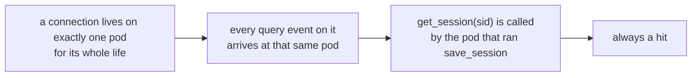
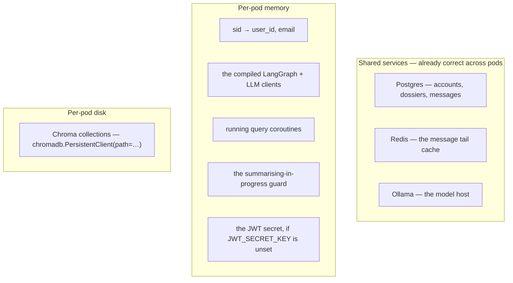
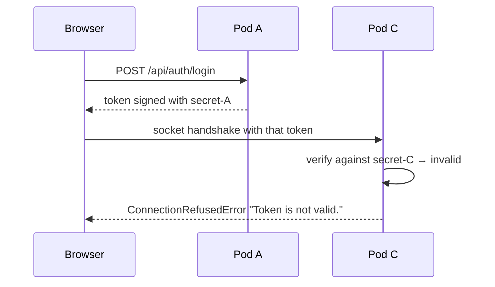
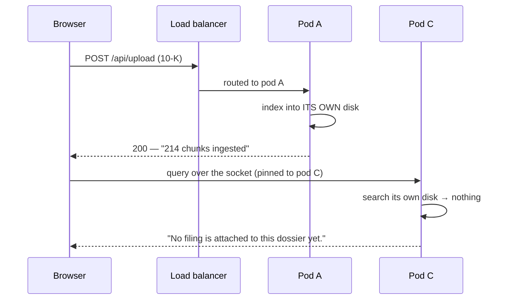
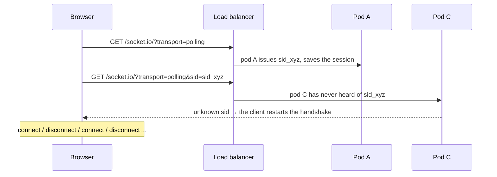
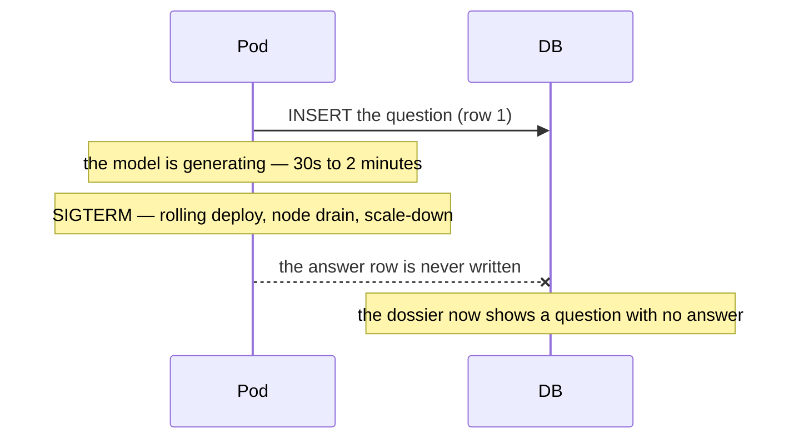
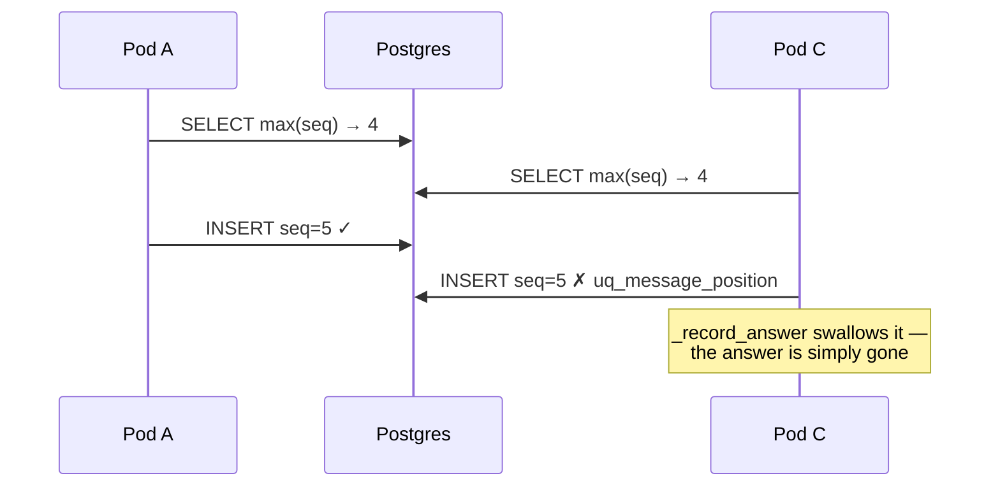
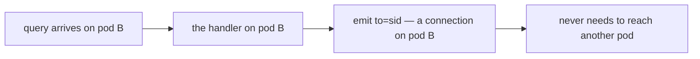
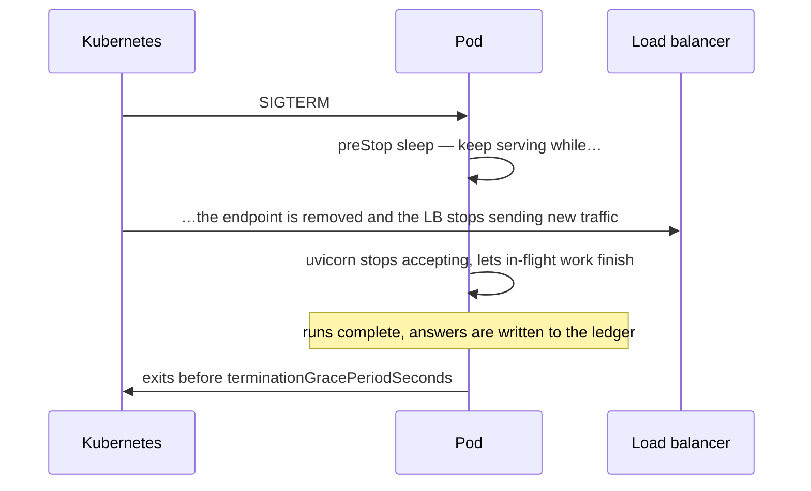
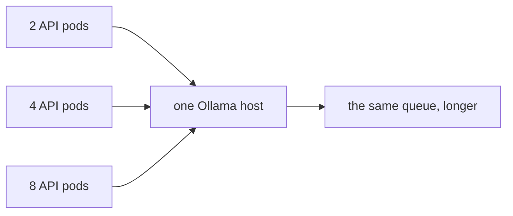

# Running more than one instance

What breaks when this app goes from one process to many — on EKS, on ECS, or
just `--workers 4` — and what to do about each thing, in the order that matters.

The short version, before any detail:

> **This app runs on N instances, and Socket.IO was never the reason it
> couldn't.** The socket layer is the *easiest* part to scale. What actually
> broke first was the JWT signing key, the embedded vector store, and a race on
> message positions that quietly lost answers — none of which has anything to
> do with WebSockets. All three are fixed. What is left is deployment: one
> shared secret, one shared store, and a sticky ingress.

Everything below describes what breaks, why, and where it is now handled. Two
things decide whether an instance is safe to replicate, and both are settings:

```bash
JWT_SECRET_KEY=…      # the same value on every instance
CHROMA_HOST=chroma    # one store, not one per instance
```

[`deploy/minikube/`](../deploy/minikube/) is a working deployment with both set,
two API replicas, and the ingress stickiness [§10](#10-sticky-sessions-on-eks-concretely)
describes.

| Where to look | For |
| --- | --- |
| **this file** | what breaks with N instances, and the fix for each |
| [DEPLOYMENT.md](DEPLOYMENT.md) | how to deploy it — locally or on Kubernetes — and how to test it |
| [TESTING-SCALING.md](TESTING-SCALING.md) | how to provoke each break below and watch it happen |
| [`deploy/minikube/`](../deploy/minikube/) | all of it, applied — manifests you can run |
| [`deploy/checks/`](../deploy/checks/) | scripts that prove a deployment is one of the good ones |
| [SOCKETIO.md](SOCKETIO.md#running-more-than-one-worker) | the short version, in the Socket.IO guide |
| [FRONTEND-SOCKETIO.md](FRONTEND-SOCKETIO.md) | what the backend does per operation |
| [DB-OPERATIONS.md](DB-OPERATIONS.md) | every database read and write |

---

## Contents

1. [The verdict table](#1-the-verdict-table)
2. [What `save_session` really does — and why it is *not* the problem](#2-what-save_session-really-does--and-why-it-is-not-the-problem)
3. [Everything this app keeps in process memory](#3-everything-this-app-keeps-in-process-memory)
4. [Break #1 — The JWT signing key](#break-1--the-jwt-signing-key)
5. [Break #2 — The embedded vector store](#break-2--the-embedded-vector-store)
6. [Break #3 — Handshake routing](#break-3--handshake-routing)
7. [Break #4 — In-flight runs die on a rollout](#break-4--in-flight-runs-die-on-a-rollout)
8. [Break #5 — Two writers, one message position](#break-5--two-writers-one-message-position)
9. [Break #6 — Broadcasting (not a problem *yet*)](#break-6--broadcasting-not-a-problem-yet)
10. [Smaller things that also change](#9-smaller-things-that-also-change)
11. [Sticky sessions on EKS, concretely](#10-sticky-sessions-on-eks-concretely)
12. [The Redis client manager](#11-the-redis-client-manager)
13. [Graceful shutdown for minute-long answers](#12-graceful-shutdown-for-minute-long-answers)
14. [A working EKS manifest](#13-a-working-eks-manifest)
15. [Should you scale out at all?](#14-should-you-scale-out-at-all)
16. [How to verify it actually works](#15-how-to-verify-it-actually-works)

---

## 1. The verdict table

| # | Component | At 1 instance | At N instances, unhandled | How it is handled now | Yours to do? |
| --- | --- | --- | --- | --- | --- |
| 1 | **JWT signing key** | fine (random key if unset) | tokens from one pod are rejected by every other | warned at startup, not at first login | **set `JWT_SECRET_KEY`** |
| 2 | **Chroma vector store** | fine (embedded, on disk) | a filing uploaded to pod A is invisible to pod B | `CHROMA_HOST` switches to a shared server | **run Chroma, set the host** |
| 3 | **Socket.IO handshake** | fine | polling handshakes split across pods → reconnect loops | nothing in code can fix this | **sticky ingress** |
| 4 | **In-flight runs** | lost on restart | lost on every rollout, more often | drained on shutdown, swept on startup | grace period |
| 5 | **Message positions** | *loses answers under concurrency* | loses them routinely | the conversation row is locked while a position is claimed | no |
| 6 | **Schema creation** | fine | concurrent `create_all` → one pod exits | advisory lock around it | no |
| 7 | **Startup housekeeping** | fine | every pod prunes and sweeps at once | advisory lock; one pod does it | no |
| 8 | **`emit` / rooms** | fine — nothing broadcasts | still fine; breaks the day you add broadcast | `SOCKETIO_MESSAGE_QUEUE_URL` when you do | not yet |
| 9 | `save_session` | fine | fine — read only by the pod holding the connection | nothing to do | no |
| 10 | Postgres pool | 5 + 10 | × N pods against one `max_connections` | nothing in code can fix this | size it |
| 11 | Redis message cache | shared | shared — already correct | reads are re-ordered by `seq` | no |
| 12 | Rolling summaries | one at a time | two pods fold the same dossier; a pooled connection is held across the model call | a Redis lease, and the session released before the call | no |
| 13 | Ollama | the bottleneck | **still** the bottleneck, now with N clients | nothing in code can fix this | scale the model host |

Items 9 and 11 are the ones people expect to break and that do not. Item 5 is
the one nobody looks for: it is a race on the ledger, it predates any thought of
scaling, and two browser tabs on one instance are enough to trigger it.

Rows 1, 2, 3, 10 and 13 are the ones still yours — they are configuration and
capacity, and no amount of application code decides them.

---

## 2. What `save_session` really does — and why it is *not* the problem

```python
await sio.save_session(sid, {"user_id": user.id, "email": user.email})
```

It stores a dictionary against one connection id, in the Socket.IO server's own
store — by default, a plain dict in **this process's memory**. Later handlers
read it back:

```python
socket_session = await sio.get_session(sid)
user_id = socket_session.get("user_id") if socket_session else None
```

Two facts about it are worth stating precisely, because the general advice about
Socket.IO sessions does not apply cleanly here.

### It is per-process, and that is fine here

The usual warning is "sessions are not visible across processes". True — but in
this app **no other process ever needs to read one**:



A `sid` and its session are created, read and destroyed by one process. There is
no code path where pod B reads a session pod A wrote. Replicating sessions into
Redis would buy nothing.

The one way it *appears* to break is if the connection itself gets split across
pods during the handshake — which is a routing problem
([Break #3](#break-3--handshake-routing)), not a session problem. Fix the
routing and the session is correct by construction.

### Every connection is already in a room of one

Socket.IO puts each connection into an implicit room named after its own `sid`.
That is what makes this work:

```python
await sio.emit(event_name, payload, to=sid)
```

`to=sid` is "emit to the room containing exactly this one connection". So the
app *does* use rooms — one per connection, automatically, and never a named one.
This matters for scaling only because **the process doing the emitting is always
the process holding that connection** ([Break #6](#break-6--broadcasting-not-a-problem-yet)).

---

## 3. Everything this app keeps in process memory

Worth knowing exactly, because "what breaks at N instances" is precisely "what
is in this list and is not shared".



| In memory | Where | Breaks at N pods? |
| --- | --- | --- |
| `sid → {user_id, email}` | Socket.IO's default store | **no** — never read by another pod |
| the compiled graph, model clients | `container.py` singletons | no — stateless, rebuilt per pod |
| in-flight run coroutines | the `query` handler | only on shutdown ([Break #4](#break-4--in-flight-runs-die-on-a-rollout)) |
| `_summarising` dedupe set | `HistoryService` | harmless duplicate folds |
| an ephemeral JWT secret | `auth/security.py` | **yes — hard break** |
| Chroma collections | on the pod's own disk | **yes — hard break** |

---

## Break #1 — The JWT signing key

**Severity: blocker. Symptom: random 401s and refused handshakes, roughly
`(N-1)/N` of the time.**

If `JWT_SECRET_KEY` is unset, each process invents its own:

```python
def _secret() -> str:
    """The signing key, generating a throwaway one only for local runs."""
    if settings.JWT_SECRET_KEY:
        return settings.JWT_SECRET_KEY
    global _EPHEMERAL_SECRET
    if _EPHEMERAL_SECRET is None:
        _EPHEMERAL_SECRET = secrets.token_urlsafe(64)
        logger.warning(
            "JWT_SECRET_KEY is not set — signing with a random key that dies "
            "with this process. …"
        )
    return _EPHEMERAL_SECRET
```

With three pods there are three different secrets. A token minted by pod A fails
signature verification everywhere else:



**Fix:** one shared secret, from a Kubernetes Secret:

```yaml
env:
  - name: JWT_SECRET_KEY
    valueFrom:
      secretKeyRef:
        name: cfa-secrets
        key: jwt-secret
```

The warning line is the thing to grep for after any deploy:

```
WARNING  auth.security  JWT_SECRET_KEY is not set — signing with a random key…
WARNING  main           Tokens are signed with a key that dies with this process…
```

If either appears in a production log, authentication is already unreliable —
even on one pod, where every restart signs everybody out.

Note *when* they appear. `auth.security` warns the first time a key is asked
for, which on a quiet pod is whenever somebody first signs in — possibly hours
after it started, long after anyone was reading the rollout. So the startup
check in `main._check_signing_key` provokes it deliberately, and the second line
is emitted beside it: the warning is now in the first few lines of a pod's log
or it is nowhere, which is what makes "grep the logs after a deploy" a check
that can actually pass or fail.

This is the one blocker the app cannot fix for you. It has no way to know
whether it is one instance or six, and an app that refused to start without a
secret would be an app you could not run locally.

---

## Break #2 — The embedded vector store

**Severity: blocker. Symptom: "No filing is attached to this dossier yet" for
filings the analyst just uploaded successfully.**

Filings are the one thing the app keeps on its own disk:

```python
self._client = chromadb.PersistentClient(path=persist_directory)
```

`PersistentClient` is an **embedded** database — a library reading a local
directory, not a client talking to a server. Each pod therefore has its own,
private copy.

Uploads go over plain HTTP and are load-balanced like any other request, while
the question travels over a socket that is pinned to one pod. Those are two
different routing decisions, so they land on different pods routinely:



The database row says the filing exists — `record_filing` wrote it — so the
dock lists a filing that no longer answers anything. Confusing in exactly the
way that wastes an afternoon.

### Why shared storage is not the fix

Mounting one EFS volume into every pod looks like it should work. It does not:
Chroma's embedded mode keeps its index in SQLite, and several processes writing
one SQLite file over NFS is the textbook way to corrupt it. The same objection
applies to two uvicorn workers in one pod.

### The fix, and how to turn it on

Run Chroma as a service, so every pod talks to **one** store over HTTP. The app
supports this: `CHROMA_HOST` is what chooses between the two clients.

```yaml
CHROMA_HOST: chroma        # or chroma.default.svc.cluster.local
CHROMA_PORT: "8000"
```

```python
# analysis/retrieval/vector_store.py
if settings.CHROMA_HOST:
    self._client = chromadb.HttpClient(
        host=settings.CHROMA_HOST, port=settings.CHROMA_PORT, ssl=settings.CHROMA_SSL
    )
else:
    self._client = chromadb.PersistentClient(path=persist_directory)
```

Everything downstream is unchanged — `langchain_chroma.Chroma` is handed the
client either way, and collections, search and deletion do not know the
difference. A managed vector database is the same switch with a different
client. Chroma's own persistence belongs to that one deployment (a PVC, one
writer), and every API pod becomes stateless.

Which one is running is in the first few lines of the log, and worth checking
before you trust a two-pod deployment:

```
INFO  analysis.retrieval.vector_store  VectorService ready (store=chroma:8000, shared=True, …)
INFO  analysis.retrieval.vector_store  VectorService ready (store=/app/data/chroma_db, shared=False, …)
```

`shared=False` on more than one pod is the bug, not a warning about it.

**Leaving `CHROMA_HOST` unset is still right for a single instance** — one
process, one directory, nothing else to run. It is only the second instance
that turns it into a bug.

Two smaller things came with the switch:

- **A missing store is a startup failure, not a slow discovery.** `HttpClient`
  heartbeats the server in its constructor, so a pod that cannot reach Chroma
  exits with a message naming the host rather than serving requests that fail
  one by one. Deployments should gate on it — `deploy/minikube/` has an init
  container that waits.
- **`delete_session` and `prune_to` moved off the event loop.** Chroma's client
  is synchronous, and against a remote server that is a network round trip; run
  on the loop it would stall every answer streaming through that pod, not just
  the request that asked for it.

### The ordering problem it exposed

Startup housekeeping drops collections no conversation claims. Upload used to
ingest the filing *and then* write the conversation row, so between those two a
starting pod was entitled to delete a collection somebody was still filling.
With one embedded store per pod that window was narrow. With one shared store
and rolling deploys it is not.

The row is opened first now, so there is never a collection without a
conversation behind it.

---

## Break #3 — Handshake routing

**Severity: high. Symptom: reconnect loops, "session expired" toasts, works at
low traffic and fails under load.**

A Socket.IO connection may start life as a sequence of HTTP polling requests
that must all reach the same process:



The client here asks for `transports: ["websocket", "polling"]` — WebSocket
first, polling as the fallback. A WebSocket that upgrades cleanly is **one** TCP
connection and cannot split. Polling is the path that breaks, and it is exactly
the path taken by clients behind proxies that refuse upgrades — i.e. the ones
you cannot see from your desk.

**Two fixes, and you want the first:**

1. **Sticky sessions** at the ingress — see
   [§10](#10-sticky-sessions-on-eks-concretely). Keeps polling working.
2. **WebSocket-only** — configure the client with `transports: ["websocket"]`.
   Simpler, and immune to the split, but it gives up the fallback: a corporate
   proxy that blocks upgrades leaves those users with nothing.

Note that even a WebSocket-only deployment wants stickiness for the reconnect
after a pod comes back.

---

## Break #4 — In-flight runs die on a rollout

**Severity: medium, but it leaves a visible mark in the ledger.**

A question writes two rows: the question before the graph runs, the answer after
the stream ends. Kill the process in between and only the first exists.



More pods means more rollouts touching more concurrent runs, so what was rare at
one instance becomes routine.

**What the app does about it now, in the order it happens:**

- **Shutdown waits for the runs it is holding.** Every `query` registers its
  task in `api.socket._in_flight`, and the lifespan calls `drain()` after new
  connections have stopped arriving. A run allowed to finish writes its answer
  row; the wait is bounded by `SHUTDOWN_DRAIN_SECONDS` (120 by default).
  Whatever is still going when that expires is left alone rather than cancelled
  — the process is leaving either way, and cancelling a run halfway cannot make
  its answer any more written.

- **The next pod to start closes out what did not survive.** For the deaths that
  give no warning — a SIGKILL past the grace period, a lost node —
  `HistoryService.sweep_interrupted_runs` finds questions with nothing written
  after them and appends an answer row marked `error`, saying the run was
  interrupted. The dossier then shows what happened instead of a question
  waiting forever, and the failed turn is kept out of later prompts.

  The cutoff (`STALE_RUN_MINUTES`, 30) is deliberately generous, because the
  dangerous mistake is the opposite one: marking a run that is merely slow, on
  another pod, right now. It runs under an advisory lock, so one pod does it and
  the rest skip.

**What is still yours:**

- **Give the pod time to finish.** Default `terminationGracePeriodSeconds` is 30
  — shorter than a single answer, and shorter than the drain. The three numbers
  are one budget: `preStop` sleep + `SHUTDOWN_DRAIN_SECONDS` must fit inside the
  grace period, or the kubelet SIGKILLs the drain it was waiting for. See
  [§12](#12-graceful-shutdown-for-minute-long-answers).
- **Deploy when it is quiet**, or use a `PodDisruptionBudget` to avoid draining
  several at once.

What is *not* lost: filings, dossiers, every completed answer, and the client's
own recovery path. The browser reconnects on its own and the ledger is read
back.

One ordering detail worth knowing, because it looks like a bug when you go
looking: `done` is emitted to the client *before* `_record_answer` writes the
row. The analyst has the answer on screen a moment before it is in the ledger,
so a page reload in that instant shows the question without it. The drain covers
the case that matters — a shutdown in that window still writes the row — and
anything the drain misses is closed out by the sweep.

---

## Break #5 — Two writers, one message position

**Severity: blocker, and the only one here that was already losing data at a
single instance. Symptom: an answer the analyst watched arrive and cannot find
when they reopen the dossier.**

Messages are positioned by `seq`, unique per conversation:

```python
UniqueConstraint("conversation_id", "seq", name="uq_message_position")
```

and the position was claimed by reading the highest one and writing the next:

```python
next_seq = await self._next_seq(session, conversation.id)   # SELECT MAX(seq) + 1
```

Read, then write, with nothing in between to stop somebody else doing the same.
Two writers compute the same number and the second insert loses to the
constraint:



The loser's error is *caught*, because `_record_answer` will not fail a request
over a bookkeeping problem. So there is no 500, no error toast, nothing in the
UI at all — just an answer that was streamed to the browser and never stored.

This does not need several pods. Two browser tabs on one instance are enough,
and a filing upload racing a question is enough. More instances only make it
ordinary.

**The fix:** claim the position under a row lock, so the read and the write are
one step across every process.

```python
# conversations/service.py, first thing in record_message
await session.exec(
    select(Conversation.id).where(Conversation.id == conversation.id).with_for_update()
)
```

Locking the *conversation* row rather than the message table serialises writers
per dossier and nowhere else, which is exactly the scope of the constraint.
Twelve concurrent writers to one conversation, before and after:

```
without the row lock:  2/12 writes landed, 10 IntegrityErrors
with the row lock:    12/12 writes landed, seq 1…12
```

The same lock also settles `message_count` and `last_message_at`, which were
being written from whatever each session happened to have read.

---

## Break #6 — Broadcasting (not a problem *yet*)

**Severity: none today. It becomes a blocker the day someone adds a feature.**

The usual horror story is that `emit(room="chat_general")` silently reaches only
the users on the emitting pod. That cannot happen here, because **this app never
emits to anyone but the asker**:

```python
await sio.emit(event_name, payload, to=sid)
```

Every event is produced by the very handler that received the question, in the
process holding that connection. There is no cross-pod delivery to get wrong.



**When it stops being true.** Any of these turns it into a real cross-pod
problem overnight:

- the same analyst on two devices (`room=f"user:{id}"`)
- shared dossiers, where colleagues watch a run stream live
- an admin broadcast
- a background job that pushes a notification to a connected user

At that point you need [the Redis client manager](#11-the-redis-client-manager),
and the day to add it is the day you write the first `enter_room` — not after
the bug reports.

---

## 9. Smaller things that also change

### Postgres connections multiply

Each pod opens its own pool: `DB_POOL_SIZE` (5) plus `DB_MAX_OVERFLOW` (10).

| Pods | Worst case connections | Against a default `max_connections = 100` |
| --- | --- | --- |
| 1 | 15 | fine |
| 4 | 60 | fine |
| 8 | 120 | **refused connections** |

Either lower the per-pod pool or put PgBouncer in front. CloudNativePG (which
`deploy/cnpg-cluster.yaml` already describes) can run a pooler for you.

### Duplicate rolling summaries

The "already summarising" guard was a per-process set, so two pods could fold
the same dossier at once — a wasted call to the model that is already the
bottleneck. There is a lease in front of it now:

```python
lease = f"summary:{conversation_id}"
if not await leases.acquire(lease, _SUMMARY_LEASE_SECONDS):
    return
```

`core.leases` is a Redis `SET NX EX`, deliberately **best effort**: with no
Redis it says yes to everybody and the per-process set still dedupes within one
pod. That is the right shape here, because a duplicate fold costs a model call
and not correctness — the two writes are the same three columns. Anything that
must actually be exclusive uses `db.locks` instead, where Postgres is.

A stale fold is also discarded rather than applied: the write phase re-reads
`summary_through_seq` and gives up if somebody folded further while it was
waiting on the model, so a slow summary cannot walk a newer one backwards.

### Summaries used to hold a pooled connection across the model call

Worth its own note, because it was a scaling problem hiding inside a background
job. `_summarise` opened a session, read the transcript, called the summariser
— *inside the session* — and wrote back. A summarising call takes tens of
seconds, and a pool is 5 + 5 per pod: a handful of concurrent folds could
exhaust it and leave analysts waiting on a connection to ask a question.

It is three phases now — read, close, call, reopen, write — and holds nothing
while the model works.

### Startup housekeeping runs on one pod, not all of them

`_prune_orphaned_filings` and `sweep_interrupted_runs` both run at startup, and
with a shared Chroma every starting pod would run them against the same store.
Both are now inside one non-blocking advisory lock:

```python
async with only_one("startup-housekeeping") as mine:
    if mine:
        await _prune_orphaned_filings()
        await _close_out_interrupted_runs()
```

Whichever pod gets it does the work; the rest log a line and get on with
serving. Nothing waits.

### Creating the schema needed the same treatment

`init_db` calls `create_all`, which reflects the schema, decides what is
missing, and creates it. Two pods starting together — which is what a rolling
deploy *is* — can both decide a table is missing, and the one that issues its
`CREATE TABLE` second gets a DuplicateTable error and exits. An intermittent
CrashLoopBackOff that looks like a database problem and is a startup race.

It takes a blocking advisory lock held to the end of the transaction, so
whoever waits reflects a finished schema and creates nothing.

### Redis is already right

The message cache is keyed by conversation id and lives in shared Redis, so it
works across pods with no changes — and every operation on it fails soft, so a
Redis outage costs one extra `SELECT` per question rather than an outage.

One thing did change. The cached tail is appended to by whichever pod recorded
the message, after its own commit, so two pods writing to one dossier can push
their rows in the opposite order to the positions they were assigned. Sorting
the tail by `seq` on the way out costs nothing at forty entries and means a
reader never has to trust the order they arrived in.

### Collection handles are no longer kept forever

`VectorService` caches an open Chroma handle per session id. Unbounded, a
long-lived pod accumulates one per dossier it has ever answered for — a slow
leak that only shows up on a pod that is weeks old, which is exactly the pod a
stable deployment has. It is an LRU with a cap now; evicting a handle costs one
reopen and never a filing.

---

## 10. Sticky sessions on EKS, concretely

### AWS Load Balancer Controller (ALB)

```yaml
apiVersion: networking.k8s.io/v1
kind: Ingress
metadata:
  name: cfa
  annotations:
    alb.ingress.kubernetes.io/scheme: internet-facing
    # Pods, not NodePorts — required for stickiness to mean anything.
    alb.ingress.kubernetes.io/target-type: ip
    # The sticky cookie itself.
    alb.ingress.kubernetes.io/target-group-attributes: >-
      stickiness.enabled=true,
      stickiness.type=lb_cookie,
      stickiness.lb_cookie.duration_seconds=3600,
      deregistration_delay.timeout_seconds=180
    # A socket between two questions is quiet. Engine.IO pings about every 25s,
    # so the 60s default is survivable — but leave no margin at your peril.
    alb.ingress.kubernetes.io/load-balancer-attributes: idle_timeout.timeout_seconds=3600
spec:
  ingressClassName: alb
  rules:
    - http:
        paths:
          - path: /
            pathType: Prefix
            backend:
              service:
                name: cfa-backend
                port:
                  number: 8000
```

`deregistration_delay` is the other half of
[Break #4](#break-4--in-flight-runs-die-on-a-rollout): it keeps a draining pod
receiving its existing connections while it finishes.

### NGINX ingress

```yaml
annotations:
  nginx.ingress.kubernetes.io/affinity: "cookie"
  nginx.ingress.kubernetes.io/session-cookie-name: "cfa-sticky"
  nginx.ingress.kubernetes.io/session-cookie-max-age: "3600"
  # A streamed answer has quiet stretches; a short read timeout cuts it mid-word.
  nginx.ingress.kubernetes.io/proxy-read-timeout: "3600"
  nginx.ingress.kubernetes.io/proxy-send-timeout: "3600"
  nginx.ingress.kubernetes.io/proxy-buffering: "off"
```

These mirror what [`frontend/nginx.conf`](../frontend/nginx.conf) already does
for the container-local proxy — the same three settings, one layer up.

### Service-level `sessionAffinity: ClientIP`

```yaml
spec:
  sessionAffinity: ClientIP
  sessionAffinityConfig:
    clientIP:
      timeoutSeconds: 10800
```

Works, but it is the weakest option: everyone behind one corporate NAT becomes
one "client" and lands on one pod, and it does nothing when the traffic arrives
through an ingress that has already terminated the original source IP. Use
cookie stickiness at the ingress where you can.

---

## 11. The Redis client manager

What it is: a shared bus so several Socket.IO servers can deliver each other's
emits. It is wired in already, behind a setting that is empty by default:

```bash
SOCKETIO_MESSAGE_QUEUE_URL=redis://redis:6379/0    # off when blank
```

```python
# main.py
def _client_manager() -> socketio.AsyncManager | None:
    url = settings.SOCKETIO_MESSAGE_QUEUE_URL.strip()
    return socketio.AsyncRedisManager(url) if url else None

sio = socketio.AsyncServer(async_mode="asgi", client_manager=_client_manager(), …)
```

**What it does:** replicates room membership and routes emits through Redis
pub/sub, so `emit(room=...)` from pod A reaches a connection on pod C.

**What it does *not* do — the part that trips people up:** it does **not**
replicate `save_session` / `get_session`. Those stay in per-process memory even
with the manager attached. If you ever need a session readable from another pod,
store it yourself (in Redis, or re-derive it: this app's access token is a JWT,
so any pod can decode it without a lookup).

**Do you need it today?** No — nothing broadcasts
([Break #6](#break-6--broadcasting-not-a-problem-yet)). Turning it on costs a
Redis hop per emit — per *token*, on a streamed answer — and buys nothing until
the first `enter_room`. That is why it ships off rather than on: it is now one
environment variable away on the day it is needed, and free until then.

---

## 12. Graceful shutdown for minute-long answers

The default Kubernetes grace period is 30 seconds. A filing analysis on a local
model regularly takes longer than that, so the default cuts runs in half.



```yaml
spec:
  # Longer than the longest answer you expect, plus the preStop sleep.
  terminationGracePeriodSeconds: 180
  containers:
    - name: backend
      lifecycle:
        preStop:
          exec:
            # Endpoint removal is asynchronous; this is the standard pause that
            # stops new requests arriving at a pod that is already shutting down.
            command: ["sh", "-c", "sleep 15"]
```

and give uvicorn its own budget. Its CLI reads `UVICORN_`-prefixed variables,
so this can be an environment variable rather than a rewritten `CMD`:

```yaml
env:
  - name: UVICORN_TIMEOUT_GRACEFUL_SHUTDOWN
    value: "150"
  # How long the app itself waits for answers still streaming to reach the
  # ledger, once new connections have stopped arriving.
  - name: SHUTDOWN_DRAIN_SECONDS
    value: "120"
```

**These four numbers are one budget and have to agree:**

```
terminationGracePeriodSeconds  180   the kubelet's patience; SIGKILL after this
  preStop sleep                 15   the ingress stops sending new work
  SHUTDOWN_DRAIN_SECONDS       120   the app waits for in-flight answers
  UVICORN_TIMEOUT_GRACEFUL…    150   uvicorn's own ceiling
```

15 + 120 has to fit inside 180, with room to spare, or the kubelet kills the
drain it was waiting on and you are back to
[Break #4](#break-4--in-flight-runs-die-on-a-rollout) with extra steps. Open
WebSockets do keep a server alive during a graceful shutdown, so pair this with
a grace period you are actually willing to wait.

---

## 13. A working EKS manifest

Assumes [Break #1](#break-1--the-jwt-signing-key) and
[Break #2](#break-2--the-embedded-vector-store) are configured — a shared secret
and a Chroma service. Without those, `replicas: 2` is broken however good the
rest of this file is.

> A complete, runnable version of everything below —
> [`deploy/minikube/`](../deploy/minikube/) — has the Chroma service, the
> secret, the sticky ingress and the shutdown budget already wired together.
> Read that first if you want the whole thing rather than the shape of it.

```yaml
apiVersion: apps/v1
kind: Deployment
metadata:
  name: cfa-backend
spec:
  replicas: 2
  selector:
    matchLabels: { app: cfa-backend }
  template:
    metadata:
      labels: { app: cfa-backend }
    spec:
      terminationGracePeriodSeconds: 180
      containers:
        - name: backend
          image: cfa-backend:latest
          ports: [{ containerPort: 8000 }]
          env:
            - name: JWT_SECRET_KEY
              valueFrom:
                secretKeyRef: { name: cfa-secrets, key: jwt-secret }
            - name: DATABASE_URL
              valueFrom:
                secretKeyRef: { name: cfa-secrets, key: database-url }
            - name: REDIS_URL
              value: redis://redis:6379/0
            # The one setting that makes replicas legal — see Break #2.
            - name: CHROMA_HOST
              value: chroma
            - name: CHROMA_PORT
              value: "8000"
            - name: OLLAMA_BASE_URL
              value: http://ollama:11434
            # N pods × this pool must stay under Postgres max_connections.
            - name: DB_POOL_SIZE
              value: "5"
            - name: DB_MAX_OVERFLOW
              value: "5"
          readinessProbe:
            httpGet: { path: /api/health, port: 8000 }
            periodSeconds: 10
          livenessProbe:
            httpGet: { path: /api/health, port: 8000 }
            periodSeconds: 30
            failureThreshold: 5
          lifecycle:
            preStop:
              exec: { command: ["sh", "-c", "sleep 15"] }
---
apiVersion: policy/v1
kind: PodDisruptionBudget
metadata:
  name: cfa-backend
spec:
  minAvailable: 1
  selector:
    matchLabels: { app: cfa-backend }
```

`/api/health` is deliberately unauthenticated — *"a health check that needs a
login cannot be used by the thing that has to know whether logins are working."*

**On autoscaling:** think twice before an HPA on CPU. The API pod spends most of
a run waiting on Ollama, so CPU stays low while latency climbs; the autoscaler
adds pods that queue on the same model host. If you scale on anything, scale on
concurrent runs — and scale the model host first.

---

## 14. Should you scale out at all?

For this workload, usually not first. The bottleneck is the model, not the
socket layer: every pod you add queues against the same Ollama.



**Reasons to scale out that actually hold:**

- **Availability**, not throughput — one pod means a node drain is an outage.
  Two pods behind sticky sessions means a rollout costs a reconnect, not a
  downtime.
- **Upload throughput**, since embedding a filing is CPU work in the API pod.
- **Isolation** — keeping a slow upload from starving the event loop that is
  streaming someone's answer.

**Order of work, if you do.** None of it is application code any more; it is
five settings and a service.

1. `JWT_SECRET_KEY` from a Secret, the same value everywhere.
2. Chroma as a service with its own volume, and `CHROMA_HOST` pointing at it.
3. Sticky sessions at the ingress, on the route that carries `/socket.io`.
4. Grace period, `preStop`, and a `SHUTDOWN_DRAIN_SECONDS` that fits inside it.
5. Pool sizing, or PgBouncer.
6. *Then* `replicas: 2`.
7. `SOCKETIO_MESSAGE_QUEUE_URL` — only when you add the first broadcast.

---

## 15. How to verify it actually works

Nothing here is subtle to test, and every check has an obvious pass/fail.

| Test | How | Pass looks like |
| --- | --- | --- |
| Shared JWT secret | grep every pod's logs for `JWT_SECRET_KEY is not set` | no hits, on any pod — and now visible from the first seconds of a pod's life |
| Token portability | sign in, then `kubectl delete pod` the one you hit, keep using the app | no re-login prompt |
| Shared store | grep every pod for `VectorService ready` | `shared=True` on all of them |
| Shared filings | upload a filing, then ask about it repeatedly | never "No filing is attached to this dossier yet" |
| Upload/query split | `kubectl logs` both pods — check `Ingested …` and `Retrieved …` | the two land on *different* pods and the answer still cites the filing |
| Concurrent writes | ask two questions in one dossier from two tabs at once | both questions and both answers are in the ledger |
| Sticky handshake | force polling in the browser (block WebSocket), watch the network tab | no connect/disconnect loop |
| Rollout survival | start a long question, then `kubectl rollout restart` | the answer is in the ledger when you reopen the dossier |
| Drain | `kubectl logs` a terminating pod | `Waiting up to 120s for N run(s) to finish` |
| Sweep | SIGKILL a pod mid-answer, wait out `STALE_RUN_MINUTES`, restart | the question shows "This run was interrupted…", not silence |
| Grace period | time from SIGTERM to exit in the pod events | pod exits *before* the grace period, not by SIGKILL |
| Pool sizing | `SELECT count(*) FROM pg_stat_activity` under load | comfortably under `max_connections` |
| Reconnect | kill a pod while connected | the client reconnects on its own; a "Reconnected" toast |

**The one test that matters most** is the upload/query split, because it is the
only one that proves the two pods share a store rather than merely both having
one. Forcing it beats waiting for it: port-forward each pod separately, upload
through the first and open the socket on the second.

```bash
kubectl -n cfa port-forward pod/<pod-a> 18001:8000 &
kubectl -n cfa port-forward pod/<pod-b> 18002:8000 &
backend/Analyzer/.venv/bin/python deploy/checks/split.py \
    --a http://127.0.0.1:18001 --b http://127.0.0.1:18002
```

That script and two others — a smoke test and one for the locks, leases and the
sweep — are in [`deploy/checks/`](../deploy/checks/), and
[DEPLOYMENT.md](DEPLOYMENT.md) covers running them against each way of
deploying, including how to break each thing on purpose and watch the right
check go red.

And the fastest way to *see* a break rather than read about one: take the
setting away from a running deployment and watch the right check go red.

```bash
kubectl -n cfa set env deploy/cfa-backend CHROMA_HOST=""     # then split.py
kubectl -n cfa set env deploy/cfa-backend CHROMA_HOST-       # and back
```

[DEPLOYMENT.md §8](DEPLOYMENT.md#8-breaking-it-on-purpose) does this for the
shared store, the shared secret, Redis, Chroma and Ollama in turn. A check you
have never seen fail is a check you do not know works.

For the rest — stickiness, drain timing, the schema race, pool exhaustion, the
summary lease, and the negatives for everything the scripts cover —
[TESTING-SCALING.md](TESTING-SCALING.md) is the same idea taken through every
break in this file, by hand: which rig can express each fault, how to provoke
it, and the single line of output that says which way it went.
